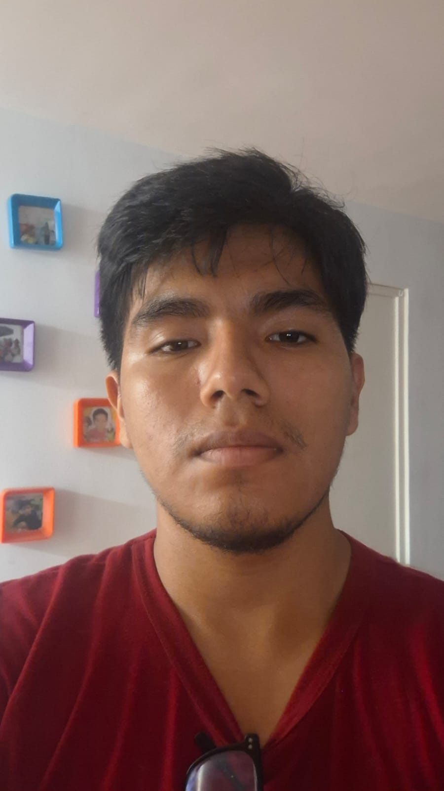

# Capítulo I: Introducción

## 1.1. Startup Profile

### 1.1.1. Descripción de la Startup

Sanuvi nace con el propósito de contribuir al seguimiento y control del tratamiento de la anemia infantil en el Perú. En un contexto donde las familias pueden enfrentar dificultades para mantener la continuidad del tratamiento y el personal de salud requiere información organizada para realizar un seguimiento adecuado de sus pacientes, ofrecemos una solución tecnológica que busca facilitar este proceso y fortalecer la coordinación entre las familias y los profesionales de salud.

Nuestra propuesta busca facilitar el acompañamiento de los niños durante su tratamiento, brindando a las familias herramientas accesibles que les permitan mantener un seguimiento más organizado de su progreso. Asimismo, busca proporcionar al personal de salud información relevante para conocer la evolución de sus pacientes y realizar un seguimiento oportuno, favoreciendo una atención más organizada y eficiente.

Nos enfocamos en apoyar a las familias y al personal de salud involucrado en el seguimiento de la anemia infantil, ofreciendo una alternativa digital que facilite la continuidad del tratamiento y la gestión de la información de los pacientes. Creemos que la transformación digital puede contribuir a fortalecer el seguimiento de la anemia, facilitando la comunicación y el acceso a información relevante para quienes participan en el proceso de recuperación.

En Sanuvi, aspiramos a contribuir a la transformación digital del seguimiento de la anemia infantil en el Perú, promoviendo una atención más organizada, conectada y centrada en las necesidades de cada paciente. Buscamos generar un impacto positivo en la continuidad del tratamiento y apoyar a las familias y profesionales de salud en el seguimiento de los niños con anemia.

**Misión**

Nuestra misión es contribuir a mejorar el seguimiento del tratamiento de la anemia infantil mediante una solución digital que facilite la gestión de la información, el cumplimiento del tratamiento y la comunicación entre las madres o cuidadoras y el personal de salud. Buscamos proporcionar herramientas accesibles e intuitivas que permitan realizar un seguimiento más organizado y favorecer la continuidad del proceso de recuperación de los niños.

**Visión**

Visualizamos un futuro donde las familias y el personal de salud cuenten con herramientas digitales que faciliten el seguimiento continuo de los niños con anemia. Aspiramos a que Sanuvi contribuya a la transformación digital del seguimiento de la anemia infantil en el Perú, promoviendo una atención más organizada, conectada y centrada en las necesidades de cada paciente.

### 1.1.2. Perfiles de integrantes del equipo

<table>
  <tr>
    <td width="140"></td>
    <td>
      <b>Vitaly Arturo Baca Camargo</b> — <code>u20231c426</code> 
      <i>Ingeniería de Software</i>  
      <strong>Perfil</strong>
         
      Estudiante de Ingeniería de Software con interés en la resolución de problemas en diversos sectores mediante el uso de tecnología. Apasionado por el diseño de interfaces de usuario Movil (UI) y enfocado en el desarrollo de soluciones arquitectónicas eficientes y escalables, orientadas a mejorar la experiencia del usuario y el rendimiento de los sistemas.
        
      <strong>Habilidades Técnicas:</strong>
      <ul>
        <li>Java, Node.js</li>
        <li>MongoDB, MySql</li>
        <li>kotlin, Flutter</li>
        <li>Git, Git Flow</li>
        <li>Raliway, Vercel</li>
      </ul>
      <strong>Habilidades Sociales:</strong>
       <ul>
        <li> Trabajo en equipo y colaboración en entornos ágile</li>
        <li> Comunicación efectiva para coordinación técnica y funcional</li>
        <li> Pensamiento analítico y resolución de problemas</li>
        <li> Adaptabilidad y aprendizaje continuo</li>
      </ul>
    </td>
  </tr>
</table>

## 1.2. Solution Profile

### 1.2.1. Antecedentes y problemática

**What (¿Qué ocurre?)**

La persistencia de la anemia infantil en niños menores de cinco años, a pesar de la disponibilidad de tratamientos con hierro, lo cual evidencia deficiencias tanto en la adherencia al tratamiento como en su efectividad clínica. En este contexto, una gran proporción de pacientes no sigue adecuadamente las indicaciones médicas, lo que limita la recuperación y contribuye a la continuidad del problema (Choque-Medrano & Gutarra-Vilchez, 2025). Asimismo, el problema se agrava debido al fracaso del tratamiento, definido como la persistencia de niveles bajos de hemoglobina (<11 g/dL) incluso después de seis meses de suplementación con hierro, lo que indica que las intervenciones no están logrando los resultados esperados en todos los pacientes (Sulca Orellana, 2021)

**Who (¿Quiénes se ven afectados?)**

La anemia en el Perú afecta principalmente a niños menores de cinco años, especialmente menores de tres años, gestantes y adolescentes, considerados grupos vulnerables (UNICEF, 2025) . Asimismo, la prevalencia en la población infantil atendida en servicios de salud varía según factores como edad, altitud y criterios diagnósticos (Hernández-Vásquez et al., 2025)

**Where (¿Dónde sucede?)**

El problema de la anemia en gestantes constituye una situación relevante de salud pública en el Perú. De acuerdo con los registros del Sistema de Información del Estado Nutricional (SIEN/HIS) del Instituto Nacional de Salud (INS), durante el periodo de enero a marzo de 2025 se evaluaron 144 577 gestantes a nivel nacional, de las cuales 26 306 fueron diagnosticadas con anemia, alcanzando una prevalencia de 18,20 %. Asimismo, la distribución de esta problemática presenta diferencias entre los departamentos del país. Apurímac registró una prevalencia de 34,02 %, seguido de Huancavelica con 31,53 % y Ayacucho con 23,59 %, evidenciando una mayor concentración del problema en determinadas regiones del país (Instituto Nacional de Salud [INS], 2025).

**When (¿Desde cuándo y con qué frecuencia?)**

De acuerdo con McCarthy et al. (2022), el problema de la anemia por deficiencia de hierro se presenta principalmente durante los primeros 1000 días de vida, los cuales comprenden desde el embarazo hasta los primeros años de vida del niño, etapa considerada crítica debido al rápido crecimiento y desarrollo, especialmente a nivel cerebral. Según los autores, durante este periodo los requerimientos de hierro aumentan significativamente; por ejemplo, en el embarazo pueden alcanzar hasta 7.5 mg/día en el tercer trimestre, lo que incrementa el riesgo de desarrollar anemia si no se cubren adecuadamente dichas necesidades . Asimismo, en la infancia temprana, particularmente entre los 6 y 24 meses, la demanda de hierro es una de las más altas del ciclo de vida, lo que convierte a esta etapa en un momento crítico para la aparición de la enfermedad. Por otro lado, según Ambreen et al. (2025), la anemia también se manifiesta durante el periodo de tratamiento clínico, el cual se desarrolla a lo largo del tiempo y requiere seguimiento continuo. En su estudio, el análisis se llevó a cabo en diferentes fases comprendidas entre enero y junio de 2023 y octubre de 2023 a marzo de 2024, lo que evidencia que la adherencia al tratamiento es un proceso prolongado y no inmedia.

**Why (¿Por qué es un problema?)**

De acuerdo con Martinez-Torres et al. (2023), la anemia en niños se origina por una combinación de múltiples factores de riesgo, lo que la convierte en un problema complejo de salud pública. Entre las principales causas se encuentran las deficiencias nutricionales, especialmente la falta de hierro, así como la carencia de vitamina B12 y ácido fólico, las cuales afectan directamente la producción de glóbulos rojos. Asimismo, según los autores, existen factores ambientales y sociales que incrementan el riesgo de anemia, como la pobreza, la mala alimentación, el acceso limitado a servicios de salud y la exposición a contaminantes como el plomo, los cuales influyen negativamente en el estado nutricional y la salud infantil.

**How (¿Cómo se aborda la anemia?)**

De acuerdo con el Comité Nacional de Hematología y Nutrición (2017), el abordaje de la anemia por deficiencia de hierro se basa en tres pilares fundamentales: diagnóstico, tratamiento y prevención, los cuales permiten una intervención integral orientada a corregir la deficiencia y evitar su recurrencia. En primer lugar, según la guía, es necesario realizar un diagnóstico adecuado, que incluya evaluación clínica y estudios de laboratorio como hemoglobina y ferritina, con el fin de determinar la causa y severidad de la anemia. Posteriormente, el tratamiento se centra en la suplementación con hierro, principalmente por vía oral, en dosis controladas, con el objetivo de normalizar los niveles de hemoglobina y reponer las reservas del organismo. Asimismo, la prevención constituye un componente esencial, incluyendo estrategias como la alimentación rica en hierro, la lactancia materna, la fortificación de alimentos y la suplementación en grupos de riesgo, como niños pequeños y gestantes. Sin embargo, según Bustamante et al. (2025), este enfoque tradicional centrado en el hierro debe ser reconsiderado, ya que la anemia es un problema multifactorial que no siempre se debe exclusivamente a la deficiencia de este mineral . En este sentido, los autores señalan que la suplementación y fortificación universal no siempre han demostrado ser efectivas, presentando resultados limitados en la reducción de la prevalencia de anemia.

**How Much (¿Cuánto impacto tiene la anemia?)**

De acuerdo con Merino Loor et al. (2022), la anemia constituye un problema de salud pública de gran magnitud a nivel mundial, afectando aproximadamente a 1620 millones de personas, lo que equivale al 24% de la población global, siendo los niños menores de cinco años uno de los grupos más vulnerables, con una prevalencia cercana al 42%. En el contexto nacional, según datos del Instituto Nacional de Salud (INS, 2023), el impacto de los problemas nutricionales asociados a la anemia es significativo en la población infantil. Durante el 2023, se evaluaron 1,740,365 niños menores de 5 años en el Perú, de los cuales el 15.9% presentó desnutrición crónica y el 36.8% se encontraba en riesgo, evidenciando una alta vulnerabilidad nutricional que favorece la aparición de anemia. Además, se identificó la presencia de otras condiciones como sobrepeso (5.8%) y obesidad (1.7%), lo que refleja una doble carga de malnutrición en el país. Asimismo, de acuerdo con Zavaleta y Astete-Robilliard (2017), la anemia tiene consecuencias importantes a largo plazo, ya que afecta el desarrollo cognitivo, motor y conductual en los niños, incluso después de haber sido tratada . Los autores señalan que esta condición puede generar un menor desempeño escolar, limitaciones en el desarrollo intelectual y dificultades en la conducta a lo largo del ciclo de vida.

### 1.2.2. Lean UX Process

En esta sección, aplicaremos la herramienta Lean UX para presentar la visión del modelo de negocio que nuestro producto de software utilizará durante todo el desarrollo de la aplicación. Esta herramienta está dividida en cuatro partes: El desarrollo del problema (Problem Statement), los supuestos del problema (Assumptions), las hipótesis (Hypothesis Statements) y el gráfico que resuma el desarrollo del Lean UX (Lean UX Canvas).

#### 1.2.2.1. Lean UX Problem Statements

Sanuvi surge con el propósito de contribuir al seguimiento y control del tratamiento de la anemia infantil en el Perú, con especial énfasis en favorecer la adherencia al tratamiento por parte de las familias y cuidadores. El problema se presenta cuando las familias tienen dificultades para mantener de manera continua y organizada el cumplimiento de las indicaciones del tratamiento, mientras que el personal de salud enfrenta dificultades para realizar un seguimiento periódico y verificar la adherencia y evolución de los niños.

Actualmente, las madres, padres y cuidadores pueden depender de procesos manuales y poco organizados, como cuadernos, apuntes informales o la memoria, para recordar y mantener información relacionada con el tratamiento de sus hijos. Estas condiciones pueden dificultar el cumplimiento continuo de las indicaciones y, por tanto, la adherencia al tratamiento.

La Norma Técnica de Salud N.° 213-MINSA/DGIESP-2024 define la adherencia al suplemento de hierro como el grado de cumplimiento del régimen de suplementación o tratamiento respecto a la dosis y el tiempo indicado, considerando adecuada una adherencia de 75 % o más. Asimismo, establece que el seguimiento debe permitir verificar la adherencia al suplemento de hierro y contempla acciones como visitas domiciliarias y teleorientación para realizar dicha verificación. (Ministerio de Salud [MINSA], 2024).

Por ello, existe una oportunidad de mejorar la adherencia al tratamiento mediante un seguimiento más continuo y organizado, fortaleciendo también la coordinación entre las familias y el personal de salud.

**¿Cómo podríamos mejorar la adherencia al tratamiento de la anemia infantil y fortalecer la continuidad y coordinación del seguimiento entre las familias y el personal de salud, para favorecer el cumplimiento de las indicaciones durante el tratamiento?**

#### 1.2.2.2. Lean UX Assumptions

**Business Assumptions**

1. Creemos que existe una necesidad real de mejorar el seguimiento del tratamiento de la anemia infantil por parte de las familias y del personal de salud.

2. Creemos que mejorar el seguimiento y control del tratamiento puede contribuir a que los establecimientos de salud gestionen de manera más organizada la atención de los pacientes con anemia.

3. Creemos que los establecimientos de salud constituyen un contexto viable para la adopción de una solución digital orientada al seguimiento del tratamiento de la anemia infantil.

4. Creemos que facilitar la coordinación entre las familias y el personal de salud puede generar suficiente valor para justificar la adopción de Sanuvi.

5. Creemos que el seguimiento continuo de los pacientes puede proporcionar información útil para que el personal de salud tome mejores decisiones sobre el seguimiento de los tratamientos.

6. Creemos que Sanuvi puede integrarse al proceso de seguimiento que actualmente realizan los establecimientos de salud sin reemplazar las responsabilidades del personal sanitario.

7. Creemos que las principales barreras para la adopción de Sanuvi estarán relacionadas con la disposición de los usuarios y las condiciones reales en las que se realiza el seguimiento del tratamiento.

8. Creemos que Sanuvi puede ser una solución sostenible si demuestra que genera valor tanto para las familias como para los establecimientos de salud.

**User Assumptions**

#### Usuario 1: Madre, padre o cuidador

- *¿Quién es el usuario?*

Creemos que las madres, padres o cuidadores responsables del tratamiento de niños con anemia constituyen uno de los principales grupos de usuarios de Sanuvi.

- *¿Qué busca conseguir?*

Creemos que estos usuarios buscan cumplir adecuadamente con las indicaciones del tratamiento y mantener un seguimiento de las actividades relacionadas con la atención de sus hijos.

- *¿En qué contexto utiliza el producto?*
  
Creemos que utilizarán Sanuvi principalmente durante su rutina cotidiana de cuidado del niño y en los momentos relacionados con el seguimiento de su tratamiento.

- *¿Qué dificultades puede tener?*

Creemos que pueden tener dificultades para mantener la continuidad del seguimiento del tratamiento y para recordar u organizar la información relacionada con las indicaciones recibidas.

- *¿Qué características del usuario son relevantes?*
  
Creemos que existen diferencias entre los cuidadores en cuanto a sus rutinas, disponibilidad de tiempo, familiaridad con herramientas digitales y formas actuales de organizar el seguimiento del tratamiento.

#### Usuario 2: Personal de salud

- *¿Quién es el usuario?*

Creemos que el personal de salud responsable del seguimiento de niños con anemia constituye otro grupo principal de usuarios de Sanuvi.

- *¿Qué busca conseguir?*
  
Creemos que estos usuarios buscan realizar un seguimiento organizado de sus pacientes y disponer de información que les permita conocer la evolución del tratamiento.

- *¿En qué contexto utiliza el producto?*

Creemos que utilizarán Sanuvi como parte de sus actividades habituales de seguimiento y atención de pacientes con anemia infantil.

- *¿Qué dificultades puede tener?*

Creemos que pueden enfrentar dificultades para mantener organizada y actualizada la información necesaria para realizar el seguimiento de sus pacientes.

- *¿Qué características del usuario son relevantes?*

Creemos que existen diferencias entre los profesionales en cuanto a sus responsabilidades, carga de trabajo, procesos de seguimiento y familiaridad con herramientas digitales.

**Business Outcomes**

- *Aumentar la adherencia al tratamiento de los niños con anemia.*
- *Aumentar la continuidad con la que los apoderados del paciente. cumplen las indicaciones del tratamiento.*
- *Aumentar la frecuencia con la que los apoderados del paciente. realizan el seguimiento del tratamiento de sus hijos.*
- *Aumentar la frecuencia con la que el personal de salud verifica la adherencia y evolución de los niños.*
- *Aumentar la continuidad de la comunicación entre las apoderados y el personal de salud durante el tratamiento.*

**User Outcomes**

#### Usuario 1: Madre, padre o cuidador

- *Cumplir de manera continua las indicaciones del tratamiento de su hijo.*
- *Dar seguimiento al tratamiento de su hijo de manera organizada.*
- *Conocer cómo está avanzando el tratamiento de su hijo.*
- *Sentirse seguros de que están cumpliendo adecuadamente con el tratamiento de su hijo.*
- *Contar con mayor claridad sobre las indicaciones que deben seguir durante el tratamiento.*

#### Usuario 2: Personal de Salud

- *Realizar el seguimiento de los niños con anemia de manera continua.*
- *Verificar el cumplimiento de las indicaciones del tratamiento por parte de los apoderados del paciente.*
- *Conocer oportunamente la evolución del niño durante el tratamiento.*
- *Contar con confianza sobre el estado del seguimiento de sus pacientes.*
- *Mantener una comunicación continua con los apoderados del paciente durante el tratamiento.*
- *Verificar periódicamente la adherencia y evolución de los niños bajo su seguimiento.*
- *Sentirse seguros de que conocen la situación y evolución de los niños bajo su seguimiento.*

**Features Assumption**

- Creemos que un registro del cumplimiento de las indicaciones del tratamiento permitirá a las familias llevar un seguimiento más organizado de las actividades indicadas y favorecerá la adherencia al tratamiento de sus hijos.

- Creemos que los recordatorios de las indicaciones y actividades del tratamiento ayudarán a las familias a cumplir oportunamente con las actividades indicadas y favorecerán la continuidad del tratamiento.

- Creemos que un registro organizado del seguimiento del tratamiento permitirá a las familias conocer y mantener un mayor control sobre las actividades realizadas durante el tratamiento de sus hijos.

- Creemos que el registro de los controles de hemoglobina permitirá a las familias y al personal de salud consultar la evolución del niño y facilitará el seguimiento de su tratamiento.

- Creemos que una herramienta para registrar y consultar la adherencia de los niños permitirá al personal de salud verificar periódicamente el cumplimiento del tratamiento y realizar un seguimiento más continuo.

- Creemos que un canal de comunicación entre las familias y el personal de salud facilitará la coordinación durante el tratamiento y favorecerá la continuidad del seguimiento de los niños.

- Creemos que una visualización del progreso del tratamiento permitirá a las familias y al personal de salud comprender de manera más clara la evolución y el cumplimiento de las indicaciones.

#### 1.2.2.3. Lean UX Hypothesis Statements

> Formato: *Creemos que [business outcome] se logrará si [user] alcanza [user outcome] con [feature].*

<!-- COMPLETAR -->

#### 1.2.2.4. Lean UX Canvas

<!-- COMPLETAR: explicación del canvas -->

## 1.3. Segmentos objetivo

> Descripción de los segmentos asociados al dominio del problema, incluyendo características demográficas e información estadística de sustento.

### Segmento Objetivo 1: [Nombre del segmento]

<!-- COMPLETAR -->

### Segmento Objetivo 2: [Nombre del segmento]

<!-- COMPLETAR -->
