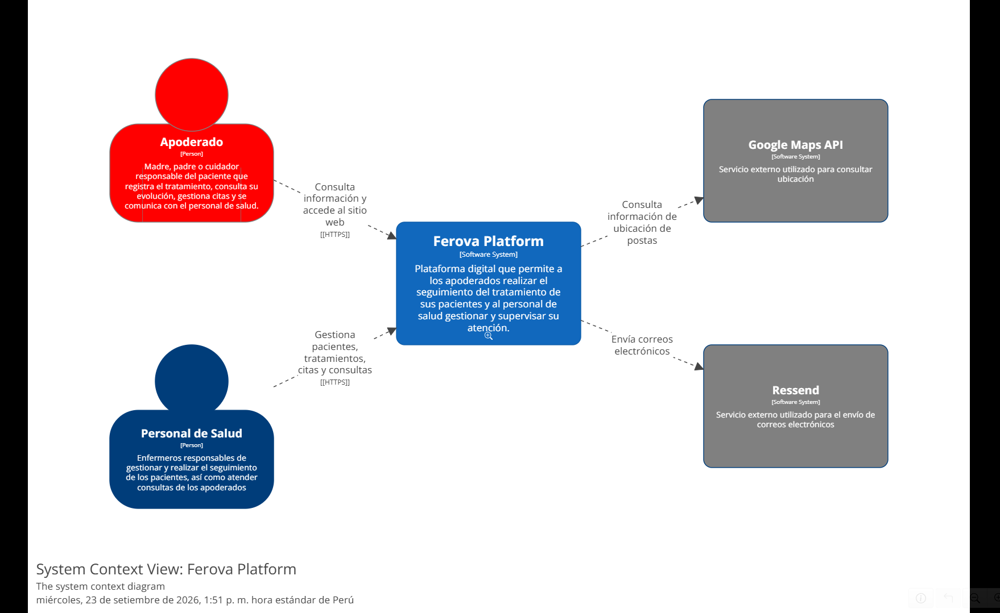
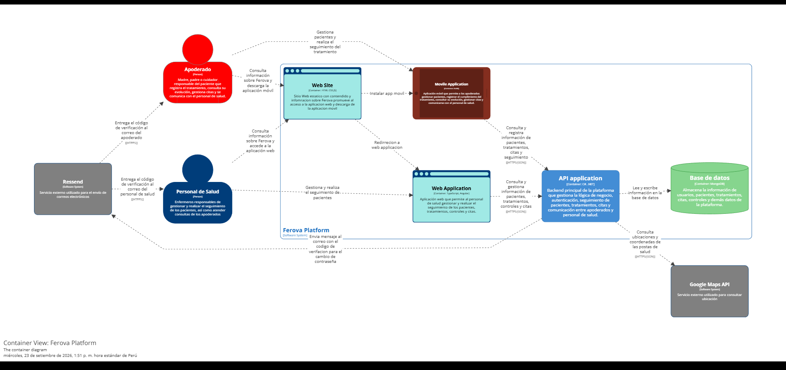
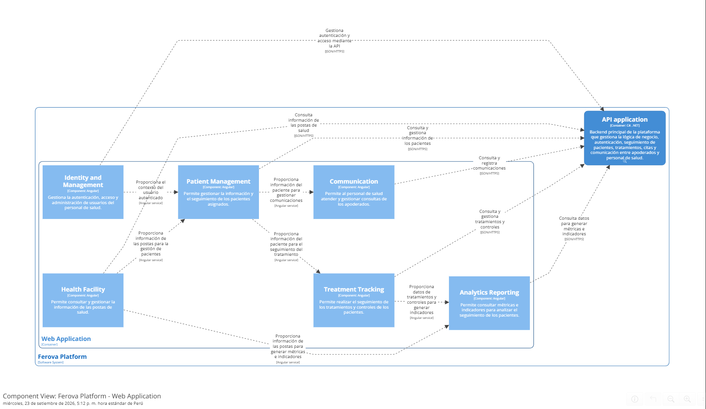
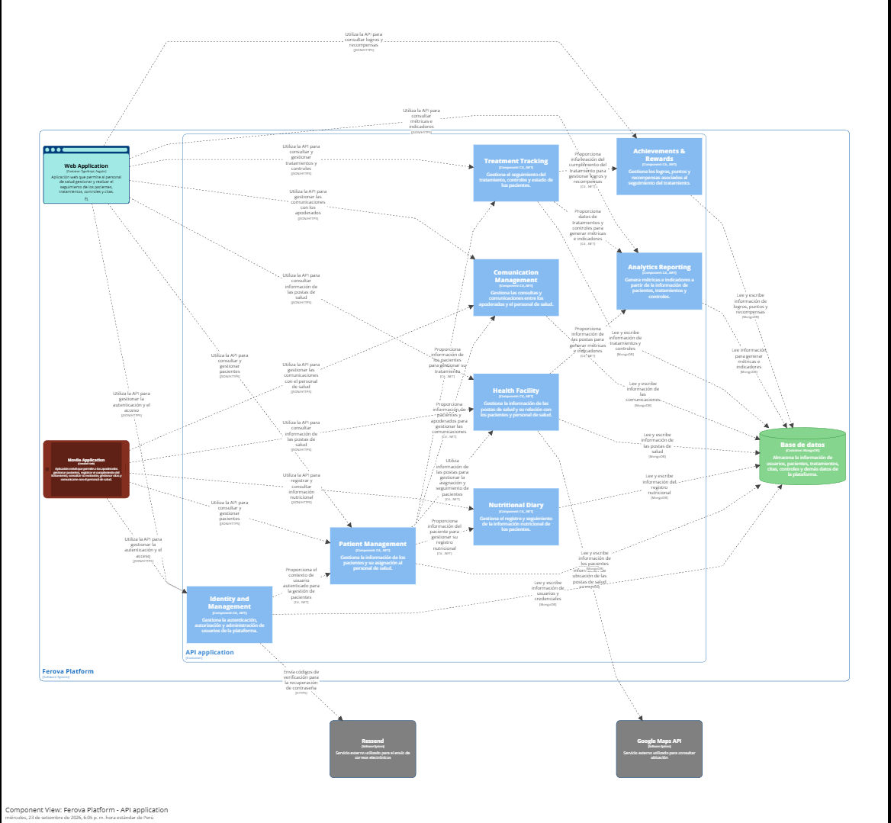
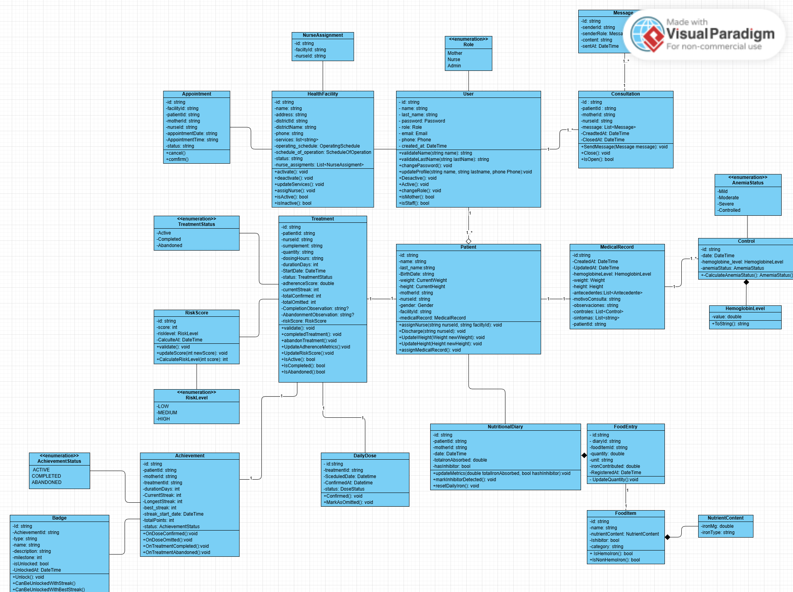

# Capítulo IV: Product Design

## 4.1. Style Guidelines

### 4.1.1. General Style Guidelines

> Branding, tipografía, paleta de colores, tono de voz (Four Dimensions of Tone of Voice), espaciado y principios de diseño inclusivo.

**Branding**

<!-- COMPLETAR -->

**Typography**

<!-- COMPLETAR -->

**Colors**

<!-- COMPLETAR -->

**Spacing**

<!-- COMPLETAR -->

**Tone of Voice**

<!-- COMPLETAR -->

### 4.1.2. Web Style Guidelines

<!-- COMPLETAR -->

### 4.1.3. Mobile Style Guidelines

<!-- COMPLETAR -->

#### 4.1.3.1. iOS Mobile Style Guidelines

> Aplicación de las Apple Human Interface Guidelines.

<!-- COMPLETAR -->

#### 4.1.3.2. Android Mobile Style Guidelines

> Aplicación de Material Design.

<!-- COMPLETAR -->

## 4.2. Information Architecture

### 4.2.1. Organization Systems

<!-- COMPLETAR -->

### 4.2.2. Labeling Systems

<!-- COMPLETAR -->

### 4.2.3. SEO Tags and Meta Tags

| Página | Title | Description | Keywords | Author |
|--------|-------|-------------|----------|--------|
| Landing Page | | | | |

<!-- COMPLETAR -->

### 4.2.4. Searching Systems

<!-- COMPLETAR -->

### 4.2.5. Navigation Systems

<!-- COMPLETAR -->

## 4.3. Landing Page UI Design

### 4.3.1. Landing Page Wireframe

<!-- COMPLETAR -->

### 4.3.2. Landing Page Mock-up

<!-- COMPLETAR -->

## 4.4. Mobile Applications UX/UI Design

### 4.4.1. Mobile Applications Wireframes

<!-- COMPLETAR -->

### 4.4.2. Mobile Applications Wireflow Diagrams

> Un Wireflow por cada User Goal, considerando los User Persona.

**User Goal 1:** [enunciado]

<!-- COMPLETAR -->

### 4.4.3. Mobile Applications Mock-ups

<!-- COMPLETAR -->

### 4.4.4. Mobile Applications User Flow Diagrams

> Un User Flow por cada User Goal, consistente con los Wireflows. Incluir happy path y unhappy paths.

**User Goal 1:** [enunciado]

<!-- COMPLETAR -->

## 4.5. Mobile Applications Prototyping

> Introducción con los principales criterios para las decisiones de interacción y su relación con la arquitectura de información.

<!-- COMPLETAR -->

### 4.5.1. Android Mobile Applications Prototyping

**Enlace del video:** [URL de Microsoft Stream]

### 4.5.2. iOS Mobile Applications Prototyping

**Enlace del video:** [URL de Microsoft Stream]

## 4.6. Web Applications UX/UI Design

### 4.6.1. Web Applications Wireframes

<!-- COMPLETAR -->

### 4.6.2. Web Applications Wireflow Diagrams

**User Goal 1:** [enunciado]

<!-- COMPLETAR -->

### 4.6.3. Web Applications Mock-ups

<!-- COMPLETAR -->

### 4.6.4. Web Applications User Flow Diagrams

**User Goal 1:** [enunciado]

<!-- COMPLETAR -->

## 4.7. Web Applications Prototyping

**Enlace del video:** [URL de Microsoft Stream]

<!-- COMPLETAR -->

## 4.8. Domain-Driven Software Architecture

La arquitectura de software de Ferova Platform se organiza mediante un enfoque orientado al dominio, utilizando el modelo C4 para representar progresivamente la estructura de la solución. Esta representación permite visualizar el sistema desde una perspectiva general hasta el detalle de sus componentes internos.

La arquitectura considera como actores principales al Apoderado y al Personal de Salud, quienes interactúan con la plataforma mediante diferentes aplicaciones. La solución está compuesta por una aplicación web para el personal de salud, una aplicación móvil para los apoderados y una API que centraliza la lógica de negocio y el acceso a los datos.

Asimismo, Ferova Platform integra servicios externos como Resend, utilizado para el envío de correos electrónicos, y Google Maps API, utilizado para consultar información relacionada con la ubicación de las postas de salud.

Para representar esta arquitectura se emplearon tres niveles del modelo C4: Contexto, Contenedores y Componentes, desarrollados mediante Structurizr.

### 4.8.1. Software Architecture Context Diagram

El Context Diagram presenta una visión general de Ferova Platform y permite identificar los principales actores y sistemas externos que interactúan con la solución.

  

En el centro del contexto se encuentra Ferova Platform, que proporciona las funcionalidades necesarias para que los apoderados realicen el seguimiento del tratamiento de sus pacientes y para que el personal de salud gestione y supervise su atención.

Los principales actores identificados son:

- **Apoderado:** madre, padre o cuidador responsable del paciente, quien utiliza la plataforma para gestionar la información del paciente, realizar el seguimiento del tratamiento, consultar su evolución, gestionar citas y comunicarse con el personal de salud.

- **Personal de Salud:** profesionales responsables de gestionar y realizar el seguimiento de los pacientes, así como atender las consultas de los apoderados.

Además, Ferova Platform mantiene comunicación con servicios externos. Resend permite gestionar el envío de correos electrónicos, particularmente aquellos relacionados con procesos como la recuperación de contraseña. Google Maps API permite consultar información de ubicación asociada a las postas de salud.

### 4.8.2. Software Architecture Container Diagrams

El Container Diagram descompone Ferova Platform en los principales contenedores que conforman la solución y muestra cómo estos interactúan entre sí.

  

La plataforma está organizada principalmente en los siguientes contenedores:

- **Web Site:** sitio web público que presenta información sobre Ferova y permite a los usuarios acceder a la aplicación web o descargar la aplicación móvil.
- **Web Application:** aplicación web destinada al personal de salud, mediante la cual puede gestionar pacientes y realizar el seguimiento de tratamientos, controles y citas.
- **Mobile Application:** aplicación móvil destinada a los apoderados, que permite gestionar pacientes, registrar y consultar información relacionada con el tratamiento, consultar citas y mantener comunicación con el personal de salud.
- **API Application:** backend principal de la plataforma, responsable de centralizar la lógica de negocio, autenticación, gestión de pacientes, tratamientos, citas, seguimiento y comunicación.
- **Base de datos:** contenedor encargado de almacenar la información operativa de la plataforma, incluyendo usuarios, pacientes, tratamientos, citas, controles y demás información requerida por los módulos funcionales.

La Web Application y la Mobile Application utilizan la API Application mediante comunicaciones HTTP/HTTPS para consultar y registrar información. A su vez, la API utiliza la base de datos para leer y escribir la información necesaria para la operación de la plataforma.

En este nivel también se representan las integraciones externas. La plataforma utiliza Resend para el envío de correos electrónicos y Google Maps API para consultar información de ubicación de las postas de salud.

De esta manera, el diagrama permite observar la separación entre las interfaces utilizadas por los usuarios, la capa encargada de la lógica de negocio y la persistencia de información.

### 4.8.3. Software Architecture Components Diagrams

El Component Diagram presenta una descomposición interna de los contenedores principales de Ferova Platform, permitiendo identificar las responsabilidades funcionales que conforman cada aplicación.

**Web Application**

La aplicación web utilizada por el personal de salud se organiza en componentes orientados a las principales funcionalidades de gestión y seguimiento:

  

- **Identity and Management:** gestiona la autenticación, autorización y administración de los usuarios del personal de salud.
- **Patient Management:** permite gestionar la información de los pacientes y su asignación al personal de salud.
- **Treatment Tracking:** gestiona el seguimiento de tratamientos, controles y estado de los pacientes.
- **Health Facility:** permite consultar y gestionar información relacionada con las postas de salud.
- **Communication:** gestiona las comunicaciones y consultas entre el personal de salud y los apoderados.
- **Analytics Reporting:** permite consultar métricas e indicadores para analizar información relacionada con el seguimiento de los pacientes.

Estos componentes mantienen relaciones funcionales entre sí y utilizan la API Application para acceder a las funcionalidades y datos proporcionados por el backend.

**API Application**

La API Application concentra la lógica de negocio de Ferova Platform y se encuentra organizada en componentes funcionales que representan las principales responsabilidades del backend:

  

- **Identity and Management:** gestiona autenticación, autorización y administración de usuarios.
- **Patient Management:** gestiona la información de los pacientes y su relación con el personal de salud.
- **Treatment Tracking:** gestiona tratamientos, controles y seguimiento de los pacientes.
- **Health Facility:** administra la información relacionada con las postas de salud y su ubicación.
- **Communication Management:** gestiona las comunicaciones entre apoderados y personal de salud.
- **Analytics Reporting:** genera métricas e indicadores a partir de la información disponible en la plataforma.
- **Achievements & Rewards:** gestiona logros, puntos y recompensas relacionados con el seguimiento del tratamiento.
- **Nutritional Diary:** gestiona el registro y seguimiento de información nutricional de los pacientes.

Los componentes del backend mantienen relaciones entre sí para intercambiar información necesaria para ejecutar las funcionalidades del sistema. Por ejemplo, Patient Management proporciona información utilizada por Treatment Tracking, mientras que los datos de tratamientos y controles son utilizados por Analytics Reporting y Achievements & Rewards.

La API también mantiene comunicación con servicios externos. El componente Identity and Management utiliza Resend para el envío de códigos de verificación relacionados con la recuperación de contraseña, mientras que Health Facility utiliza Google Maps API para consultar información de ubicación de las postas de salud.

Finalmente, los componentes del backend interactúan con la base de datos MongoDB para almacenar y recuperar la información necesaria para la operación de la plataforma.

## 4.9. Software Object-Oriented Design

### 4.9.1. Class Diagrams

El diagrama de clases representa la estructura estática del dominio de Ferova Platform, mostrando las principales clases que intervienen en la gestión de pacientes y el seguimiento de su tratamiento.

El modelo incluye entidades relacionadas con la administración de usuarios y pacientes, historias clínicas, controles de hemoglobina, tratamientos, establecimientos de salud, citas, asignación de personal de salud y comunicación entre usuarios. Asimismo, incorpora las clases asociadas al seguimiento nutricional y al sistema de logros y recompensas.

Entre las principales clases representadas se encuentran User, Patient, MedicalRecord, Control, Treatment, HealthFacility, Appointment, NurseAssignment, Consultation, Message, RiskScore, Achievement, Badge, DailyDose, NutritionalDiary, FoodEntry y FoodItem. También se incluyen enumeraciones utilizadas para representar estados y categorías del dominio, como Role, TreatmentStatus, RiskLevel, AnemiaStatus y AchievementStatus.

Las relaciones entre estas clases permiten representar, entre otros aspectos, la asociación de pacientes con usuarios, la gestión de historias clínicas y controles, el seguimiento de tratamientos, la asignación de personal de salud, la programación de citas, el registro de consultas y mensajes, el seguimiento nutricional y la obtención de logros durante el tratamiento.

  

### 4.9.2. Class Dictionary

El diccionario de clases describe los principales elementos que conforman el modelo orientado a objetos de Ferova Platform, detallando las clases, atributos y métodos definidos en el diagrama.

**User**

| Clase | Atributo / Método  | Tipo     | Descripción                                                    |
| ----- | ------------------ | -------- | -------------------------------------------------------------- |
| User  | id                 | string   | Identificador único del usuario.                               |
| User  | name               | string   | Nombre del usuario.                                            |
| User  | last_name          | string   | Apellido del usuario.                                          |
| User  | password           | Password | Contraseña utilizada para la autenticación.                    |
| User  | role               | Role     | Rol asignado al usuario dentro de la plataforma.               |
| User  | email              | Email    | Correo electrónico del usuario.                                |
| User  | phone              | Phone    | Número telefónico del usuario.                                 |
| User  | created_at         | DateTime | Fecha y hora de creación del usuario.                          |
| User  | validateName()     | string   | Valida el nombre registrado del usuario.                       |
| User  | validateLastName() | string   | Valida el apellido registrado del usuario.                     |
| User  | changePassword()   | void     | Permite cambiar la contraseña del usuario.                     |
| User  | updateProfile()    | void     | Actualiza la información del perfil.                           |
| User  | Deactive()         | void     | Desactiva al usuario.                                          |
| User  | Active()           | void     | Activa al usuario.                                             |
| User  | changeRole()       | void     | Permite cambiar el rol del usuario.                            |
| User  | isMother()         | bool     | Determina si el usuario corresponde al rol de madre/apoderada. |
| User  | isStaff()          | bool     | Determina si el usuario pertenece al personal de salud.        |

**Patient**

| Clase   | Atributo / Método     | Tipo          | Descripción                                       |
| ------- | --------------------- | ------------- | ------------------------------------------------- |
| Patient | id                    | string        | Identificador único del paciente.                 |
| Patient | name                  | string        | Nombre del paciente.                              |
| Patient | last_name             | string        | Apellido del paciente.                            |
| Patient | BirthDate             | string        | Fecha de nacimiento del paciente.                 |
| Patient | weight                | CurrentWeight | Peso actual del paciente.                         |
| Patient | height                | CurrentHeight | Talla o altura actual del paciente.               |
| Patient | motherId              | string        | Identificador de la madre o apoderada.            |
| Patient | nurseId               | string        | Identificador del personal de salud asignado.     |
| Patient | gender                | Gender        | Género del paciente.                              |
| Patient | facilityId            | string        | Identificador del establecimiento de salud.       |
| Patient | medicalRecord         | MedicalRecord | Historia clínica asociada al paciente.            |
| Patient | assignNurse()         | void          | Permite asignar un personal de salud al paciente. |
| Patient | Discharge()           | void          | Gestiona el alta del paciente.                    |
| Patient | UpdateWeight()        | void          | Actualiza el peso del paciente.                   |
| Patient | UpdateHeight()        | void          | Actualiza la altura del paciente.                 |
| Patient | assignMedicalRecord() | void          | Asigna la historia clínica al paciente.           |

**MedicalRecord**

| Clase         | Atributo / Método | Tipo              | Descripción                                         |
| ------------- | ----------------- | ----------------- | --------------------------------------------------- |
| MedicalRecord | id                | string            | Identificador de la historia clínica.               |
| MedicalRecord | CreatedAt         | DateTime          | Fecha de creación de la historia clínica.           |
| MedicalRecord | UpdatedAt         | DateTime          | Fecha de última actualización.                      |
| MedicalRecord | hemoglobinLevel   | HemoglobinLevel   | Nivel de hemoglobina registrado.                    |
| MedicalRecord | weight            | Weight            | Peso registrado en la historia clínica.             |
| MedicalRecord | height            | Height            | Altura registrada en la historia clínica.           |
| MedicalRecord | antecedentes      | List<Antecedente> | Antecedentes registrados del paciente.              |
| MedicalRecord | motivoConsulta    | string            | Motivo de la consulta médica.                       |
| MedicalRecord | observaciones     | string            | Observaciones registradas por el personal de salud. |
| MedicalRecord | controles         | List<Control>     | Controles asociados a la historia clínica.          |
| MedicalRecord | sintomas          | List<string>      | Síntomas registrados del paciente.                  |
| MedicalRecord | patientId         | string            | Identificador del paciente asociado.                |

**Control**

| Clase   | Atributo / Método       | Tipo             | Descripción                                         |
| ------- | ----------------------- | ---------------- | --------------------------------------------------- |
| Control | id                      | string           | Identificador único del control.                    |
| Control | date                    | DateTime         | Fecha del control.                                  |
| Control | hemoglobine_level       | HemoglobineLevel | Nivel de hemoglobina registrado durante el control. |
| Control | anemiaStatus            | AnemiaStatus     | Estado de anemia determinado para el paciente.      |
| Control | CalculateAnemiaStatus() | AnemiaStatus     | Calcula el estado de anemia del paciente.           |

**Treatment**

| Clase     | Atributo / Método        | Tipo            | Descripción                                           |
| --------- | ------------------------ | --------------- | ----------------------------------------------------- |
| Treatment | id                       | string          | Identificador del tratamiento.                        |
| Treatment | patientId                | string          | Identificador del paciente.                           |
| Treatment | nurseId                  | string          | Identificador del personal de salud responsable.      |
| Treatment | supplement               | string          | Suplemento indicado para el tratamiento.              |
| Treatment | quantity                 | string          | Cantidad indicada del suplemento.                     |
| Treatment | dosingHours              | string          | Horario o frecuencia de administración.               |
| Treatment | durationDays             | int             | Duración del tratamiento en días.                     |
| Treatment | StartDate                | DateTime        | Fecha de inicio del tratamiento.                      |
| Treatment | status                   | TreatmentStatus | Estado actual del tratamiento.                        |
| Treatment | adherenceScore           | double          | Porcentaje o puntuación de adherencia al tratamiento. |
| Treatment | currentStreak            | int             | Racha actual de cumplimiento.                         |
| Treatment | totalConfirmed           | int             | Cantidad total de dosis confirmadas.                  |
| Treatment | totalOmitted             | int             | Cantidad total de dosis omitidas.                     |
| Treatment | CompletionObservation    | string?         | Observación relacionada con la finalización.          |
| Treatment | AbandonmentObservation   | string?         | Observación relacionada con el abandono.              |
| Treatment | riskScore                | RiskScore       | Nivel de riesgo asociado al tratamiento.              |
| Treatment | validate()               | void            | Valida la información del tratamiento.                |
| Treatment | completedTreatment()     | void            | Registra la finalización del tratamiento.             |
| Treatment | abandonTreatment()       | void            | Registra el abandono del tratamiento.                 |
| Treatment | UpdateAdherenceMetrics() | void            | Actualiza las métricas de adherencia.                 |
| Treatment | UpdateRiskScore()        | void            | Actualiza el nivel de riesgo.                         |
| Treatment | IsActive()               | bool            | Determina si el tratamiento está activo.              |
| Treatment | IsCompleted()            | bool            | Determina si el tratamiento está completado.          |
| Treatment | IsAbandoned()            | bool            | Determina si el tratamiento fue abandonado.           |

**HealthFacility**

| Clase          | Atributo / Método     | Tipo                  | Descripción                                         |
| -------------- | --------------------- | --------------------- | --------------------------------------------------- |
| HealthFacility | id                    | string                | Identificador del establecimiento de salud.         |
| HealthFacility | name                  | string                | Nombre del establecimiento.                         |
| HealthFacility | address               | string                | Dirección del establecimiento.                      |
| HealthFacility | districtId            | string                | Identificador del distrito.                         |
| HealthFacility | districtName          | string                | Nombre del distrito.                                |
| HealthFacility | phone                 | string                | Número telefónico del establecimiento.              |
| HealthFacility | services              | list<string>          | Servicios disponibles.                              |
| HealthFacility | operating_schedule    | OperatingSchedule     | Horario de atención.                                |
| HealthFacility | schedule_of_operation | ScheduleOfOperation   | Información del funcionamiento del establecimiento. |
| HealthFacility | status                | string                | Estado del establecimiento.                         |
| HealthFacility | nurse_assignments     | List<NurseAssignment> | Asignaciones del personal de salud.                 |
| HealthFacility | activate()            | void                  | Activa el establecimiento.                          |
| HealthFacility | deactivate()          | void                  | Desactiva el establecimiento.                       |
| HealthFacility | updateServices()      | void                  | Actualiza los servicios disponibles.                |
| HealthFacility | assignNurse()         | void                  | Asigna personal de salud.                           |
| HealthFacility | isActive()            | bool                  | Determina si el establecimiento está activo.        |
| HealthFacility | isInactive()          | bool                  | Determina si el establecimiento está inactivo.      |

**Appoitment**

| Clase       | Atributo / Método | Tipo   | Descripción                                 |
| ----------- | ----------------- | ------ | ------------------------------------------- |
| Appointment | id                | string | Identificador de la cita.                   |
| Appointment | facilityId        | string | Identificador del establecimiento de salud. |
| Appointment | patientId         | string | Identificador del paciente.                 |
| Appointment | motherId          | string | Identificador de la madre o apoderada.      |
| Appointment | nurseId           | string | Identificador del personal de salud.        |
| Appointment | appointmentDate   | string | Fecha de la cita.                           |
| Appointment | AppointmentTime   | string | Hora de la cita.                            |
| Appointment | status            | string | Estado de la cita.                          |
| Appointment | cancel()          | void   | Cancela la cita.                            |
| Appointment | confirm()         | void   | Confirma la cita.                           |

**NurseAssigment**

| Clase           | Atributo / Método | Tipo   | Descripción                                   |
| --------------- | ----------------- | ------ | --------------------------------------------- |
| NurseAssignment | id                | string | Identificador de la asignación.               |
| NurseAssignment | facilityId        | string | Identificador del establecimiento de salud.   |
| NurseAssignment | nurseId           | string | Identificador del personal de salud asignado. |

**Consultation**

| Clase        | Atributo / Método            | Tipo          | Descripción                             |
| ------------ | ---------------------------- | ------------- | --------------------------------------- |
| Consultation | id                           | string        | Identificador de la consulta.           |
| Consultation | patientId                    | string        | Identificador del paciente.             |
| Consultation | motherId                     | string        | Identificador de la madre o apoderada.  |
| Consultation | nurseId                      | string        | Identificador del personal de salud.    |
| Consultation | message                      | List<Message> | Lista de mensajes de la consulta.       |
| Consultation | CreatedAt                    | DateTime      | Fecha de creación de la consulta.       |
| Consultation | ClosedAt                     | DateTime      | Fecha de cierre de la consulta.         |
| Consultation | SendMessage(Message message) | void          | Envía un mensaje dentro de la consulta. |
| Consultation | Close()                      | void          | Cierra la consulta.                     |
| Consultation | IsOpen()                     | bool          | Determina si la consulta está abierta.  |

**Message**

| Clase   | Atributo / Método | Tipo          | Descripción                  |
| ------- | ----------------- | ------------- | ---------------------------- |
| Message | id                | string        | Identificador del mensaje.   |
| Message | senderId          | string        | Identificador del remitente. |
| Message | senderRole        | MessageSender | Rol del remitente.           |
| Message | content           | string        | Contenido del mensaje.       |
| Message | sentAt            | DateTime      | Fecha y hora de envío.       |

**RiskScore**

| Clase     | Atributo / Método    | Tipo      | Descripción                           |
| --------- | -------------------- | --------- | ------------------------------------- |
| RiskScore | id                   | string    | Identificador del registro de riesgo. |
| RiskScore | score                | int       | Puntuación calculada de riesgo.       |
| RiskScore | riskLevel            | RiskLevel | Nivel de riesgo determinado.          |
| RiskScore | CalculateAt          | DateTime  | Fecha de cálculo del riesgo.          |
| RiskScore | validate()           | void      | Valida la información del riesgo.     |
| RiskScore | updateScore()        | void      | Actualiza la puntuación de riesgo.    |
| RiskScore | CalculateRiskLevel() | int       | Calcula el nivel de riesgo.           |

**DailyDose**

| Clase     | Atributo / Método | Tipo       | Descripción                             |
| --------- | ----------------- | ---------- | --------------------------------------- |
| DailyDose | id                | string     | Identificador de la dosis.              |
| DailyDose | treatmentId       | string     | Identificador del tratamiento asociado. |
| DailyDose | ScheduledDate     | DateTime   | Fecha programada para la dosis.         |
| DailyDose | ConfirmedAt       | DateTime   | Fecha y hora de confirmación.           |
| DailyDose | status            | DoseStatus | Estado de la dosis.                     |
| DailyDose | Confirmed()       | void       | Registra la confirmación de la dosis.   |
| DailyDose | MarkAsOmitted()   | void       | Registra la dosis como omitida.         |

**Achievement**

| Clase       | Atributo / Método      | Tipo              | Descripción                                         |
| ----------- | ---------------------- | ----------------- | --------------------------------------------------- |
| Achievement | id                     | string            | Identificador del logro.                            |
| Achievement | patientId              | string            | Identificador del paciente.                         |
| Achievement | motherId               | string            | Identificador de la madre o apoderada.              |
| Achievement | treatmentId            | string            | Identificador del tratamiento.                      |
| Achievement | durationDays           | int               | Duración asociada al logro.                         |
| Achievement | currentStreak          | int               | Racha actual.                                       |
| Achievement | longestStreak          | int               | Racha más larga alcanzada.                          |
| Achievement | best_streak            | int               | Mejor racha registrada.                             |
| Achievement | streakStart            | DateTime          | Fecha de inicio de la racha.                        |
| Achievement | totalPoints            | int               | Total de puntos obtenidos.                          |
| Achievement | status                 | AchievementStatus | Estado del logro.                                   |
| Achievement | OnDoseConfirmed()      | void              | Procesa el logro al confirmar una dosis.            |
| Achievement | OnDoseOmitted()        | void              | Procesa el logro cuando se omite una dosis.         |
| Achievement | OnTreatmentCompleted() | void              | Procesa el logro al completar el tratamiento.       |
| Achievement | OnTreatmentAbandoned() | void              | Procesa el logro cuando se abandona el tratamiento. |

**Bage**

| Clase | Atributo / Método             | Tipo   | Descripción                                               |
| ----- | ----------------------------- | ------ | --------------------------------------------------------- |
| Badge | id                            | string | Identificador de la insignia.                             |
| Badge | AchievementId                 | string | Identificador del logro relacionado.                      |
| Badge | type                          | string | Tipo de insignia.                                         |
| Badge | name                          | string | Nombre de la insignia.                                    |
| Badge | description                   | string | Descripción de la insignia.                               |
| Badge | milestone                     | string | Hito que representa la insignia.                          |
| Badge | isUnlocked                    | bool   | Indica si la insignia ha sido desbloqueada.               |
| Badge | Unclock()                     | void   | Desbloquea la insignia.                                   |
| Badge | CanBeUnlockedWithStreak()     | bool   | Determina si puede desbloquearse mediante una racha.      |
| Badge | CanBeUnlockedWithBestStreak() | bool   | Determina si puede desbloquearse mediante la mejor racha. |

**NutritionalDiary**

| Clase            | Atributo / Método       | Tipo     | Descripción                                  |
| ---------------- | ----------------------- | -------- | -------------------------------------------- |
| NutritionalDiary | id                      | string   | Identificador del diario nutricional.        |
| NutritionalDiary | patientId               | string   | Identificador del paciente.                  |
| NutritionalDiary | motherId                | string   | Identificador de la madre o apoderada.       |
| NutritionalDiary | date                    | DateTime | Fecha del registro nutricional.              |
| NutritionalDiary | totalIronAbsorbed       | double   | Cantidad total de hierro absorbido.          |
| NutritionalDiary | hasInhibitor            | bool     | Indica si se registró un alimento inhibidor. |
| NutritionalDiary | updateMetrics()         | void     | Actualiza las métricas nutricionales.        |
| NutritionalDiary | markInhibitorDetected() | void     | Registra la detección de un inhibidor.       |
| NutritionalDiary | resetDailyIron()        | void     | Reinicia el registro diario de hierro.       |

**FoodEntry**

| Clase     | Atributo / Método | Tipo     | Descripción                                  |
| --------- | ----------------- | -------- | -------------------------------------------- |
| FoodEntry | id                | string   | Identificador del registro alimenticio.      |
| FoodEntry | foodItemId        | string   | Identificador del alimento.                  |
| FoodEntry | diaryId           | string   | Identificador del diario nutricional.        |
| FoodItem  | quantity          | double   | Cantidad consumida.                          |
| FoodEntry | unit              | string   | Unidad utilizada para registrar la cantidad. |
| FoodEntry | ironContributed   | double   | Cantidad de hierro aportada.                 |
| FoodEntry | RegisteredAt      | DateTime | Fecha y hora del registro.                   |
| FoodEntry | UpdateQuantity()  | void     | Actualiza la cantidad registrada.            |

**FoodItem**

| Clase    | Atributo / Método | Tipo            | Descripción                                                          |
| -------- | ----------------- | --------------- | -------------------------------------------------------------------- |
| FoodItem | id                | string          | Identificador del alimento.                                          |
| FoodItem | name              | string          | Nombre del alimento.                                                 |
| FoodItem | nutrientContent   | NutrientContent | Información nutricional del alimento.                                |
| FoodItem | isInhibitor       | bool            | Indica si el alimento es inhibidor.                                  |
| FoodItem | category          | string          | Categoría del alimento.                                              |
| FoodItem | IsHemolron()      | bool            | Determina una característica relacionada con el hierro del alimento. |
| FoodItem | IsNonHemolron()   | bool            | Determina si corresponde a la categoría indicada de hierro.          |

**Enumerations**

| Enumeración       | Valores representados              | Descripción                                        |
| ----------------- | ---------------------------------- | -------------------------------------------------- |
| Role              | Mother, Nurse, Admin               | Define los roles de los usuarios de la plataforma. |
| TreatmentStatus   | Active, Completed, Abandoned       | Representa el estado del tratamiento.              |
| RiskLevel         | LOW, MEDIUM, HIGH                  | Representa el nivel de riesgo calculado.           |
| AnemiaStatus      | Mild, Moderate, Severe, Controlled | Representa el estado de anemia determinado.        |
| AchievementStatus | ACTIVE, COMPLETED, ABANDONED       | Representa el estado del logro.                    |

## 4.10. Database Design

### 4.10.1. Relational/Non-Relational Database Diagram

<!-- COMPLETAR -->
