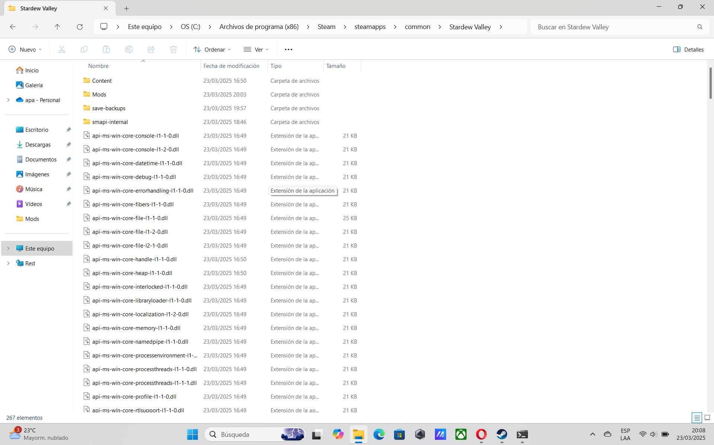
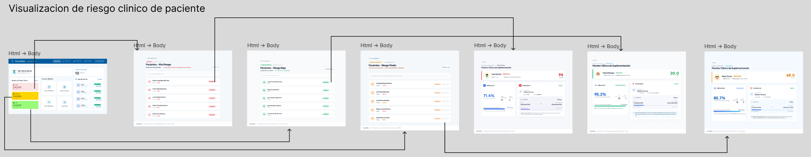
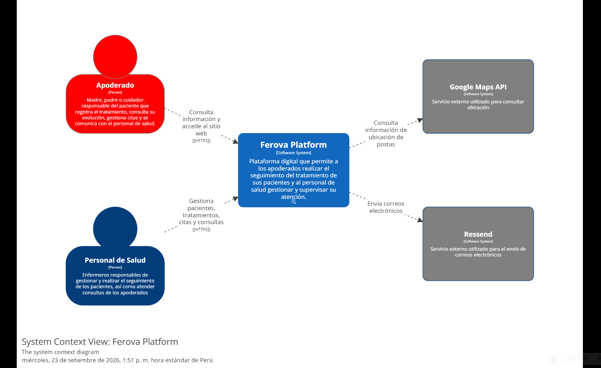
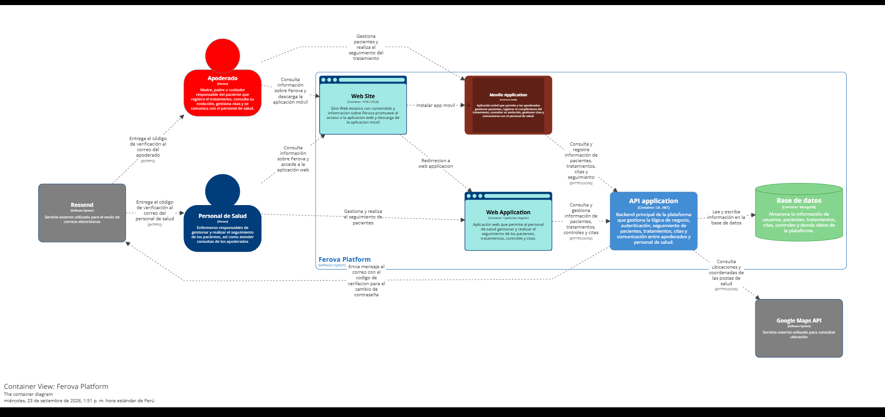
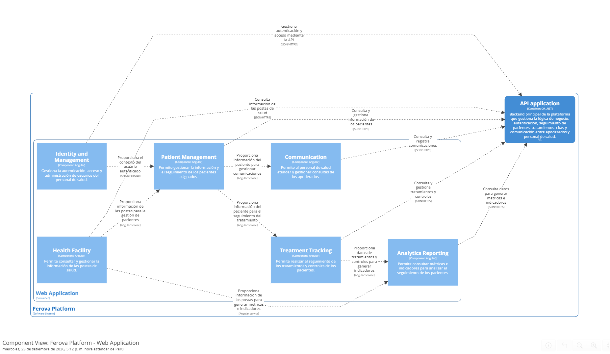
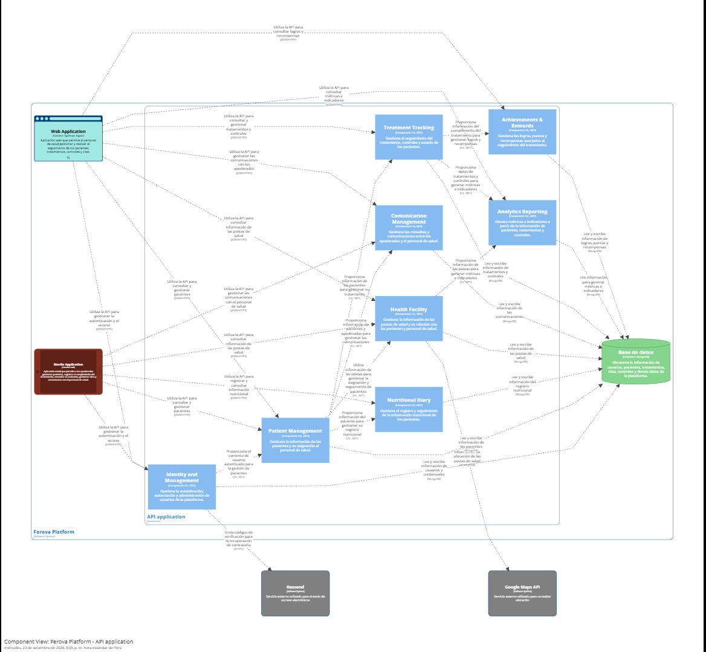
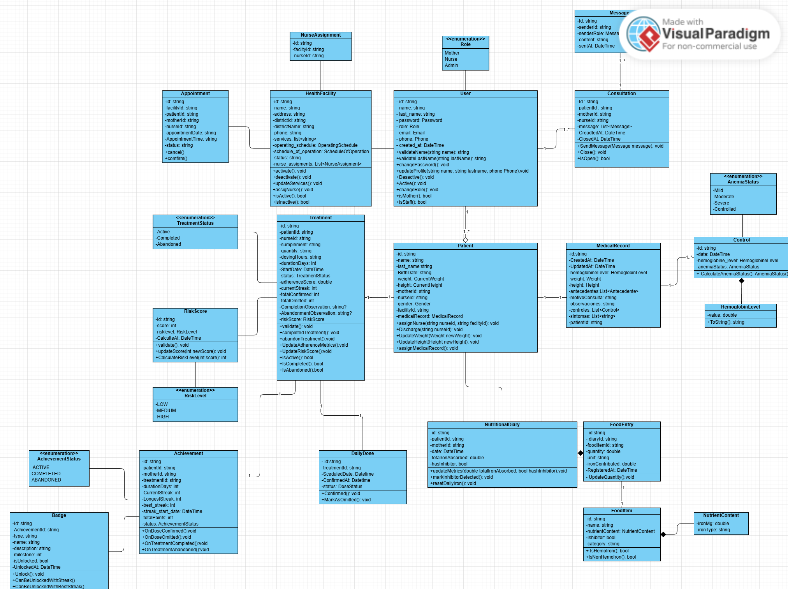
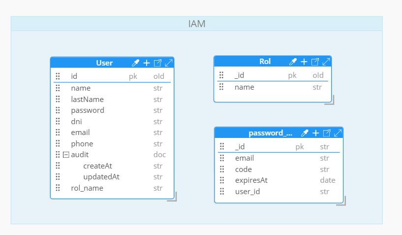
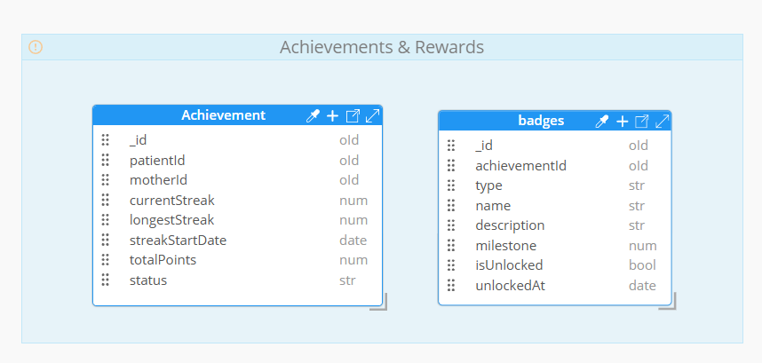
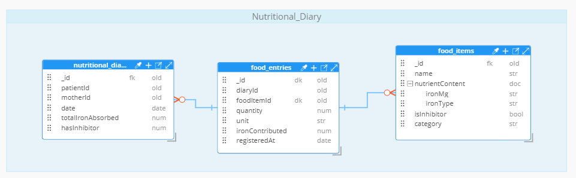

# Capítulo IV: Product Design

## 4.1. Style Guidelines

Los *Style Guidelines* o guías de estilo constituyen el fundamento visual, normativo y de interacción para la construcción de una identidad de producto coherente, accesible y profesional a lo largo de todo el ecosistema de **Ferova**. La plataforma comprende dos frentes principales de interacción: **Ferova Family**, una solución móvil orientada a madres, padres y cuidadores que supervisan la administración del tratamiento de hierro en el hogar; y **Ferova Clinic**, una solución web para el personal de salud (médicos, enfermeras y técnicos) en los establecimientos de atención primaria encargados de monitorear la adherencia terapéutica y la evolución de los valores de hemoglobina. Asimismo, se considera la **Landing Page** institucional de **Sanuvi** como portal de captación y difusión.

El propósito central de estas directrices es reducir la fricción cognitiva en ambos perfiles de usuario, garantizar el cumplimiento de los estándares de accesibilidad digital WCAG 2.1 nivel AA y asegurar una experiencia unificada independientemente del dispositivo, plataforma o resolución en la que se interactúe.

---

### 4.1.1. General Style Guidelines

> Esta sección define los pilares transversales del sistema de diseño de Ferova: identidad de marca (Branding), sistema tipográfico con la familia tipográfica Inter, paleta de colores cromática y semántica basada en los tonos clave `#003178` y `#7C0303`, sistema modular de espaciado, dimensiones del tono de voz (Four Dimensions of Tone of Voice) y principios de diseño inclusivo.

---

#### Branding

La identidad visual de Ferova sintetiza el compromiso social de la startup Sanuvi por erradicar la anemia infantil en el Perú a través de la articulación tecnológica entre familias y el sistema de salud pública.

##### 1. Concepto e Isotipo
El identificador visual de Ferova integra tres metáforas esenciales:
1. **La Gota de Sangre y el Hierro:** Representa el valor hemático, la medición de hemoglobina y la administración de gotas de sulfato ferroso / hierro polimaltosado.
2. **El Escudo Protector y la Unión:** La silueta envolvente evoca protección clínica, cuidado maternal y acompañamiento continuo.
3. **El Corazón y la Vitalidad Infantil:** El remate de la curva sugiere afecto, calidez y el restablecimiento del vigor y desarrollo cognitivo de los niños.

##### 2. Anatomía del Logotipo y Tipografía de Marca
El logotipo se compone del isotipo estilizado seguido del imagotipo tipográfico "Ferova", escrito en caja alta y baja con la fuente **Inter** en peso *Bold* (700), aplicando un *tracking* de `-0.02em` para otorgar un porte institucional, moderno y amigable. Debajo del nombre se incluye el descriptor institucional "Cuidado y Control de la Anemia Infantil" en **Inter Regular** (400).

```
   [ ISOTIPO ]       FEROVA
  (Gota + Escudo)    Cuidado y Control de la Anemia Infantil
```

##### 3. Zona de Protección (Clearance Area)
Para preservar la legibilidad y el impacto visual del identificador, se establece un área de seguridad mínima alrededor del logotipo en la que no debe invadir ningún elemento tipográfico, gráfico o borde de pantalla.
- La zona de seguridad equivale a la altura $X$, donde $X$ corresponde a la altura de la letra mayúscula **"F"** del logotipo de Ferova.
- Esta separación perimetral de $1X$ debe respetarse rigurosamente en cabeceras web, tarjetas móviles, material impreso y piezas de comunicación.

##### 4. Dimensiones Mínimas de Reproducción
- **Canales Digitales (Web y Móvil):**
  - Logotipo completo (Isotipo + Logotipo tipográfico): Ancho mínimo de **120 px** (densidad 1x) o **60 pt** en pantallas de alta densidad.
  - Isotipo aislado (Favicon, icono de aplicación, avatar de navegación): **32 × 32 px** como tamaño mínimo absoluto en web; **48 × 48 dp/pt** en aplicaciones móviles para conservar definición.
- **Canales Impresos:**
  - Logotipo completo: Ancho mínimo de **25 mm**.
  - Isotipo aislado: Dimensiones mínimas de **8 × 8 mm**.

##### 5. Variantes Permitidas de la Marca
- **Versión Principal a Color (Fondo Claro):** Isotipo en combinación cromática Azul Clínico (`#003178`) y Rojo Óxido (`#7C0303`), con tipografía en Azul Clínico (`#003178`) sobre superficies blancas o neutras claras (`#FFFFFF` o `#F8FAFC`).
- **Versión Negativa / Invertida (Fondo Oscuro):** Isotipo a dos colores adaptados o blanco puro, con tipografía en Blanco Puro (`#FFFFFF`) sobre fondos corporativos Azul Clínico (`#003178`) o superficies oscuras (`#0F172A`).
- **Versión Monocromática:** Empleada en reportes clínicos impresos en escala de grises o documentos oficiales de centros de salud con restricciones de tinta: Isotipo y texto en Negro 100% (`#0F172A`) sobre fondo blanco, o blanco puro sobre negro.

##### 6. Usos Incorrectos y Restricciones
Para mantener la integridad visual de Ferova, se prohíbe taxativamente:

| Práctica Prohibida | Razón Técnica y de Percepción |
|:---|:---|
| **Distorsionar proporciones** (estirar horizontal o verticalmente) | Degrada la percepción de rigurosidad médica y calidad tecnológica. |
| **Alterar los colores corporativos** (usar rojos brillantes saturados o azules cielo) | Rompe la consonancia con el sistema de tokens y el rigor clínico. |
| **Colocar sobre fondos fotográficos complejos sin contraste** | Impide el reconocimiento accesible por usuarios con agudeza visual reducida. |
| **Aplicar efectos visuales obsoletos** (biseles, sombras 3D duras, degradados arcoíris) | Contradice los principios de diseño de interfaz limpios, modernos y funcionales. |
| **Separar o recomponer los componentes del logo fuera de la cuadrícula normada** | Fragmenta la unidad de la marca en puntos de contacto clave. |

##### 7. Co-Branding y Relación Sanuvi – Ferova
En la Landing Page institucional y en los pies de página de Ferova Clinic se especifica claramente el endoso corporativo bajo el formato: **"Ferova, una iniciativa de Sanuvi"**. Ante eventuales integraciones o despliegues pilotos en centros de salud del MINSA o EsSalud, el imagotipo de Ferova se ubica a la izquierda, separado por una línea divisoria vertical de `1px` en tono `#CBD5E1` de `24px` de altura, seguido del escudo o logotipo de la entidad correspondiente respetando idéntica jerarquía visual.

---

#### Typography

La tipografía elegida como fuente primaria y única para todo el ecosistema Ferova (Landing Page, Ferova Clinic Web y Ferova Family Mobile) es **Inter**, una familia tipográfica sans-serif de código abierto diseñada específicamente por Rasmus Andersson para interfaces de usuario en pantallas de computadoras y dispositivos móviles.

##### 1. Justificación Técnica de la Elección
- **Gran Altura de X (*x-height*):** Las minúsculas poseen una proporción vertical amplia respecto a las mayúsculas, lo que incrementa notablemente la legibilidad de textos informativos en dosis, horarios y nombres de medicamentos en pantallas pequeñas de smartphones de gama media o baja.
- **Diferenciación Clícica de Caracteres Críticos:** Inter cuenta con glifos cuidadosamente diferenciados para caracteres que suelen inducir a error médico en fuentes estándar, tales como la `I` mayúscula (con serifa opcional), el número `1`, y la letra `l` minúscula.
- **Rendimiento de Carga y Soporte Open Source:** Al estar disponible en Google Fonts y contar con versiones como fuente variable (*variable font*), optimiza el peso de transferencia de red (clave en postas rurales o periféricas con conectividad 3G/4G limitada).
- **Consistencia Multiplataforma:** Proporciona una experiencia homogénea al transitar entre el panel web de la enfermera y la aplicación móvil del apoderado.

##### 2. Pesos Tipográficos Utilizados
Para mantener una jerarquía limpia sin sobrecargar los recursos, el sistema se restringe a cuatro pesos fundamentales:

- **Regular (Weight 400):** Empleado en texto corrido, párrafos explicativos, descripciones de alimentos facilitadores e inhibidores de hierro, textos de ayuda (*hint text*) y valores de tablas clínicas.
- **Medium (Weight 500):** Utilizado en etiquetas de formularios (*labels*), elementos de navegación secundaria, textos de botones secundarios y estados de componentes interactivos.
- **SemiBold (Weight 600):** Aplicado en subtítulos de sección, encabezados de tarjetas (*cards*), encabezados de columnas de tablas clínicas, botones principales y cifras destacadas en paneles de adherencia.
- **Bold (Weight 700):** Reservado para títulos principales de página (H1), cifras críticas de hemoglobina, títulos de modales de confirmación y llamadas a la acción prioritarias.

##### 3. Escala Tipográfica Modular (Modular Type Scale)
Se implementa una escala modular basada en múltiplos y submúltiplos de **16 px** (1 rem), asegurando una correlación directa entre el entorno Web de escritorio y el entorno Móvil:

| Nivel Jerárquico | Token / Etiqueta | Tamaño Web | Line-Height Web | Tamaño Mobile | Line-Height Mobile | Peso | Uso Principal |
|:---|:---|:---:|:---:|:---:|:---:|:---:|:---|
| **Display / Hero** | `type-display` | 36 px (2.25 rem) | 44 px | 30 px (1.875 rem) | 36 px | Bold (700) | Portadas de Landing Page y cabeceras de bienvenida. |
| **Heading 1** | `type-h1` | 30 px (1.875 rem) | 38 px | 24 px (1.50 rem) | 32 px | Bold (700) | Títulos principales de pantallas en Ferova Clinic y Family. |
| **Heading 2** | `type-h2` | 24 px (1.50 rem) | 32 px | 20 px (1.25 rem) | 26 px | SemiBold (600) | Títulos de secciones principales, paneles y modales. |
| **Heading 3** | `type-h3` | 20 px (1.25 rem) | 28 px | 18 px (1.125 rem) | 24 px | SemiBold (600) | Títulos de tarjetas de pacientes y bloques de contenido. |
| **Heading 4 / Subtitle** | `type-h4` | 18 px (1.125 rem) | 26 px | 16 px (1.00 rem) | 22 px | Medium (500) | Subtítulos explicativos, encabezados de listas agrupadas. |
| **Body Large** | `type-body-lg` | 16 px (1.00 rem) | 24 px | 16 px (1.00 rem) | 24 px | Regular (400) | Texto principal de lectura y guías nutricionales. |
| **Body Default** | `type-body` | 14 px (0.875 rem) | 20 px | 14 px (0.875 rem) | 20 px | Regular (400) | Contenido de celdas en tablas clínicas, listas de ítems. |
| **Caption / Small** | `type-caption` | 12 px (0.75 rem) | 16 px | 12 px (0.75 rem) | 16 px | Regular (400) / Med (500) | Metadatos, marcas de tiempo, etiquetas secundarias. |
| **Overline / Badge** | `type-overline` | 11 px (0.6875 rem) | 14 px | 11 px (0.6875 rem) | 14 px | SemiBold (600) | Indicadores de estado de dosis (Mayúsculas con `letter-spacing: 0.05em`). |

##### 4. Reglas de Composición Tipográfica
- **Alineación:** Siempre justificada a la izquierda (*left-aligned*) en textos en español para garantizar ríos de lectura regulares y facilitar el rastreo visual. Queda estrictamente desaconsejada la justificación completa (*justify*).
- **Longitud de Línea Óptima:** Los bloques de texto continuo se limitan a un ancho máximo de entre **45 y 75 caracteres por línea** (aproximadamente `600 px` a `720 px` en desktop), evitando la fatiga visual del personal médico durante jornadas extensas.
- **Espaciado Entre Párrafos:** Todo párrafo finaliza con un margen inferior de `12 px` a `16 px` (tokens `spacing-3` o `spacing-4`), evitando dobles saltos de línea manuales y preservando el ritmo vertical.

---

#### Colors

La paleta cromática de Ferova se fundamenta en dos colores ancla dictados por la naturaleza médica y humana del problema: el **Azul Clínico Profundo (`#003178`)**, que aporta confiabilidad, serenidad institucional y rigor profesional, y el **Rojo Óxido / Hemoglobina (`#7C0303`)**, que representa la sangre, el tratamiento de reposición de hierro y la urgencia vital de combatir la anemia infantil.

A partir de estos dos ejes, se desarrolló una escala cromática completa con tokens semánticos, neutros y de soporte calibrados para superar las directrices de contraste WCAG 2.1 AA y AAA.

```
       #003178                      #7C0303
  [ Azul Clínico Profundo ]     [ Rojo Óxido / Hierro ]
  Confianza médica, serenidad    Hemoglobina, gotas de hierro,
  y rigor institucional          alerta y vitalidad infantil
```

##### 1. Paleta Primaria: Azul Clínico Profundo (`#003178`)
Color corporativo institucional y de mayor jerarquía visual en navegación, botones primarios, cabeceras y gráficos clínicos en Ferova Clinic y Landing Page.

| Token | Código HEX | Valor RGB | Valor HSL | Rol en la Interfaz |
|:---|:---:|:---:|:---:|:---|
| `primary-50` | `#EBF1FA` | rgb(235, 241, 250) | hsl(216, 60%, 95%) | Fondos suaves de tarjetas activas, estados hover sutiles. |
| `primary-100` | `#D0DDF3` | rgb(208, 221, 243) | hsl(218, 58%, 88%) | Bordes de selección, contenedores de badges primarios. |
| `primary-200` | `#A2BEE7` | rgb(162, 190, 231) | hsl(216, 57%, 77%) | Indicadores inactivos, divisores destacados. |
| `primary-300` | `#6B93D6` | rgb(107, 147, 214) | hsl(218, 59%, 63%) | Focus rings de accesibilidad, gráficos comparativos. |
| `primary-400` | `#3467BE` | rgb(52, 103, 190) | hsl(218, 57%, 47%) | Enlaces interactivos, estados hover de elementos secundarios. |
| **`primary-500` (Base)** | **`#003178`** | **rgb(0, 49, 120)** | **hsl(216, 100%, 24%)** | **Color Primario Base:** Botones principales, cabeceras, sidebar. |
| `primary-600` | `#002A66` | rgb(0, 42, 102) | hsl(216, 100%, 20%) | Estado hover/active de botones primarios. |
| `primary-700` | `#002254` | rgb(0, 34, 84) | hsl(216, 100%, 16%) | Estado pressed y cabeceras de tablas clínicas. |
| `primary-800` | `#001A40` | rgb(0, 26, 64) | hsl(216, 100%, 13%) | Fondos oscuros de alta jerarquía. |
| `primary-900` | `#00112B` | rgb(0, 17, 43) | hsl(216, 100%, 8%) | Sombras profundas y contrastes extremos. |

##### 2. Paleta Secundaria: Rojo Óxido / Hemoglobina (`#7C0303`)
Color de acento médico y simbólico. Representa directamente el hierro medicinal (sulfato ferroso y polimaltosado), la hemoglobina y la adherencia en Ferova Family, así como alertas críticas de nivel de anemia en Ferova Clinic.

| Token | Código HEX | Valor RGB | Valor HSL | Rol en la Interfaz |
|:---|:---:|:---:|:---:|:---|
| `secondary-50` | `#FDF2F2` | rgb(253, 242, 242) | hsl(0, 67%, 97%) | Fondo de tarjetas de tratamiento y avisos de dosis. |
| `secondary-100` | `#FBE4E4` | rgb(251, 228, 228) | hsl(0, 64%, 94%) | Badges de alerta de anemia severa, bordes de recordatorio. |
| `secondary-200` | `#F5BDBD` | rgb(245, 189, 189) | hsl(0, 69%, 85%) | Ilustraciones y elementos decorativos de apoyo. |
| `secondary-300` | `#E98888` | rgb(233, 136, 136) | hsl(0, 68%, 72%) | Gráficos de evolución de hemoglobina (rango bajo). |
| `secondary-400` | `#B53030` | rgb(181, 48, 48) | hsl(0, 58%, 45%) | Acentos interactivos secundarios. |
| **`secondary-500` (Base)** | **`#7C0303`** | **rgb(124, 3, 3)** | **hsl(0, 95%, 25%)** | **Color Secundario Base:** Iconos de dosis de hierro, acción clave en Family. |
| `secondary-600` | `#690202` | rgb(105, 2, 2) | hsl(0, 96%, 21%) | Hover de botones de registro de dosis. |
| `secondary-700` | `#560202` | rgb(86, 2, 2) | hsl(0, 95%, 17%) | Textos de alerta médica sobre fondos rosados claros. |
| `secondary-800` | `#420101` | rgb(66, 1, 1) | hsl(0, 97%, 13%) | Títulos de gravedad clínica. |
| `secondary-900` | `#2D0101` | rgb(45, 1, 1) | hsl(0, 96%, 9%) | Contrastes máximos de alerta. |

##### 3. Colores de Acento y Soporte Funcional
- **Bio Teal / Salud Nutricional (`#0D9488`):** Derivado para representar alimentos ricos en hierro (sangrecita, bazo, hígado), nutrición saludable y estilos de vida adecuados. Complementa armoniosamente la paleta sin competir con el rojo y el azul.
  - Base: `#0D9488` | Fondo: `#F0FDFA` | Borde: `#99F6E4`
- **Iron Gold / Motivación y Gamificación (`#F59E0B`):** Destinado a medallas de cumplimiento de tratamiento, rachas de días consecutivos administrando el hierro y felicitaciones al cuidador.
  - Base: `#F59E0B` | Fondo: `#FFFBEB` | Borde: `#FDE68A`

##### 4. Colores Semánticos del Sistema (Feedback UX)
Diseñados para proporcionar retroalimentación inequívoca sobre el estado del paciente o del sistema:

| Estado Semántico | Token de Superficie (Surface) | Token de Borde (Border) | Token de Texto / Icono (Content) | Caso de Uso en Ferova |
|:---|:---:|:---:|:---:|:---|
| **Éxito (Success)** | `#ECFDF5` | `#86EFAC` | `#15803D` | Dosis diaria de hierro confirmada y registrada; hemoglobina dentro del valor normal (> 11.0 g/dL). |
| **Advertencia (Warning)** | `#FFFBEB` | `#FDE68A` | `#B45309` | Dosis pendiente por tomar en la ventana horaria; cita de control médico programada en los próximos 3 días. |
| **Peligro / Error (Danger)** | `#FEF2F2` | `#FECACA` | `#DC2626` | Dosis no administrada fuera de horario; anemia moderada o severa detectada (< 9.9 g/dL); error en registro. |
| **Información (Info)** | `#EFF6FF` | `#BFDBFE` | `#1D4ED8` | Mensaje educativo de absorción (ej. "Acompañar con vitamina C"); notificación de la posta de salud. |

##### 5. Escala de Neutros y Superficies
Basada en la gama Slate para garantizar armonía fría con el Azul Clínico:

| Token | Código HEX | Uso en Interfaz |
|:---|:---:|:---|
| `neutral-white` | `#FFFFFF` | Superficie de tarjetas (*card background*), modales, fondos de inputs. |
| `neutral-50` | `#F8FAFC` | Fondo general de pantallas en Web y Mobile (*canvas background*). |
| `neutral-100` | `#F1F5F9` | Fondos de inputs inactivos, cabeceras de tablas secundarias. |
| `neutral-200` | `#E2E8F0` | Líneas divisorias, bordes de tarjetas y bordes de campos de formulario. |
| `neutral-300` | `#CBD5E1` | Bordes en estado hover, separadores marcados. |
| `neutral-400` | `#94A3B8` | Iconos inactivos, texto de *placeholder* en inputs. |
| `neutral-500` | `#64748B` | Textos terciarios, marcas de agua, leyendas de gráficos. |
| `neutral-600` | `#475569` | Textos secundarios, etiquetas de metadatos, subtítulos. |
| `neutral-700` | `#334155` | Texto de cuerpo principal en modo de alta densidad. |
| `neutral-800` | `#1E293B` | Encabezados de tarjetas, títulos secundarios. |
| `neutral-900` | `#0F172A` | Títulos principales (H1/H2) y texto de alto contraste. |

##### 6. Matriz de Cumplimiento de Accesibilidad y Ratios de Contraste (WCAG 2.1)
Se evaluó el contraste de los colores clave contra los fondos del sistema mediante la fórmula de luminancia relativa de la W3C:

| Combinación Evaluada | Color de Texto | Color de Fondo | Ratio de Contraste | Cumplimiento WCAG 2.1 | Evaluación |
|:---|:---:|:---:|:---:|:---:|:---|
| **Azul Primario sobre Blanco** | `#003178` | `#FFFFFF` | **12.28 : 1** | AAA (Pasa) | Excelente legibilidad en botones primarios y títulos. |
| **Azul Primario sobre Canvas** | `#003178` | `#F8FAFC` | **11.75 : 1** | AAA (Pasa) | Óptimo para encabezados de sección. |
| **Rojo Secundario sobre Blanco** | `#7C0303` | `#FFFFFF` | **11.19 : 1** | AAA (Pasa) | Alta visibilidad para advertencias y acentos de hierro. |
| **Blanco sobre Azul Primario** | `#FFFFFF` | `#003178` | **12.28 : 1** | AAA (Pasa) | Contraste perfecto para botones y cabeceras sólidas. |
| **Blanco sobre Rojo Secundario** | `#FFFFFF` | `#7C0303` | **11.19 : 1** | AAA (Pasa) | Contraste ideal en botones de acción crítica. |
| **Texto Primario sobre Blanco** | `#0F172A` | `#FFFFFF` | **18.73 : 1** | AAA (Pasa) | Lectura descansada en párrafos extensos y tablas. |
| **Texto Secundario sobre Blanco** | `#475569` | `#FFFFFF` | **5.45 : 1** | AA (Pasa) | Cumple estándar para texto regular (> 4.5:1). |
| **Texto de Éxito sobre Fondo Verde** | `#15803D` | `#ECFDF5` | **5.32 : 1** | AA (Pasa) | Indicadores legibles sin fatiga. |
| **Texto de Peligro sobre Fondo Rojo** | `#7C0303` | `#FDF2F2` | **10.35 : 1** | AAA (Pasa) | Alertas clínicas nítidas y seguras. |

---

#### Spacing

El dimensionamiento espacial y layout de Ferova se rige por un **sistema de cuadrícula de 8 puntos (8-point grid system)** con el apoyo de un token sub-base de **4 px** para microalineaciones. Esta decisión matemática garantiza simetría visual, previsibilidad al maquetar componentes y adaptabilidad modular en Flutter / Jetpack Compose / SwiftUI y CSS Flexbox / Grid.

##### 1. Escala de Tokens de Espaciado

| Token | Medida (px) | Medida (rem) | Aplicación Típica en Componentes y Vistas |
|:---|:---:|:---:|:---|
| `spacing-0.5` | 2 px | 0.125 rem | Ajustes milimétricos, bordes activos, grosor de líneas de progreso. |
| `spacing-1` | 4 px | 0.250 rem | Micro-gap entre iconos y texto en badges; padding interno de tags. |
| `spacing-2` | 8 px | 0.500 rem | Separación entre avatar y nombre; espaciado en grupos de botones compactos. |
| `spacing-3` | 12 px | 0.750 rem | Padding vertical en celdas de tablas clínicas; padding interno de inputs estándar. |
| `spacing-4` | 16 px | 1.000 rem | **Paso Base:** Padding interno de tarjetas (*cards*), márgenes laterales móviles estándar. |
| `spacing-5` | 20 px | 1.250 rem | Separación entre bloques de formularios en modales y paneles. |
| `spacing-6` | 24 px | 1.500 rem | Gutter entre columnas de escritorio; separación entre tarjetas de métricas. |
| `spacing-8` | 32 px | 2.000 rem | Padding de secciones en dashboard web; márgenes perimetrales en pantallas amplias. |
| `spacing-10` | 40 px | 2.500 rem | Separación entre bloques funcionales diferenciados en desktop. |
| `spacing-12` | 48 px | 3.000 rem | Altura estándar de áreas táctiles mínimas (*touch targets*) y espaciado de secciones. |
| `spacing-16` | 64 px | 4.000 rem | Separación entre bloques macro en Landing Page. |

##### 2. Tokens de Radio de Curvatura (Border Radius)
La morfología de los bordes busca transmitir una sensación de proximidad, cuidado infantil y suavidad táctil, huyendo de esquinas filosas punitivas:

| Token | Radio (px) | Propósito |
|:---|:---:|:---|
| `rounded-none` | 0 px | Contenedores a sangre, divisores de tablas. |
| `rounded-sm` | 4 px | Checkboxes, tooltips, tags de estado muy compactos. |
| `rounded-md` | 8 px | Botones estándar, inputs de formularios, selects desplegables. |
| `rounded-lg` | 12 px | Tarjetas de información (*cards*), diálogos modales, menús flotantes. |
| `rounded-xl` | 16 px | Contenedores principales en vistas móviles, hojas de acción inferiores (*bottom sheets*). |
| `rounded-2xl` | 24 px | Banners destacados de felicitación y métricas de racha. |
| `rounded-full` | 9999 px | Botones flotantes (FAB), avatares, chips de filtro y píldoras de navegación activa. |

##### 3. Tokens de Elevación y Profundidad (Elevation & Box Shadows)
Las elevaciones delimitan niveles de interacción mediante sombras suaves de tono Slate frío, evitando ensuciar la interfaz:

- **Plano (`shadow-none`):** Componentes integrados a la superficie con borde `neutral-200` de 1 px.
- **Bajo (`shadow-sm`):** `0px 1px 2px rgba(15, 23, 42, 0.05)`. Empleado en tarjetas de datos en reposo y botones secundarios.
- **Medio (`shadow-md`):** `0px 4px 6px -1px rgba(15, 23, 42, 0.10), 0px 2px 4px -2px rgba(15, 23, 42, 0.05)`. Empleado en menús desplegables (*dropdowns*), tarjetas en estado hover y notificaciones toast.
- **Alto (`shadow-lg`):** `0px 10px 15px -3px rgba(15, 23, 42, 0.10), 0px 4px 6px -4px rgba(15, 23, 42, 0.05)`. Empleado en modales de escritorio, diálogos de confirmación y hojas inferiores móviles.

---

#### Tone of Voice

El tono y la voz de Ferova se estructuran rigurosamente bajo el marco de las **Cuatro Dimensiones del Tono de Voz (*The Four Dimensions of Tone of Voice*)** desarrollado por el Nielsen Norman Group (NN/g). La comunicación se calibra de forma diferenciada según se dirija a la familia o al profesional de salud, salvaguardando siempre la empatía, el rigor y la claridad pedagógica.

```
  [ Funny ] ─────────────●───────────── [ Serious ]          (Serio pero afectuoso)
  [ Casual ] ────────────●───────────── [ Formal ]           (Diferenciado según rol)
  [ Irreverent ] ──────────────────────● [ Respectful ]       (Completamente respetuoso)
  [ Enthusiastic ] ──────●───────────── [ Matter-of-Fact ]   (Alentador con datos claros)
```

##### 1. Análisis de las Cuatro Dimensiones

1. **Humor vs. Seriedad (Serious with Warmth):**
   - *Posición:* Inclinado decididamente hacia la **Seriedad**, mitigada con **Calidez Humana**.
   - *Justificación:* La anemia ferropénica compromete el desarrollo cognitivo y motriz del infante, por lo que el humor o bromas resultarían frívolos e inapropiados. No obstante, en Ferova Family la seriedad nunca se confunde con frialdad: se emplea un lenguaje reconfortante que celebra los avances de los cuidadores.
2. **Formalidad vs. Informalidad (Context-Adaptive Formal/Casual):**
   - *Ferova Clinic (Personal de Salud):* **Formal – Técnico:** Comunicación directa, precisa, sintética y basada en métricas estandarizadas del MINSA (dosis en mg/kg/día, valores de Hb en g/dL, porcentaje de adherencia).
   - *Ferova Family (Cuidadores):* **Cercano – Coloquial Respetuoso:** Lenguaje sencillo, despojado de tecnicismos intimidantes, utilizando metáforas cotidianas (ejemplo: "gotitas de hierro", "alimentos amigos y enemigos de la absorción").
3. **Respeto vs. Irreverencia (Unconditionally Respectful & Non-Punitive):**
   - *Posición:* **100% Respetuoso y Comprensivo.**
   - *Justificación:* Las madres y cuidadores a menudo experimentan culpa, sobrecarga doméstica o angustia ante un olvido de dosis. Ferova **nunca juzga ni utiliza lenguaje punitivo**. Cuando ocurre una omisión, el sistema asume una postura de solución constructiva ("No te preocupes, lo importante es retomar el camino; administra la siguiente dosis según el horario habitual").
4. **Entusiasmo vs. Materia de Hecho (Matter-of-Fact vs. Encouraging):**
   - *Ferova Clinic:* **Materia de Hecho (*Matter-of-fact*):** Presentación sobria, estructurada y sin adornos adjetivales, facilitando decisiones rápidas.
   - *Ferova Family:* **Moderadamente Entusiasta y Motivador:** Se reconoce el esfuerzo del cuidador mediante microcopys positivos cuando se cumple la meta semanal, fortaleciendo el hábito terapéutico.

##### 2. Matriz de Ejemplos de Microcopy en Situaciones Críticas

| Escenario de Interacción | Enfoque Incorrecto (Antipatrón) | Mensaje en Ferova Family (Cuidador) | Mensaje en Ferova Clinic (Personal de Salud) |
|:---|:---|:---|:---|
| **Registro exitoso de la dosis diaria** | *"Operación exitosa. Código de transacción 200."* | *"¡Muy bien! Registraste las 5 gotitas de Matías de hoy. ¡Cada día más fuerte!"* | *"Dosis diaria confirmada por el apoderado (10:15 AM). Adherencia mensual actualizada al 94%."* |
| **Dosis olvidada o retrasada** | *"¡ALERTA! Has olvidado darle el medicamento a tu hijo. Riesgo de recaída."* | *"Parece que la dosis de la mañana no se tomó a tiempo. No dupliques la siguiente; dásela en su horario habitual de las 6:00 PM."* | *"Dosis matutina omitida reportada. Alerta de riesgo moderado de abandono terapéutico."* |
| **Acompañamiento nutricional** | *"Consumo de quelantes férricos detectado."* | *"Consejo Ferova: Dale a Matías sus gotitas con mandarina o camu camu. Evita darle leche o té una hora antes y después."* | *"Orientación sobre inhibidores de absorción férrica registrada en el expediente familiar."* |
| **Recordatorio de control de hemoglobina** | *"Tiene cita obligatoria en posta médica mañana."* | *"Hola Rosa, mañana toca el control de hemoglobina de Matías en la Posta de San Juan. ¡Lleva su carné de vacunación!"* | *"Paciente Matías Quispe citado para dosaje de hemoglobina de control: 27/09/2026 - Turno Mañana."* |
| **Error en el ingreso de datos** | *"Input inválido: campo requerido."* | *"Por favor, escribe cuántas gotitas tomó Matías hoy para poder guardarlo."* | *"Error de validación: El campo de dosificación (gotas/ml) no puede estar vacío."* |

---

#### Inclusive Design & Accessibility

El diseño inclusivo en Ferova no es una característica opcional, sino una exigencia fundamental de equidad en salud pública. Las directrices responden a la realidad socio-sanitaria peruana, contemplando a madres que atienden a sus hijos en condiciones de baja iluminación, cuidadores con diferentes niveles de instrucción y personal de salud con sobrecarga de trabajo.

##### 1. Principios Operativos de Accesibilidad (WCAG 2.1 Nivel AA)
1. **Perceptibilidad:**
   - **No Dependencia Exclusiva del Color:** Ningún mensaje de estado se transmite únicamente mediante un cambio cromático. Todo badge o alerta combina **Color + Icono semántico distintivo + Texto explicativo explícito**. Por ejemplo, una dosis omitida utiliza fondo rojo, icono de alerta triangular y el texto "Omitida".
   - **Jerarquía de Contraste:** Todo texto normal mantiene un ratio de contraste igual o superior a **4.5:1** frente a su fondo, y todo texto grande (>= 18 px o >= 14 px negrita) supera **3.0:1**.
2. **Operabilidad:**
   - **Áreas Táctiles Mínimas (*Touch Targets*):** Todo botón, interruptor o icono interactivo cuenta con una superficie táctil mínima de **48 × 48 dp** en Android y **44 × 44 pt** en iOS, garantizando pulsaciones precisas incluso sosteniendo al niño con una mano.
   - **Navegabilidad por Teclado y Foco Visible:** En Ferova Clinic, el personal de enfermería puede desplazarse íntegramente mediante la tecla `Tab`, observando un anillo de foco visible (`focus-visible`) de 2 px en color Azul Interactivo (`#3467BE`) con desplazamiento (*offset*) de 2 px.
3. **Comprensibilidad:**
   - **Lenguaje Claro y Predictibilidad:** Formularios con etiquetas permanentes que no desaparecen al escribir, instrucciones contextuales previas al ingreso y mensajes de error orientados a la solución inmediata.
4. **Robustez Tecnológica:**
   - Compatibilidad nativa con lectores de pantalla (**TalkBack** en Android, **VoiceOver** en iOS, y **NVDA / JAWS** en navegadores web de escritorio) mediante etiquetas semánticas `aria-label`, roles de accesibilidad y etiquetado jerárquico estricto (H1 a H4).

---

### 4.1.2. Web Style Guidelines

Las directrices web definen la interfaz gráfica y los patrones ergonómicos de **Ferova Clinic** (aplicación web para profesionales de salud) y de la **Landing Page** de Sanuvi, concebidas para ejecutarse fluidamente en navegadores modernos (Google Chrome, Mozilla Firefox, Microsoft Edge, Safari).

---

#### 1. Sistema de Rejilla y Layout Responsive (Responsive Grid System)
La arquitectura de visualización web se basa en una rejilla fluida de **12 columnas** con puntos de interrupción (*breakpoints*) estandarizados:

| Breakpoint | Ancho Mínimo | Columnas | Márgenes Exteriores | Gutter (Separación) | Ancho Máximo Contenedor | Contexto de Uso |
|:---|:---:|:---:|:---:|:---:|:---:|:---|
| `sm` | 640 px | 4 | 16 px | 16 px | 100% | Visualización de emergencia en dispositivos móviles. |
| `md` | 768 px | 8 | 24 px | 20 px | 720 px | Tablets en orientación vertical y pantallas reducidas. |
| `lg` | 1024 px | 12 | 32 px | 24 px | 960 px | Laptops estándar de centros de salud y postas médicas. |
| `xl` | 1280 px | 12 | 32 px | 24 px | 1200 px | Monitores de escritorio habituales de consultorio. |
| `2xl` | 1536 px | 12 | 48 px | 32 px | 1440 px | Pantallas de alta resolución y estaciones de triaje. |

##### Arquitectura de Pantalla en Ferova Clinic:
- **Barra Lateral Izquierda (Navigation Sidebar):** Ancho fijo de `260 px` (colapsable a `72 px` en resoluciones inferiores a 1200 px). Fondo en Azul Clínico (`#003178`) o Blanco con borde derecho `neutral-200`. Contiene accesos directos: *Panel General*, *Lista de Pacientes*, *Alertas de Adherencia*, *Reportes MINSA*, *Configuración*.
- **Barra Superior de Control (Header Bar):** Altura fija de `64 px`, sticky al borde superior con `backdrop-filter: blur(8px)`. Incluye selector del centro de salud / posta médica actual, barra de búsqueda global por DNI o apellido del menor, campana de alertas con badge rojo y perfil del profesional de salud.
- **Lienzo de Contenido Principal (Main Workspace):** Fondo neutro `neutral-50` (`#F8FAFC`), padding de `32 px` perimetral para una disposición despejada de widgets y tablas clínicas.

---

#### 2. Componentes UI Clave para la Web

##### A. Botones Web (Buttons)
Los botones son los accionables prioritarios de la interfaz clínica:

- **Primary Button:**
  - Fondo: `#003178` (Azul Base) | Texto: `#FFFFFF` | Borde: Ninguno.
  - Hover: `#002A66` | Active: `#002254` | Focus: Anillo exterior `#6B93D6` de 2 px con offset de 2 px.
  - Altura: `40 px` (desktop) | Padding: `0 20 px` | Radio: `8 px` (`rounded-md`).
  - Uso: "Guardar Control", "Registrar Nuevo Paciente", "Generar Reporte".
- **Secondary Button (Outlined):**
  - Fondo: Transparente | Texto: `#003178` | Borde: 1.5 px sólido `#003178`.
  - Hover: Fondo `#EBF1FA` | Active: Fondo `#D0DDF3`.
  - Uso: "Filtrar Pacientes", "Exportar CSV", "Cancelar".
- **Accent Button (Rojo Óxido):**
  - Fondo: `#7C0303` | Texto: `#FFFFFF` | Borde: Ninguno.
  - Hover: `#690202` | Active: `#560202`.
  - Uso: "Emitir Alerta Crítica", "Contactar Urgencia al Apoderado".
- **Ghost / Text Button:**
  - Fondo: Transparente | Texto: `#003178` | Hover: Fondo `neutral-100`.
  - Uso: Acciones secundarias en filas de tablas clínicas ("Ver Historial").
- **Disabled State (Universal):**
  - Fondo: `#E2E8F0` | Texto: `#94A3B8` | Borde: Ninguno | Cursor: `not-allowed`.

##### B. Tablas de Datos Clínicos (Data Tables)
Componente vertebral de Ferova Clinic para la monitorización simultánea de múltiples niños en tratamiento:
- **Cabecera de Tabla:** Fondo `neutral-100` (`#F1F5F9`), texto en `neutral-700` SemiBold (12 px mayúsculas), padding `12 px 16 px`, borde inferior `neutral-200`. Cabecera fijada (*sticky header*) al hacer scroll.
- **Filas de Datos:** Altura regular de `56 px`, fondo blanco, separadas por bordes sutiles de `1 px` en `neutral-200`. Estado *hover* con fondo sutil `neutral-50` (`#F8FAFC`).
- **Paginación y Filtrado Rápido:** Barra inferior con selector de 10/25/50 registros y estado de avance, acompañada de chips de filtro superior (Todos, Adherencia Óptima, En Riesgo, Inactivos).

##### C. Tarjetas de Indicadores Clave (KPI Metric Cards)
- Superficie blanca con borde de `1 px` en `neutral-200`, radio de `12 px` y sombra `shadow-sm`.
- Estructura interior: Icono temático superior en contenedor circular de color semántico (40 × 40 px), cifra macro destacada en **28 px Bold**, etiqueta descriptiva en **14 px Medium** `neutral-600`, e indicador de variación porcentual mensual (verde para incremento de adherencia, rojo para aumento de deserción).

##### D. Formularios y Campos de Entrada (Form Controls)
- **Inputs de Texto y Selectores:** Altura estándar de `42 px`, fondo blanco, borde de `1 px` en `neutral-300`, radio de `8 px`. Texto en 14 px Regular.
- **Etiquetas Permanentes (*Top Labels*):** Posicionadas sobre el campo en 14 px Medium `neutral-800`, evitando el uso de placeholders como único indicador.
- **Estados de Validación:** Borde rojo `#DC2626` con icono de error y mensaje explicativo inferior de 12 px al detectar datos anómalos (por ejemplo, valor de hemoglobina fuera de rango biológico admisible).

##### E. Modales y Paneles Deslizables (Drawers)
- Modales centrados con ancho de `520 px` a `680 px`, radio de `12 px`, cabecera con botón de cierre accesible (`Esc` funcional) y *backdrop overlay* oscurecido (`rgba(15, 23, 42, 0.5)` con desenfoque de 4 px).
- Paneles laterales deslizables (*Drawers*) desde el margen derecho (`480 px` de ancho) para consultar el historial completo de un niño sin abandonar la tabla de pacientes.

##### F. Notificaciones Temporales Flotantes (Toasts)
- Ubicadas en la esquina superior derecha (`top: 24px`, `right: 24px`), con ancho de `360 px`, elevación `shadow-md`, radio de `8 px`, barra de progreso de desaparición automática a los 5 segundos y botón manual de descarte.

---

### 4.1.3. Mobile Style Guidelines

Las directrices móviles gobiernan el diseño y la experiencia de usuario de **Ferova Family**, la aplicación orientada a los apoderados. Dado que el contexto de uso habitual involucra a cuidadores realizando labores del hogar o atendiendo al niño, la ergonomía táctil y la simplicidad son prioritarias.

---

#### 1. Principios Ergonómicos Móviles (Thumb-Zone Design)
- **Diseño Orientado al Pulgar:** El 80% de las acciones críticas (marcar dosis tomada, consultar cantidad de gotas, revisar próxima cita) se ubican dentro de la "Zona Natural del Pulgar" (tercio inferior y medio de la pantalla).
- **Reducción de Clics a la Meta:** El flujo principal de registrar la toma de la dosis diaria se resuelve en **máximo 2 toques** desde el arranque de la aplicación.
- **Separación Táctil Preventiva:** Los botones destructivos o de cancelación cuentan con una separación mínima de `16 px` respecto al botón de confirmación para impedir pulsaciones accidentales.

```
  ┌──────────────────────┐
  │     Zona Difícil     │  <- Metadatos, foto de perfil, configuración
  ├──────────────────────┤
  │    Zona Accesible    │  <- Indicador visual de racha, información de dosis
  ├──────────────────────┤
  │     ZONA CÓMODA      │  <- BOTÓN PRINCIPAL "REGISTRAR DOSIS",
  │      DEL PULGAR      │     Navegación inferior (Bottom Bar)
  └──────────────────────┘
```

#### 2. Patrones de Navegación y Transición
- **Barra de Navegación Inferior Persistente:** Mantiene 4 destinos principales:
  1. *Tratamiento / Hoy* (Icono de gota/reloj - seguimiento del día)
  2. *Nutrición* (Icono de manzana/plato - alimentos ricos en hierro y combinaciones)
  3. *Citas* (Icono de calendario - controles de hemoglobina y vacunas)
  4. *Mi Familia* (Icono de perfil/niño - datos del menor y carné digital)
- **Hojas de Acción Inferiores (*Bottom Sheets*):** Se prioriza el uso de hojas deslizables desde el borde inferior sobre modales centrados para el registro de dosis, selección de gotas y confirmación de síntomas secundarios.
- **Gestos Táctiles Admitidos:**
  - *Tap:* Selección y confirmación inmediata.
  - *Swipe Horizontal:* Cambio entre días de la semana en el calendario de dosis.
  - *Pull to Refresh:* Deslizar hacia abajo en la pantalla principal para sincronizar datos con el servidor central de la posta de salud.

---

#### 4.1.3.1. iOS Mobile Style Guidelines

> Esta subsección define la implementación de las **Apple Human Interface Guidelines (HIG)** para la versión de Ferova Family en el sistema operativo iOS.

##### 1. Filosofía de Integración con HIG
La interfaz respeta la estética limpia, tipografía precisa, materiales translúcidos (*vibrancy*) y respuesta física natural características del ecosistema de Apple, integrando la identidad de Ferova sin vulnerar las expectativas de los usuarios de iPhone.

##### 2. Tipografía y Soporte de Dynamic Type
- Se implementa la tipografía **Inter** adaptada rigurosamente a las categorías métricas de **Dynamic Type de iOS**, garantizando que si el usuario amplía el tamaño de letra en los ajustes de accesibilidad de iOS, la aplicación escale de forma armónica:
  - *Large Title:* 34 pt | Bold | Tracking: 0.37 pt
  - *Title 1:* 28 pt | Bold | Tracking: 0.36 pt
  - *Title 2:* 22 pt | SemiBold | Tracking: 0.35 pt
  - *Headline:* 17 pt | SemiBold | Tracking: -0.41 pt
  - *Body:* 17 pt | Regular | Tracking: -0.41 pt
  - *Callout:* 16 pt | Regular | Tracking: -0.32 pt
  - *Subheadline:* 15 pt | Regular | Tracking: -0.24 pt
  - *Footnote / Caption 1:* 13 pt | Regular | Tracking: -0.08 pt

##### 3. Componentes de Navegación y Estructura iOS
- **Navigation Bar con Large Titles:**
  - En estado reposo superior, el título de la vista (ej. "Tratamiento de Matías") se despliega como *Large Title* (34 pt Bold).
  - Al realizar scroll ascendente, la barra se comprime suavemente hacia una barra estándar de 44 pt con título centrado inline (17 pt SemiBold) y material de desenfoque translúcido (`UIBlurEffect` estilo *SystemThinMaterial*).
- **Tab Bar Nativa:**
  - Altura estándar de 49 pt (más el inset de seguridad de la barra inferior).
  - Iconos lineales de estilo **SF Symbols** con trazo regular (2 pt). Icono activo coloreado en Azul Clínico (`#003178`), icono inactivo en gris neutral (`#94A3B8`). Fondo con material translúcido y borde superior divisorio de 0.5 pt (`separatorColor`).
- **Sheets Modales (UISheetPresentationController):**
  - El formulario de "Registrar Dosis" se presenta mediante una hoja modal (*sheet*) con *detents* interactivos al 50% (*medium*) para selección rápida de gotas y expandible al 100% (*large*) si el apoderado desea añadir notas sobre síntomas o alimentos consumidos. Las esquinas superiores incorporan un radio continuo de 16 pt y un indicador superior de arrastre (*grabber*).
- **Controles Nativos iOS:**
  - *Switches (UISwitch):* Tinte activo en Azul Clínico (`#003178`).
  - *Segmented Controls:* Utilizados para alternar entre "Gotas Mañana" y "Gotas Noche", con relieve sutil y deslizamiento háptico.
  - *Alertas Nativas (UIAlertController):* Con estilo estándar de iOS para diálogos de confirmación crítica ("¿Seguro que deseas eliminar el registro de dosis?").

##### 4. Respuesta Háptica (Haptic Feedback)
Se incorpora el motor háptico de iOS (`UIFeedbackGenerator`) para brindar retroalimentación física a las acciones del cuidador:
- **`UINotificationFeedbackGenerator(.success)`:** Pulso firme y satisfactorio al presionar el botón y completar el registro de la dosis diaria de hierro.
- **`UINotificationFeedbackGenerator(.warning)`:** Doble vibración suave si el usuario intenta registrar una dosis fuera de la ventana horaria recomendada.
- **`UIImpactFeedbackGenerator(.light)`:** Respuesta táctil al cambiar de pestaña en el Tab Bar o deslizar el selector de cantidad de gotas.

##### 5. Respeto al Safe Area y Dynamic Island
- Todos los elementos de interfaz se maquetan respetando los márgenes de seguridad del sistema (`safeAreaInsets`). Se garantiza que ningún botón o texto quede obstruido por la **Dynamic Island**, el notch superior o el indicador de inicio inferior (*Home Indicator*).

---

#### 4.1.3.2. Android Mobile Style Guidelines

> Esta subsección define la implementación de las directrices de **Material Design 3 (Material You)** para la versión de Ferova Family en el sistema operativo Android.

##### 1. Filosofía de Integración con Material Design 3
La aplicación adopta el sistema de diseño expresivo de Material Design 3 (M3), caracterizado por superficies elevadas mediante color tonal, formas redondeadas y orgánicas, contenedores adaptativos y componentes con alta affordance visual optimizados para dispositivos Android (desde Android 10 en adelante).

##### 2. Asignación de Roles de Color en Material 3 (Color Roles)
Los colores institucionales de Ferova se asignan a la arquitectura de tokens de M3 para conformar un esquema armónico:

| Rol de Color M3 | Token Ferova | Valor HEX | Uso Específico en Android |
|:---|:---|:---:|:---|
| **Primary** | `primary-500` | `#003178` | Color principal de botones rellenos, píldoras activas y acentos del sistema. |
| **On Primary** | `neutral-white` | `#FFFFFF` | Texto e iconos sobre el color Primary. |
| **Primary Container** | `primary-100` | `#D0DDF3` | Contenedores de tarjetas destacadas, fondo de chips seleccionados. |
| **On Primary Container** | `primary-800` | `#001A40` | Texto e iconos sobre Primary Container. |
| **Secondary** | `secondary-500` | `#7C0303` | Botón de acción flotante (FAB) para dosis de hierro y chips de alerta. |
| **On Secondary** | `neutral-white` | `#FFFFFF` | Texto e iconos sobre Secondary. |
| **Secondary Container** | `secondary-100` | `#FBE4E4` | Fondo de avisos de anemia y badges de tratamiento activo. |
| **On Secondary Container** | `secondary-800` | `#420101` | Texto e iconos sobre Secondary Container. |
| **Surface** | `neutral-50` | `#F8FAFC` | Fondo general de la aplicación en pantallas Android. |
| **On Surface** | `neutral-900` | `#0F172A` | Texto de títulos y cuerpos sobre superficies estándar. |
| **Surface Variant** | `neutral-100` | `#F1F5F9` | Fondo de tarjetas secundarias y cajas de texto de formularios. |
| **On Surface Variant** | `neutral-600` | `#475569` | Texto secundario y subtítulos de bajo énfasis. |
| **Outline** | `neutral-300` | `#CBD5E1` | Bordes de tarjetas delineadas (*OutlinedCard*) e inputs en reposo. |

##### 3. Componentes Material 3 Clave

- **M3 Navigation Bar (Barra de Navegación Inferior):**
  - Altura de `80 dp`. Contiene las 4 opciones de navegación.
  - El ítem seleccionado se resalta mediante un contenedor en forma de píldora horizontal (*active indicator pill*) con fondo `Primary Container` (`#D0DDF3`) e icono en `Primary` (`#003178`). Los ítems inactivos muestran únicamente el icono y la etiqueta en `neutral-600`.
- **Floating Action Button (FAB) Extendido / Estándar:**
  - El botón principal para registrar la dosis de hierro se materializa como un **Extended FAB** centrado o anclado a la derecha en la vista de Tratamiento.
  - Fondo: Rojo Óxido `Secondary` (`#7C0303`) | Icono: Gota de hierro en blanco (`#FFFFFF`) | Texto: "Registrar Dosis" en SemiBold 14 sp.
  - Elevación tonal de nivel 3 (6 dp) con radio de curvatura de `16 dp` acorde a M3.
- **Top App Bar (Barra Superior de Aplicación):**
  - Variante *Center-Aligned Top App Bar* para pantallas principales con el nombre del niño y el avatar familiar centrado.
  - Variante *Small Top App Bar* con botón de retroceso nativo (*arrow back*) para pantallas secundarias de navegación profunda.
- **Material Cards (Elevated y Outlined Cards):**
  - *Outlined Card:* Borde de 1 dp en `#CBD5E1`, fondo blanco y radio de `16 dp`. Utilizada para listar las comidas del día y recordatorios secundarios.
  - *Elevated Card:* Fondo blanco con tinte tonal suave `Primary Container` y elevación de 2 dp (`Level 1`), utilizada para la tarjeta resumen del tratamiento de hoy.
- **Snackbars con Acción de Recuperación:**
  - Barra de mensaje temporal que emerge desde la parte inferior tras confirmar una toma: *"Dosis de 5 gotas registrada para Matías. [DESHACER]"*, con duración de 4 segundos y botón de acción en color dorado ámbar (`#F59E0B`).
- **M3 Time Picker y Date Picker:**
  - Diálogos circulares nativos de Material 3 para que el cuidador configure el horario de alarma diaria de administración de las gotas de hierro y las fechas de control en la posta médica.

##### 4. Animaciones y Microinteracciones (Motion Design)
- Se aplican las curvas de aceleración y desaceleración de Material 3:
  - **Emphasized Easing:** `cubic-bezier(0.2, 0.0, 0.0, 1.0)` con duración de `300 ms` para la apertura de hojas inferiores y transiciones de pantalla completa.
  - **Standard Easing:** `cubic-bezier(0.4, 0.0, 0.2, 1.0)` con duración de `200 ms` para transiciones de estado en botones y chips de selección.
  - **Efecto Ripple:** Ondulación táctil semitransparente al pulsar cualquier elemento interactivo en pantalla, proporcionando certeza visual inmediata.

## 4.2. Information Architecture

### 4.2.1. Organization Systems

<!-- COMPLETAR -->

### 4.2.2. Labeling Systems

<!-- COMPLETAR -->

### 4.2.3. SEO Tags and Meta Tags

| Página | Title | Description | Keywords | Author |
|--------|-------|-------------|----------|--------|
| Landing Page | | | | |

<!-- COMPLETAR -->

### 4.2.4. Searching Systems

<!-- COMPLETAR -->

### 4.2.5. Navigation Systems

<!-- COMPLETAR -->

## 4.3. Landing Page UI Design

### 4.3.1. Landing Page Wireframe


<!-- COMPLETAR -->

### 4.3.2. Landing Page Mock-up


<!-- COMPLETAR -->

## 4.4. Mobile Applications UX/UI Design

### 4.4.1. Mobile Applications Wireframes


<!-- COMPLETAR -->

### 4.4.2. Mobile Applications Wireflow Diagrams

> Un Wireflow por cada User Goal, considerando los User Persona.

**User Goal 1:** [enunciado]


<!-- COMPLETAR -->

### 4.4.3. Mobile Applications Mock-ups


<!-- COMPLETAR -->

### 4.4.4. Mobile Applications User Flow Diagrams

> Un User Flow por cada User Goal, consistente con los Wireflows. Incluir happy path y unhappy paths.

**User Goal 1:** [enunciado]


<!-- COMPLETAR -->

## 4.5. Mobile Applications Prototyping

> Introducción con los principales criterios para las decisiones de interacción y su relación con la arquitectura de información.

<!-- COMPLETAR -->

### 4.5.1. Android Mobile Applications Prototyping


**Enlace del video:** [URL de Microsoft Stream]

### 4.5.2. iOS Mobile Applications Prototyping


**Enlace del video:** [URL de Microsoft Stream]

## 4.6. Web Applications UX/UI Design

### 4.6.1. Web Applications Wireframes


<!-- COMPLETAR -->

### 4.6.2. Web Applications Wireflow Diagrams

**User Goal 1:** [enunciado]



<!-- COMPLETAR -->

### 4.6.3. Web Applications Mock-ups


<!-- COMPLETAR -->

### 4.6.4. Web Applications User Flow Diagrams

**User Goal 1:** [enunciado]



<!-- COMPLETAR -->

## 4.7. Web Applications Prototyping


**Enlace del video:** [URL de Microsoft Stream]

<!-- COMPLETAR -->

## 4.8. Domain-Driven Software Architecture

La arquitectura de software de Ferova Platform se organiza mediante un enfoque orientado al dominio, utilizando el modelo C4 para representar progresivamente la estructura de la solución. Esta representación permite visualizar el sistema desde una perspectiva general hasta el detalle de sus componentes internos.

La arquitectura considera como actores principales al Apoderado y al Personal de Salud, quienes interactúan con la plataforma mediante diferentes aplicaciones. La solución está compuesta por una aplicación web para el personal de salud, una aplicación móvil para los apoderados y una API que centraliza la lógica de negocio y el acceso a los datos.

Asimismo, Ferova Platform integra servicios externos como Resend, utilizado para el envío de correos electrónicos, y Google Maps API, utilizado para consultar información relacionada con la ubicación de las postas de salud.

Para representar esta arquitectura se emplearon tres niveles del modelo C4: Contexto, Contenedores y Componentes, desarrollados mediante Structurizr.


### 4.8.1. Software Architecture Context Diagram

El Context Diagram presenta una visión general de Ferova Platform y permite identificar los principales actores y sistemas externos que interactúan con la solución.

<div align ="center">
  
</div>

En el centro del contexto se encuentra Ferova Platform, que proporciona las funcionalidades necesarias para que los apoderados realicen el seguimiento del tratamiento de sus pacientes y para que el personal de salud gestione y supervise su atención.

Los principales actores identificados son:

- **Apoderado:** madre, padre o cuidador responsable del paciente, quien utiliza la plataforma para gestionar la información del paciente, realizar el seguimiento del tratamiento, consultar su evolución, gestionar citas y comunicarse con el personal de salud.

- **Personal de Salud:** profesionales responsables de gestionar y realizar el seguimiento de los pacientes, así como atender las consultas de los apoderados.

Además, Ferova Platform mantiene comunicación con servicios externos. Resend permite gestionar el envío de correos electrónicos, particularmente aquellos relacionados con procesos como la recuperación de contraseña. Google Maps API permite consultar información de ubicación asociada a las postas de salud.

### 4.8.2. Software Architecture Container Diagrams

El Container Diagram descompone Ferova Platform en los principales contenedores que conforman la solución y muestra cómo estos interactúan entre sí.

<div align ="center">
  
</div>

La plataforma está organizada principalmente en los siguientes contenedores:

- **Web Site:** sitio web público que presenta información sobre Ferova y permite a los usuarios acceder a la aplicación web o descargar la aplicación móvil.
- **Web Application:** aplicación web destinada al personal de salud, mediante la cual puede gestionar pacientes y realizar el seguimiento de tratamientos, controles y citas.
- **Mobile Application:** aplicación móvil destinada a los apoderados, que permite gestionar pacientes, registrar y consultar información relacionada con el tratamiento, consultar citas y mantener comunicación con el personal de salud.
- **API Application:** backend principal de la plataforma, responsable de centralizar la lógica de negocio, autenticación, gestión de pacientes, tratamientos, citas, seguimiento y comunicación.
- **Base de datos:** contenedor encargado de almacenar la información operativa de la plataforma, incluyendo usuarios, pacientes, tratamientos, citas, controles y demás información requerida por los módulos funcionales.

La Web Application y la Mobile Application utilizan la API Application mediante comunicaciones HTTP/HTTPS para consultar y registrar información. A su vez, la API utiliza la base de datos para leer y escribir la información necesaria para la operación de la plataforma.

En este nivel también se representan las integraciones externas. La plataforma utiliza Resend para el envío de correos electrónicos y Google Maps API para consultar información de ubicación de las postas de salud.

De esta manera, el diagrama permite observar la separación entre las interfaces utilizadas por los usuarios, la capa encargada de la lógica de negocio y la persistencia de información.

### 4.8.3. Software Architecture Components Diagrams

El Component Diagram presenta una descomposición interna de los contenedores principales de Ferova Platform, permitiendo identificar las responsabilidades funcionales que conforman cada aplicación.

**Web Application**

La aplicación web utilizada por el personal de salud se organiza en componentes orientados a las principales funcionalidades de gestión y seguimiento:

<div align ="center">
  
</div>

- **Identity and Management:** gestiona la autenticación, autorización y administración de los usuarios del personal de salud.
- **Patient Management:** permite gestionar la información de los pacientes y su asignación al personal de salud.
- **Treatment Tracking:** gestiona el seguimiento de tratamientos, controles y estado de los pacientes.
- **Health Facility:** permite consultar y gestionar información relacionada con las postas de salud.
- **Communication:** gestiona las comunicaciones y consultas entre el personal de salud y los apoderados.
- **Analytics Reporting:** permite consultar métricas e indicadores para analizar información relacionada con el seguimiento de los pacientes.

Estos componentes mantienen relaciones funcionales entre sí y utilizan la API Application para acceder a las funcionalidades y datos proporcionados por el backend.

**API Application**

La API Application concentra la lógica de negocio de Ferova Platform y se encuentra organizada en componentes funcionales que representan las principales responsabilidades del backend:

<div align ="center">
  
</div>

- **Identity and Management:** gestiona autenticación, autorización y administración de usuarios.
- **Patient Management:** gestiona la información de los pacientes y su relación con el personal de salud.
- **Treatment Tracking:** gestiona tratamientos, controles y seguimiento de los pacientes.
- **Health Facility:** administra la información relacionada con las postas de salud y su ubicación.
- **Communication Management:** gestiona las comunicaciones entre apoderados y personal de salud.
- **Analytics Reporting:** genera métricas e indicadores a partir de la información disponible en la plataforma.
- **Achievements & Rewards:** gestiona logros, puntos y recompensas relacionados con el seguimiento del tratamiento.
- **Nutritional Diary:** gestiona el registro y seguimiento de información nutricional de los pacientes.

Los componentes del backend mantienen relaciones entre sí para intercambiar información necesaria para ejecutar las funcionalidades del sistema. Por ejemplo, Patient Management proporciona información utilizada por Treatment Tracking, mientras que los datos de tratamientos y controles son utilizados por Analytics Reporting y Achievements & Rewards.

La API también mantiene comunicación con servicios externos. El componente Identity and Management utiliza Resend para el envío de códigos de verificación relacionados con la recuperación de contraseña, mientras que Health Facility utiliza Google Maps API para consultar información de ubicación de las postas de salud.

Finalmente, los componentes del backend interactúan con la base de datos MongoDB para almacenar y recuperar la información necesaria para la operación de la plataforma.


## 4.9. Software Object-Oriented Design

### 4.9.1. Class Diagrams

El diagrama de clases representa la estructura estática del dominio de Ferova Platform, mostrando las principales clases que intervienen en la gestión de pacientes y el seguimiento de su tratamiento.

El modelo incluye entidades relacionadas con la administración de usuarios y pacientes, historias clínicas, controles de hemoglobina, tratamientos, establecimientos de salud, citas, asignación de personal de salud y comunicación entre usuarios. Asimismo, incorpora las clases asociadas al seguimiento nutricional y al sistema de logros y recompensas.

Entre las principales clases representadas se encuentran User, Patient, MedicalRecord, Control, Treatment, HealthFacility, Appointment, NurseAssignment, Consultation, Message, RiskScore, Achievement, Badge, DailyDose, NutritionalDiary, FoodEntry y FoodItem. También se incluyen enumeraciones utilizadas para representar estados y categorías del dominio, como Role, TreatmentStatus, RiskLevel, AnemiaStatus y AchievementStatus.

Las relaciones entre estas clases permiten representar, entre otros aspectos, la asociación de pacientes con usuarios, la gestión de historias clínicas y controles, el seguimiento de tratamientos, la asignación de personal de salud, la programación de citas, el registro de consultas y mensajes, el seguimiento nutricional y la obtención de logros durante el tratamiento.

<div aling="center">
  
</div>

### 4.9.2. Class Dictionary

El diccionario de clases describe los principales elementos que conforman el modelo orientado a objetos de Ferova Platform, detallando las clases, atributos y métodos definidos en el diagrama.

**User**

| Clase | Atributo / Método  | Tipo     | Descripción                                                    |
| ----- | ------------------ | -------- | -------------------------------------------------------------- |
| User  | id                 | string   | Identificador único del usuario.                               |
| User  | name               | string   | Nombre del usuario.                                            |
| User  | last_name          | string   | Apellido del usuario.                                          |
| User  | password           | Password | Contraseña utilizada para la autenticación.                    |
| User  | role               | Role     | Rol asignado al usuario dentro de la plataforma.               |
| User  | email              | Email    | Correo electrónico del usuario.                                |
| User  | phone              | Phone    | Número telefónico del usuario.                                 |
| User  | created_at         | DateTime | Fecha y hora de creación del usuario.                          |
| User  | validateName()     | string   | Valida el nombre registrado del usuario.                       |
| User  | validateLastName() | string   | Valida el apellido registrado del usuario.                     |
| User  | changePassword()   | void     | Permite cambiar la contraseña del usuario.                     |
| User  | updateProfile()    | void     | Actualiza la información del perfil.                           |
| User  | Deactive()         | void     | Desactiva al usuario.                                          |
| User  | Active()           | void     | Activa al usuario.                                             |
| User  | changeRole()       | void     | Permite cambiar el rol del usuario.                            |
| User  | isMother()         | bool     | Determina si el usuario corresponde al rol de madre/apoderada. |
| User  | isStaff()          | bool     | Determina si el usuario pertenece al personal de salud.        |

**Patient**

| Clase   | Atributo / Método     | Tipo          | Descripción                                       |
| ------- | --------------------- | ------------- | ------------------------------------------------- |
| Patient | id                    | string        | Identificador único del paciente.                 |
| Patient | name                  | string        | Nombre del paciente.                              |
| Patient | last_name             | string        | Apellido del paciente.                            |
| Patient | BirthDate             | string        | Fecha de nacimiento del paciente.                 |
| Patient | weight                | CurrentWeight | Peso actual del paciente.                         |
| Patient | height                | CurrentHeight | Talla o altura actual del paciente.               |
| Patient | motherId              | string        | Identificador de la madre o apoderada.            |
| Patient | nurseId               | string        | Identificador del personal de salud asignado.     |
| Patient | gender                | Gender        | Género del paciente.                              |
| Patient | facilityId            | string        | Identificador del establecimiento de salud.       |
| Patient | medicalRecord         | MedicalRecord | Historia clínica asociada al paciente.            |
| Patient | assignNurse()         | void          | Permite asignar un personal de salud al paciente. |
| Patient | Discharge()           | void          | Gestiona el alta del paciente.                    |
| Patient | UpdateWeight()        | void          | Actualiza el peso del paciente.                   |
| Patient | UpdateHeight()        | void          | Actualiza la altura del paciente.                 |
| Patient | assignMedicalRecord() | void          | Asigna la historia clínica al paciente.           |

**MedicalRecord**

| Clase         | Atributo / Método | Tipo              | Descripción                                         |
| ------------- | ----------------- | ----------------- | --------------------------------------------------- |
| MedicalRecord | id                | string            | Identificador de la historia clínica.               |
| MedicalRecord | CreatedAt         | DateTime          | Fecha de creación de la historia clínica.           |
| MedicalRecord | UpdatedAt         | DateTime          | Fecha de última actualización.                      |
| MedicalRecord | hemoglobinLevel   | HemoglobinLevel   | Nivel de hemoglobina registrado.                    |
| MedicalRecord | weight            | Weight            | Peso registrado en la historia clínica.             |
| MedicalRecord | height            | Height            | Altura registrada en la historia clínica.           |
| MedicalRecord | antecedentes      | List<Antecedente> | Antecedentes registrados del paciente.              |
| MedicalRecord | motivoConsulta    | string            | Motivo de la consulta médica.                       |
| MedicalRecord | observaciones     | string            | Observaciones registradas por el personal de salud. |
| MedicalRecord | controles         | List<Control>     | Controles asociados a la historia clínica.          |
| MedicalRecord | sintomas          | List<string>      | Síntomas registrados del paciente.                  |
| MedicalRecord | patientId         | string            | Identificador del paciente asociado.                |

**Control**

| Clase   | Atributo / Método       | Tipo             | Descripción                                         |
| ------- | ----------------------- | ---------------- | --------------------------------------------------- |
| Control | id                      | string           | Identificador único del control.                    |
| Control | date                    | DateTime         | Fecha del control.                                  |
| Control | hemoglobine_level       | HemoglobineLevel | Nivel de hemoglobina registrado durante el control. |
| Control | anemiaStatus            | AnemiaStatus     | Estado de anemia determinado para el paciente.      |
| Control | CalculateAnemiaStatus() | AnemiaStatus     | Calcula el estado de anemia del paciente.           |

**Treatment**

| Clase     | Atributo / Método        | Tipo            | Descripción                                           |
| --------- | ------------------------ | --------------- | ----------------------------------------------------- |
| Treatment | id                       | string          | Identificador del tratamiento.                        |
| Treatment | patientId                | string          | Identificador del paciente.                           |
| Treatment | nurseId                  | string          | Identificador del personal de salud responsable.      |
| Treatment | supplement               | string          | Suplemento indicado para el tratamiento.              |
| Treatment | quantity                 | string          | Cantidad indicada del suplemento.                     |
| Treatment | dosingHours              | string          | Horario o frecuencia de administración.               |
| Treatment | durationDays             | int             | Duración del tratamiento en días.                     |
| Treatment | StartDate                | DateTime        | Fecha de inicio del tratamiento.                      |
| Treatment | status                   | TreatmentStatus | Estado actual del tratamiento.                        |
| Treatment | adherenceScore           | double          | Porcentaje o puntuación de adherencia al tratamiento. |
| Treatment | currentStreak            | int             | Racha actual de cumplimiento.                         |
| Treatment | totalConfirmed           | int             | Cantidad total de dosis confirmadas.                  |
| Treatment | totalOmitted             | int             | Cantidad total de dosis omitidas.                     |
| Treatment | CompletionObservation    | string?         | Observación relacionada con la finalización.          |
| Treatment | AbandonmentObservation   | string?         | Observación relacionada con el abandono.              |
| Treatment | riskScore                | RiskScore       | Nivel de riesgo asociado al tratamiento.              |
| Treatment | validate()               | void            | Valida la información del tratamiento.                |
| Treatment | completedTreatment()     | void            | Registra la finalización del tratamiento.             |
| Treatment | abandonTreatment()       | void            | Registra el abandono del tratamiento.                 |
| Treatment | UpdateAdherenceMetrics() | void            | Actualiza las métricas de adherencia.                 |
| Treatment | UpdateRiskScore()        | void            | Actualiza el nivel de riesgo.                         |
| Treatment | IsActive()               | bool            | Determina si el tratamiento está activo.              |
| Treatment | IsCompleted()            | bool            | Determina si el tratamiento está completado.          |
| Treatment | IsAbandoned()            | bool            | Determina si el tratamiento fue abandonado.           |

**HealthFacility**

| Clase          | Atributo / Método     | Tipo                  | Descripción                                         |
| -------------- | --------------------- | --------------------- | --------------------------------------------------- |
| HealthFacility | id                    | string                | Identificador del establecimiento de salud.         |
| HealthFacility | name                  | string                | Nombre del establecimiento.                         |
| HealthFacility | address               | string                | Dirección del establecimiento.                      |
| HealthFacility | districtId            | string                | Identificador del distrito.                         |
| HealthFacility | districtName          | string                | Nombre del distrito.                                |
| HealthFacility | phone                 | string                | Número telefónico del establecimiento.              |
| HealthFacility | services              | list<string>          | Servicios disponibles.                              |
| HealthFacility | operating_schedule    | OperatingSchedule     | Horario de atención.                                |
| HealthFacility | schedule_of_operation | ScheduleOfOperation   | Información del funcionamiento del establecimiento. |
| HealthFacility | status                | string                | Estado del establecimiento.                         |
| HealthFacility | nurse_assignments     | List<NurseAssignment> | Asignaciones del personal de salud.                 |
| HealthFacility | activate()            | void                  | Activa el establecimiento.                          |
| HealthFacility | deactivate()          | void                  | Desactiva el establecimiento.                       |
| HealthFacility | updateServices()      | void                  | Actualiza los servicios disponibles.                |
| HealthFacility | assignNurse()         | void                  | Asigna personal de salud.                           |
| HealthFacility | isActive()            | bool                  | Determina si el establecimiento está activo.        |
| HealthFacility | isInactive()          | bool                  | Determina si el establecimiento está inactivo.      |

**Appoitment**

| Clase       | Atributo / Método | Tipo   | Descripción                                 |
| ----------- | ----------------- | ------ | ------------------------------------------- |
| Appointment | id                | string | Identificador de la cita.                   |
| Appointment | facilityId        | string | Identificador del establecimiento de salud. |
| Appointment | patientId         | string | Identificador del paciente.                 |
| Appointment | motherId          | string | Identificador de la madre o apoderada.      |
| Appointment | nurseId           | string | Identificador del personal de salud.        |
| Appointment | appointmentDate   | string | Fecha de la cita.                           |
| Appointment | AppointmentTime   | string | Hora de la cita.                            |
| Appointment | status            | string | Estado de la cita.                          |
| Appointment | cancel()          | void   | Cancela la cita.                            |
| Appointment | confirm()         | void   | Confirma la cita.                           |

**NurseAssigment**

| Clase           | Atributo / Método | Tipo   | Descripción                                   |
| --------------- | ----------------- | ------ | --------------------------------------------- |
| NurseAssignment | id                | string | Identificador de la asignación.               |
| NurseAssignment | facilityId        | string | Identificador del establecimiento de salud.   |
| NurseAssignment | nurseId           | string | Identificador del personal de salud asignado. |

**Consultation**

| Clase        | Atributo / Método            | Tipo          | Descripción                             |
| ------------ | ---------------------------- | ------------- | --------------------------------------- |
| Consultation | id                           | string        | Identificador de la consulta.           |
| Consultation | patientId                    | string        | Identificador del paciente.             |
| Consultation | motherId                     | string        | Identificador de la madre o apoderada.  |
| Consultation | nurseId                      | string        | Identificador del personal de salud.    |
| Consultation | message                      | List<Message> | Lista de mensajes de la consulta.       |
| Consultation | CreatedAt                    | DateTime      | Fecha de creación de la consulta.       |
| Consultation | ClosedAt                     | DateTime      | Fecha de cierre de la consulta.         |
| Consultation | SendMessage(Message message) | void          | Envía un mensaje dentro de la consulta. |
| Consultation | Close()                      | void          | Cierra la consulta.                     |
| Consultation | IsOpen()                     | bool          | Determina si la consulta está abierta.  |

**Message**

| Clase   | Atributo / Método | Tipo          | Descripción                  |
| ------- | ----------------- | ------------- | ---------------------------- |
| Message | id                | string        | Identificador del mensaje.   |
| Message | senderId          | string        | Identificador del remitente. |
| Message | senderRole        | MessageSender | Rol del remitente.           |
| Message | content           | string        | Contenido del mensaje.       |
| Message | sentAt            | DateTime      | Fecha y hora de envío.       |

**RiskScore**

| Clase     | Atributo / Método    | Tipo      | Descripción                           |
| --------- | -------------------- | --------- | ------------------------------------- |
| RiskScore | id                   | string    | Identificador del registro de riesgo. |
| RiskScore | score                | int       | Puntuación calculada de riesgo.       |
| RiskScore | riskLevel            | RiskLevel | Nivel de riesgo determinado.          |
| RiskScore | CalculateAt          | DateTime  | Fecha de cálculo del riesgo.          |
| RiskScore | validate()           | void      | Valida la información del riesgo.     |
| RiskScore | updateScore()        | void      | Actualiza la puntuación de riesgo.    |
| RiskScore | CalculateRiskLevel() | int       | Calcula el nivel de riesgo.           |

**DailyDose**

| Clase     | Atributo / Método | Tipo       | Descripción                             |
| --------- | ----------------- | ---------- | --------------------------------------- |
| DailyDose | id                | string     | Identificador de la dosis.              |
| DailyDose | treatmentId       | string     | Identificador del tratamiento asociado. |
| DailyDose | ScheduledDate     | DateTime   | Fecha programada para la dosis.         |
| DailyDose | ConfirmedAt       | DateTime   | Fecha y hora de confirmación.           |
| DailyDose | status            | DoseStatus | Estado de la dosis.                     |
| DailyDose | Confirmed()       | void       | Registra la confirmación de la dosis.   |
| DailyDose | MarkAsOmitted()   | void       | Registra la dosis como omitida.         |

**Achievement**

| Clase       | Atributo / Método      | Tipo              | Descripción                                         |
| ----------- | ---------------------- | ----------------- | --------------------------------------------------- |
| Achievement | id                     | string            | Identificador del logro.                            |
| Achievement | patientId              | string            | Identificador del paciente.                         |
| Achievement | motherId               | string            | Identificador de la madre o apoderada.              |
| Achievement | treatmentId            | string            | Identificador del tratamiento.                      |
| Achievement | durationDays           | int               | Duración asociada al logro.                         |
| Achievement | currentStreak          | int               | Racha actual.                                       |
| Achievement | longestStreak          | int               | Racha más larga alcanzada.                          |
| Achievement | best_streak            | int               | Mejor racha registrada.                             |
| Achievement | streakStart            | DateTime          | Fecha de inicio de la racha.                        |
| Achievement | totalPoints            | int               | Total de puntos obtenidos.                          |
| Achievement | status                 | AchievementStatus | Estado del logro.                                   |
| Achievement | OnDoseConfirmed()      | void              | Procesa el logro al confirmar una dosis.            |
| Achievement | OnDoseOmitted()        | void              | Procesa el logro cuando se omite una dosis.         |
| Achievement | OnTreatmentCompleted() | void              | Procesa el logro al completar el tratamiento.       |
| Achievement | OnTreatmentAbandoned() | void              | Procesa el logro cuando se abandona el tratamiento. |

**Bage**

| Clase | Atributo / Método             | Tipo   | Descripción                                               |
| ----- | ----------------------------- | ------ | --------------------------------------------------------- |
| Badge | id                            | string | Identificador de la insignia.                             |
| Badge | AchievementId                 | string | Identificador del logro relacionado.                      |
| Badge | type                          | string | Tipo de insignia.                                         |
| Badge | name                          | string | Nombre de la insignia.                                    |
| Badge | description                   | string | Descripción de la insignia.                               |
| Badge | milestone                     | string | Hito que representa la insignia.                          |
| Badge | isUnlocked                    | bool   | Indica si la insignia ha sido desbloqueada.               |
| Badge | Unclock()                     | void   | Desbloquea la insignia.                                   |
| Badge | CanBeUnlockedWithStreak()     | bool   | Determina si puede desbloquearse mediante una racha.      |
| Badge | CanBeUnlockedWithBestStreak() | bool   | Determina si puede desbloquearse mediante la mejor racha. |

**NutritionalDiary**

| Clase            | Atributo / Método       | Tipo     | Descripción                                  |
| ---------------- | ----------------------- | -------- | -------------------------------------------- |
| NutritionalDiary | id                      | string   | Identificador del diario nutricional.        |
| NutritionalDiary | patientId               | string   | Identificador del paciente.                  |
| NutritionalDiary | motherId                | string   | Identificador de la madre o apoderada.       |
| NutritionalDiary | date                    | DateTime | Fecha del registro nutricional.              |
| NutritionalDiary | totalIronAbsorbed       | double   | Cantidad total de hierro absorbido.          |
| NutritionalDiary | hasInhibitor            | bool     | Indica si se registró un alimento inhibidor. |
| NutritionalDiary | updateMetrics()         | void     | Actualiza las métricas nutricionales.        |
| NutritionalDiary | markInhibitorDetected() | void     | Registra la detección de un inhibidor.       |
| NutritionalDiary | resetDailyIron()        | void     | Reinicia el registro diario de hierro.       |

**FoodEntry**

| Clase     | Atributo / Método | Tipo     | Descripción                                  |
| --------- | ----------------- | -------- | -------------------------------------------- |
| FoodEntry | id                | string   | Identificador del registro alimenticio.      |
| FoodEntry | foodItemId        | string   | Identificador del alimento.                  |
| FoodEntry | diaryId           | string   | Identificador del diario nutricional.        |
| FoodItem  | quantity          | double   | Cantidad consumida.                          |
| FoodEntry | unit              | string   | Unidad utilizada para registrar la cantidad. |
| FoodEntry | ironContributed   | double   | Cantidad de hierro aportada.                 |
| FoodEntry | RegisteredAt      | DateTime | Fecha y hora del registro.                   |
| FoodEntry | UpdateQuantity()  | void     | Actualiza la cantidad registrada.            |

**FoodItem**

| Clase    | Atributo / Método | Tipo            | Descripción                                                          |
| -------- | ----------------- | --------------- | -------------------------------------------------------------------- |
| FoodItem | id                | string          | Identificador del alimento.                                          |
| FoodItem | name              | string          | Nombre del alimento.                                                 |
| FoodItem | nutrientContent   | NutrientContent | Información nutricional del alimento.                                |
| FoodItem | isInhibitor       | bool            | Indica si el alimento es inhibidor.                                  |
| FoodItem | category          | string          | Categoría del alimento.                                              |
| FoodItem | IsHemolron()      | bool            | Determina una característica relacionada con el hierro del alimento. |
| FoodItem | IsNonHemolron()   | bool            | Determina si corresponde a la categoría indicada de hierro.          |

**Enumerations**

| Enumeración       | Valores representados              | Descripción                                        |
| ----------------- | ---------------------------------- | -------------------------------------------------- |
| Role              | Mother, Nurse, Admin               | Define los roles de los usuarios de la plataforma. |
| TreatmentStatus   | Active, Completed, Abandoned       | Representa el estado del tratamiento.              |
| RiskLevel         | LOW, MEDIUM, HIGH                  | Representa el nivel de riesgo calculado.           |
| AnemiaStatus      | Mild, Moderate, Severe, Controlled | Representa el estado de anemia determinado.        |
| AchievementStatus | ACTIVE, COMPLETED, ABANDONED       | Representa el estado del logro.                    |


## 4.10. Database Design

El diseño de la base de datos de Ferova Platform define la estructura de almacenamiento necesaria para soportar las principales funcionalidades de la plataforma. Se utiliza un enfoque de base de datos NoSQL, permitiendo manejar información estructurada y documental asociada a los diferentes contextos funcionales del sistema.

La información se organiza de acuerdo con los principales dominios de la plataforma, incluyendo la gestión de usuarios, pacientes, tratamientos, establecimientos de salud, seguimiento nutricional, logros y recompensas, así como la comunicación entre los apoderados y el personal de salud.

Esta organización permite mantener los datos asociados a cada contexto de negocio y facilita su consulta y actualización desde los componentes correspondientes de la aplicación.

### 4.10.1. Relational/Non-Relational Database Diagram

El diagrama de base de datos representa la estructura de almacenamiento NoSQL utilizada por Ferova Platform. A diferencia de un modelo relacional tradicional basado exclusivamente en tablas y relaciones, el modelo utilizado permite representar información mediante documentos y colecciones, manteniendo los datos agrupados de acuerdo con las necesidades de cada contexto funcional.

**IAM**

El contexto IAM (Identity and Access Management) contiene la información necesaria para la identificación y gestión de acceso de los usuarios de la plataforma.

<br>

<div align ="center">
  
</div>

<br>
La estructura está compuesta por:

| Colección           | Descripción                                                                                                                 |
| ------------------- | --------------------------------------------------------------------------------------------------------------------------- |
| `User`              | Almacena la información de los usuarios, incluyendo nombre, apellido, contraseña, DNI, correo, teléfono y rol.              |
| `Rol`               | Contiene los roles disponibles dentro de la plataforma.                                                                     |
| `password_recovery` | Almacena los códigos utilizados para la recuperación de contraseña, junto con su fecha de expiración y el usuario asociado. |

La colección User incluye información de auditoría relacionada con la creación y actualización de los registros.

**Patient Management**

El contexto Patient Management almacena la información correspondiente a los pacientes y sus registros médicos.

<br>

<div align ="center">
  
</div>

<br>

| Colección         | Descripción                                                                                                                                                                                 |
| ----------------- | ------------------------------------------------------------------------------------------------------------------------------------------------------------------------------------------- |
| `Patient`         | Almacena los datos personales y clínicos básicos del paciente, así como referencias a su madre/apoderada y personal de salud asignado.                                                      |
| `medical_records` | Contiene los registros médicos del paciente, incluyendo fecha, nivel de hemoglobina, peso, talla, sexo, motivo de consulta, observaciones, antecedentes, controles, síntomas y tratamiento. |

La información de medical_records permite mantener el historial asociado al seguimiento clínico de cada paciente.

**Treatment Tracking**

El contexto Treatment Tracking almacena la información relacionada con el seguimiento del tratamiento.

<br>

<div align ="center">
  
</div>

 <br>

| Colección     | Descripción                                                                                                                                                                     |
| ------------- | ------------------------------------------------------------------------------------------------------------------------------------------------------------------------------- |
| `treatments`  | Almacena la información del tratamiento, paciente asociado, personal de salud responsable, suplemento, cantidad, frecuencia, duración, fechas, estado y métricas de adherencia. |
| `daily_doses` | Registra las dosis programadas, su fecha de confirmación, estado y horas transcurridas sin confirmación.                                                                        |
| `risk_scores` | Almacena la puntuación de riesgo del tratamiento, nivel de riesgo, fecha de cálculo y justificación.                                                                            |

La colección daily_doses permite registrar individualmente el cumplimiento de las dosis asociadas a un tratamiento.

**Health Facility**

El contexto Health Facility contiene la información necesaria para gestionar las postas o establecimientos de salud y las actividades relacionadas con ellos.

<br>

<div align ="center">
  
</div>

<br>

| Colección           | Descripción                                                                                                              |
| ------------------- | ------------------------------------------------------------------------------------------------------------------------ |
| `districts`         | Contiene los distritos utilizados para identificar la ubicación de los establecimientos.                                 |
| `health_facilities` | Almacena el nombre, dirección, distrito, coordenadas geográficas, horario de atención y estado del establecimiento.      |
| `appointments`      | Registra las citas de los pacientes, incluyendo establecimiento, paciente, apoderado, personal de salud, fecha y estado. |
| `nurse_assignments` | Registra la asignación del personal de salud a los establecimientos.                                                     |

La colección health_facilities incluye las coordenadas lat y lng, utilizadas para representar la ubicación geográfica de las postas.

**Achievements & Rewards**

El contexto Achievements & Rewards almacena la información asociada a los logros obtenidos durante el seguimiento del tratamiento.

<br>

<div align ="center">
  
</div>

<br>

| Colección     | Descripción                                                                                                  |
| ------------- | ------------------------------------------------------------------------------------------------------------ |
| `Achievement` | Registra los logros asociados al paciente y tratamiento, incluyendo rachas de cumplimiento, puntos y estado. |
| `badges`      | Contiene las insignias asociadas a los logros, incluyendo nombre, descripción, hito y estado de desbloqueo.  |


La información de Achievement permite registrar el progreso del paciente durante el tratamiento, mientras que badges representa los reconocimientos obtenidos.

**Nutritional Diary**

El contexto Nutritional Diary permite almacenar la información relacionada con el registro nutricional.

<br>

<div align ="center">
  
</div>

<br>


| Colección           | Descripción                                                                                                                                    |
| ------------------- | ---------------------------------------------------------------------------------------------------------------------------------------------- |
| `nutritional_diary` | Almacena el diario nutricional asociado al paciente y apoderado, incluyendo fecha, hierro absorbido e identificación de alimentos inhibidores. |
| `food_entries`      | Registra los alimentos consumidos dentro de un diario nutricional, incluyendo cantidad, unidad y aporte de hierro.                             |
| `food_items`        | Contiene el catálogo de alimentos, su información nutricional, contenido de hierro, tipo de hierro, clasificación como inhibidor y categoría.  |

La relación entre nutritional_diary y food_entries permite registrar los alimentos consumidos durante cada registro nutricional.

**Communication**

El contexto Communication permite gestionar las consultas entre los apoderados y el personal de salud.

<br>

<div align ="center">
  
</div>

<br>

| Colección       | Descripción                                                                                                                                |
| --------------- | ------------------------------------------------------------------------------------------------------------------------------------------ |
| `consultations` | Almacena las consultas realizadas entre pacientes, apoderados y personal de salud, incluyendo estado, fecha de creación y fecha de cierre. |
| `messages`      | Almacena los mensajes pertenecientes a cada consulta, incluyendo remitente, rol del remitente, contenido y fecha de envío.                 |

En este contexto, los mensajes se encuentran asociados a una consulta específica mediante consultationId.
