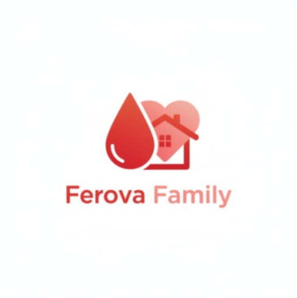
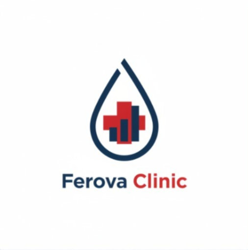
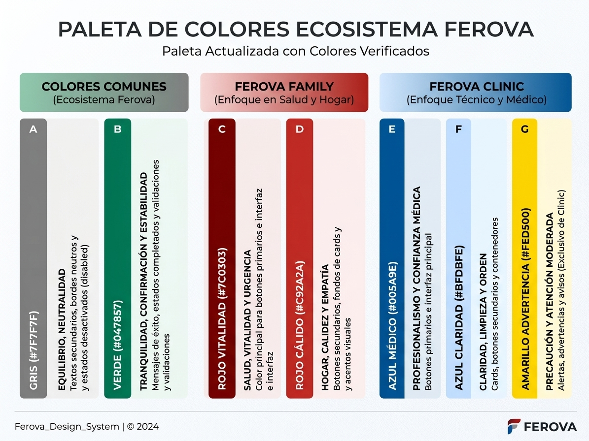
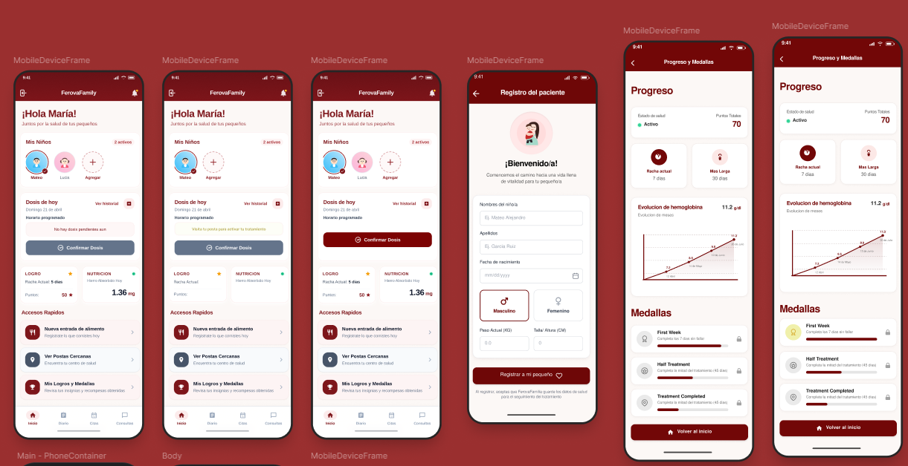
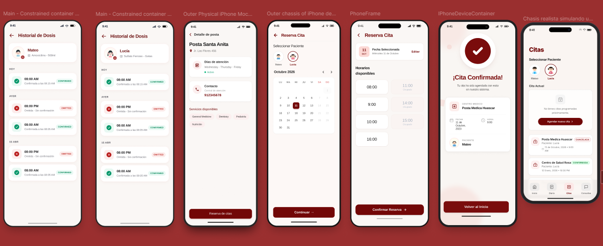

# Capítulo IV: Product Design

## 4.1. Style Guidelines

Incluiremos la guía de estilos para nuestras dos aplicaciones: FerovaFamily y FerovaClinic

**Branding**

Para Ferova Family, el branding se diseñó para mostrar confianza y profesionalismo, abarcando el tema de la salud. Los tres iconos del logo (Gota de sangre, corazón y casa) representan la salud y bienestar que nuestra aplicación promete mediante sus funcionalidades principales. En el tema de colores, el color rojo representa la vitalidad y temas de salud de la persona y el color salmón representa la calidez, contrastando de buena manera con el otro color. El diseño incluye el logo del producto y su nombre para que sea fácil de identificar.

<div align="center">
  
</div>

El branding de Ferova Clinic se diseñó para mostrar profesionalismo, enfocado en el análisis de datos. Los iconos del logo (gota de sangre, barras y cruz roja) muestran la conexión entre el análisis de datos y la salud. En los colores, el color azul muestra profesionalismo y confianza y el color rojo muestra todo lo relacionado a la salud. El diseño incluye el logo del producto y su nombre para que sea identificable.

<div align="center">
  
</div>

**Typography**

Para las dos aplicaciones, se selecciono la tipografía "Inter" como fuente principal y secundaria por su legibilidad, tono profesional y neutralidad. Esta fuente es agradable al usuario, mostrando diferencias claras en cada letra.

<div align="center">
  
</div>


**Colors**

La paleta de colores de Ferova Family y Ferova Clinic se compone de 4 colores y sus variantes. Los colores, en conjunto, permiten mostrar una claridad en el diseño de las dos aplicaciones.

<div align="center">
  
</div>

- #7C0303: Utilizado en Ferova Family. Este color y sus variaciones están asociadas a la vitalidad y salud, también se le relaciona a la urgencia. Representa la salud principalmente. Utilizada en botones primarios y la interfaz de la aplicación.

- #C92A2A : Utilizado en Ferova Family. Este color y sus variaciones están asociadas a la calidez y empatía. Representa el hogar principalmente. Utilizada en botones secundarios, fondos de cards, etc.

- #005A9E: Utilizado en Ferova Clinic. Transmite profesionalismo y confianza médica. Representa lo técnico y analítico. Utilizada en botones primarios y la interfaz de la aplicación.

- #BFDBFE: Utilizado en Ferova Clinic. Transmite claridad y limpieza. Representa el orden y organización. Utilizada en cards y botones secundarios.

- #7F7F7F (Gris): Utilizado en las dos aplicaciones. Color que transmite equilibrio. Utilizado en textos secundarios, botones desactivados, etc.

- #047857 (Verde): Utilizado en las dos aplicaciones. Transmite tranquilidad, confirmación y estabilidad.

- #FED500 (Amarillo): Utilizado en Ferova Clinic. Transmite advertencia, precaución y atención moderada.

**Spacing**

El diseño de las dos aplicaciones utiliza correctamente los espaciados para mantener un orden entre los distintos componentes que se muestran en la pantalla. Cada componente fue posicionado para que exista un espaciado y no se muestre abultado. En las dos aplicaciones, existira un espacio predefinido para la muestra del contenido y los componentes están diseñados para que se ajuste según la resolución del dispositivo.

**Tono de comunicación y Lenguaje aplicado**

Para Ferova Family, hemos tomado la decisión de tener un tono de comunicación empático, cercano al usuario y motivador. Esto debido a que la madre (el usuario principal) que utilizará esta app estará preocupada por el tratamiento de su hijo. Nosotros como desarrolladores, tenemos que tomar en cuenta esto: Debemos utilizar un lenguaje cercado al usuario, sin utilizar tecnicismos, un lenguaje amigable para que reduzca la ansiedad durante el tratamiento y motivador, que premie al usuario por los pequeños avances.

Por el otro lado, para Ferova Clinic, hemos tomado la decisión de tener un tono de comunicación profesional, directo y analítico. Esto debido a que el médico (el usuario principal) que utilizará esta app necesita acceder a todos los datos del usuario de una manera eficaz. Nosotros como desarrolladores, tenemos que tomar en cuenta lo siguiente: Debemos utilizar un lenguaje con las terminologías adecuadas, el lenguaje debe ser directo y todo se tiene que basar en los datos almacenados de los pacientes.

### 4.1.2. Web Style Guidelines

Estándares visuales e interactivos para las interfaces web de FerovaClinic, asegurando coherencia en desktop y dispositivos móviles.

#### Colores

**Primarios**
- Azul Oscuro: `#003A70` (navbar, botones principales)
- Azul Primario: `#1E7CB4` (enlaces, highlights)
- Azul Claro: `#E8F4F8` (fondos informativos)

**Sistema de Riesgo**
- Rojo (Alto): `#E53935` y fondo `#FFCDD2`
- Naranja (Medio): `#FFA500` y fondo `#FFE5CC`
- Verde (Bajo): `#4CAF50` y fondo `#E8F5E9`

**Neutros**
- Fondo: `#FFFFFF` (blanco), `#F5F7FA` (gris claro)
- Texto: `#1A1A1A` (primario), `#666666` (secundario)
- Borde: `#E0E0E0`

**Variantes de Estado Clínico**
 
| Badge | Fondo | Texto | Uso |
|-------|-------|-------|-----|
| ACTIVO | `#E8F5E9` | `#4CAF50` | Tratamiento en curso, paciente activo |
| CONFIRMADA | `#E0F2F1` | `#26A69A` | Cita confirmada, dosis confirmada |
| COMPLETADO | `#E8F5E9` | `#4CAF50` | Tratamiento finalizado, período completado |
| ABANDONADO | `#FFCDD2` | `#E53935` | Tratamiento abandonado, paciente dado de alta |
| PENDIENTE | `#FFE5CC` | `#F57C00` | Acción pendiente, control pendiente |
| EN SEGUIMIENTO | `#E3F2FD` | `#1565C0` | Monitoreo activo, seguimiento requerido |

#### Tipografía

**Familia**: `'Segoe UI', -apple-system, BlinkMacSystemFont, sans-serif`

| Elemento | Size | Weight | Uso |
|----------|------|--------|-----|
| H1 | 32px | 700 | Títulos página |
| H2 | 24px | 700 | Títulos sección |
| H3 | 18px | 600 | Subtítulos |
| H4 | 16px | 600 | Títulos card |
| Body | 14px | 400 | Texto general |
| Small | 12px | 400 | Labels |
| Metric | 28-32px | 700 | Números grandes |

#### Spacing

- Base: 8px
- Cards gap: 16px
- List gap: 12px
- Padding componentes: 12px 24px (botones), 20px (cards)

#### Componentes

**Navbar**
- Alto: 64px (fixed)
- Fondo: Gradiente azul con blur
- Logo blanco + items navegación

**Botones**
- Primario: Azul oscuro, padding 12px 24px, border-radius 6px
- Secundario: Outline azul, transparente
- Estados: hover (elevación), active (scale 0.98)

**Cards**
- Fondo blanco, border 1px gris, border-radius 8px
- Padding: 20px
- Border-left 4px según riesgo (si aplica)
- Hover: elevación suave

**Badges**
- Alto: 28px, border-radius 16px
- Padding: 4px 12px
- Font: 11px uppercase, weight 600
- Variantes: ACTIVO (verde), CONFIRMADA (verde), COMPLETADO (verde), ABANDONADO (rojo)

**Avatares**
- Circular, 48px standard
- Colores pastel por inicial
- Texto: iniciales en blanco, 18px

**Inputs**
- Alto: 44px
- Padding: 12px 14px
- Border: 1px gris, radius 6px
- Focus: border azul, shadow suave

#### Breakpoints

- Mobile: < 640px (1 columna)
- Tablet: 640px - 1024px (2 columnas)
- Desktop: > 1024px (3 columnas)
- Max-width: 1280px

#### Animaciones

- Duración: 0.3s ease-out (estándar)
- Hover: elevación + sombra
- Entradas: fade-in + slide-up (0.4s)
- Focus: outline azul 2px

#### Accesibilidad

- Contraste mínimo: 4.5:1 (texto sobre fondos)
- Navegación por teclado: Tab order lógico, focus visible
- Aria labels: en inputs y botones icon-only
- WCAG 2.1 AA

#### Componentes FerovaClinic

**Card Paciente**
- Avatar (48px) + Nombre (H4) + Badge estado
- Metadata (edad, ubicación)
- CTA: "Ver Detalles"

**Monitor Clínico**
- Score badge arriba-derecha (56px circular)
- Adherencia (círculo donut con %)
- Tratamiento (duración, dosis, progreso)

**Heatmap**
- Mapa geográfico con círculos coloreados por riesgo
- Tamaño proporcional a pacientes

### 4.1.3. Mobile Style Guidelines

Esta sección define las guías de estilo visual y de interacción para aplicaciones móviles, asegurando consistencia, usabilidad y alineación con las buenas prácticas de diseño en cada plataforma.


#### 4.1.3.1. iOS Mobile Style Guidelines
 
En esta subsección se detallan los estándares visuales y de interacción aplicados a la versión móvil de Ferova Family para dispositivos iOS, tomando como referencia las pantallas diseñadas en formato iPhone 15 Pro. Estos lineamientos aseguran una experiencia coherente con la identidad visual de Ferova Family, manteniendo una navegación clara, jerarquía de información intuitiva y adaptación a pantallas con zonas seguras como el *Dynamic Island*.
 
**Sistema de Rejilla y Layout iOS**
 
Para garantizar una correcta visualización en dispositivos iPhone, la interfaz móvil de Ferova Family utiliza una estructura vertical de una sola columna, priorizando la accesibilidad a funcionalidades médicas y la claridad en la información de salud:
 
* **Formato de pantalla iPhone:** Las vistas están diseñadas para una proporción vertical, considerando espacios superiores seguros para evitar interferencias con el *Dynamic Island* y la barra de estado del sistema iOS.
* **Distribución en una columna:** El contenido principal se organiza de forma vertical, permitiendo que secciones como inicio de sesión, diario nutricional, citas médicas, consultas y progreso se visualicen de manera ordenada y accesible.
* **Espaciado lateral:** Se emplean márgenes internos consistentes (16-20px) para evitar que los textos, cards y botones queden pegados a los bordes de la pantalla.
* **Cards centradas:** Las tarjetas de contenido, como las de "Mis Niños", "Postas Cercanas", "Historial Nutricional" y "Citas", se muestran centradas, con ancho controlado y separación visual clara entre bloques.
* **Área segura para navegación:** Un espacio inferior de aproximadamente 70-80px se mantiene reservado para la barra de navegación inferior (bottom navigation), asegurando que el contenido principal no se superponga.
**Componentes de Interfaz iOS**
 
* **Botones principales:** Los botones como **Registrarse**, **Iniciar Sesión**, **Ver detalles**, **Confirmar Reserva**, **Enviar Consulta** y **Confirmar Dosis** utilizan el color rojo/marrón institucional de Ferova Family (#8B2E3B), con bordes redondeados (radio de 8-12px) y tamaño compacto. Contienen texto en blanco con peso semibold.
* **Botones secundarios:** Los botones de acción secundaria como "Ver más información", "Volver al inicio" y "Editar" utilizan un fondo blanco o gris claro con borde de 1-2px en color rojo, manteniendo coherencia visual.
* **Cards informativas:** Las tarjetas presentan fondos blancos, bordes suaves (radio 8-10px), sombras ligeras y espaciado interno consistente (12-16px). Se utilizan para organizar información sobre citas, consultas, registros nutricionales y detalles de postas médicas.
* **Formularios:** Las pantallas de registro, inicio de sesión y envío de consultas emplean campos de entrada con fondo blanco, bordes ligeros (1px), radio de 8px y distribución vertical. Los placeholders tienen color gris claro.
* **Badges y etiquetas:** Se utilizan para indicar estado (Activo, Confirmada, Cancelada, Omitida) con colores diferenciados: verde para activo/confirmado, gris para pendiente, rojo para cancelado/omitido.
* **Iconos y avatares:** Los avatares de usuarios (niños, especialistas) se presentan en círculos de 48-64px con colores pastel diferenciados. Los íconos médicos (jeringa, medicamento, corazón) utilizan la paleta de colores de la app con peso visual coherente.
* **Componentes de mapa:** En la pantalla "Postas Cercanas", el mapa muestra marcadores de ubicación en rojo oscuro con iconos médicos centrales, sobre un fondo de mapa en tonos neutros.
* **Indicadores de progreso:** Los gráficos circulares de progreso muestran el porcentaje de absorción de hierro con un ring en color rojo oscuro sobre fondo blanco/gris claro.
* **Acordeones y desplegables:** Las respuestas en consultas y detalles de servicios se organizan mediante bloques que se expanden con transiciones suaves.
**Navegación iOS**
 
* **Header superior:** Cada pantalla mantiene un header consistente con:
  - Botón de retroceso (flecha roja) en la parte superior izquierda
  - Título de la pantalla en color rojo oscuro y peso semibold
  - Iconos de acciones secundarias (menú) en la parte superior derecha cuando aplique
  
* **Bottom Navigation:** La navegación inferior contiene 4 opciones principales:
  - **Inicio**: Acceso a la pantalla principal con resumen de información
  - **Diario**: Historial nutricional y registro de comidas/suplementos
  - **Citas**: Gestión de citas médicas y reservas
  - **Consultas**: Comunicación directa con especialistas médicos
  
  Cada ícono se resalta en color rojo cuando está activo, mostrando una pequeña línea o fondo indicador.
* **Header con contexto:** Las pantallas con múltiples opciones (como "Crear cuenta" o "Iniciar sesión") incluyen un logo o ícono distintivo en la parte superior, centrado, reforzando la identidad de Ferova Family.
* **Flujo de navegación:** La navegación está pensada para permitir desplazamiento vertical dentro de cada sección, con acceso rápido a funcionalidades clave mediante la barra inferior en todo momento.
**Tipografía iOS Aplicada**
 
La tipografía mantiene una jerarquía clara para mejorar la lectura en pantallas pequeñas y la comprensión de información médica:
 
* **Títulos principales (H1):** Se utilizan textos en negrita (weight: 600-700) y tamaño 24-28px para secciones como **Iniciar sesión**, **Diario Nutricional**, **Citas**, **Mis Consultas**, **Progreso y Medallas** y **Crear tu cuenta**. Color: rojo oscuro (#8B2E3B).
* **Subtítulos (H2):** Se aplican textos de tamaño 16-18px con weight 600, en color gris oscuro (#333333), para explicar secciones secundarias como "Seleccionar Paciente", "Horarios disponibles", "Cita Actual".
* **Etiquetas de campo:** Textos pequeños (12-14px) en gris medio (#666666) con weight 500 para identificar campos de formulario (DNI, Contraseña, Teléfono).
* **Cuerpo de texto:** El contenido descriptivo utiliza tamaño 14px, weight 400, alineación justificada o natural según el contexto, y suficiente interlineado (1.5-1.6) para mantener la legibilidad.
* **Énfasis visual:** Algunos elementos importantes, como valores numéricos (1.36 mg de hierro), nombres de especialistas, estados de citas y datos de progreso, se resaltan con weight 600 o color rojo para captar la atención.
* **Textos auxiliares:** Información secundaria como distancias ("0.5 km"), horarios, notas de estado utilizan tamaño 12px en color gris claro (#999999).
* **Links y acciones:** Los links interactivos como "¿Ya tienes cuenta? Inicia sesión" utilizan color rojo con subrayado ligero, señalando claramente la interactividad.
**Sistema de Colores iOS**
 
La paleta de colores de Ferova Family está compuesta por:
 
* **Rojo/Marrón institucional:** #8B2E3B - Color primario utilizado en botones principales, headers, títulos y elementos de mayor jerarquía. Comunica confianza y profesionalismo médico.
* **Blanco:** #FFFFFF - Fondo principal de tarjetas, formularios y áreas de contenido, asegurando legibilidad y claridad.
* **Gris claro:** #F5F5F5 - Fondo alternativo para campos de entrada, secciones secundarias y áreas de agrupación.
* **Gris medio:** #CCCCCC - Bordes ligeros, divisores y elementos de menor importancia visual.
* **Gris oscuro:** #333333 - Texto principal de cuerpo y subtítulos, asegurando suficiente contraste.
* **Verde:** #2ECC71 - Indicador de estado activo, confirmado, o acción completada (checkmarks, badges "Activo", "Confirmada").
* **Rojo claro/Rosa:** #F5D5D8 - Fondos suaves para alertas, avisos o secciones destacadas que requieren atención.
* **Azul-Gris:** #5A6B7D - Color secundario utilizado en íconos de servicios, avatares de especialistas y elementos informativos.
* **Amarillo pastel:** #F4E4A6 - Color de badges para logros y medallas completadas.
* **Tonos pastel para avatares:** Colores suaves como azul claro (#87CEEB), rosa pastel (#FFB6C1) para diferenciar perfiles de niños.
**Animaciones y Micro-interacciones iOS**
 
La experiencia móvil en iOS debe mantener interacciones suaves, responsivas y coherentes con las pautas de Human Interface Guidelines de Apple:
 
* **Transiciones de navegación:** Las pantallas utilizan transiciones push/pop suaves cuando se navega entre secciones, con duración de 300-350ms.
* **Botones táctiles:** Los botones deben responder visualmente al toque mediante:
  - Cambio de opacidad (reducción a 70-80%) durante el toque
  - Ligera reducción de escala (0.98x) para feedback táctil
  - Animación de duración 150-200ms
* **Cards interactivas:** Las tarjetas de citas, consultas y registros nutricionales pueden mostrar:
  - Ligera elevación (sombra más pronunciada) al interactuar
  - Cambio de color de fondo (gris muy claro) durante el toque
  - Transición suave al expandir/colapsar información
* **Desplegables y acordeones:** Los bloques de preguntas frecuentes, servicios disponibles y detalles expandibles utilizan:
  - Animación de rotación del ícono indicador (0° a 180°)
  - Transición suave de altura del contenido (200-300ms)
  - Cambio de color de fondo en el header del acordeón
* **Indicadores de progreso:** Los anillos de progreso (absorción de hierro) animados muestran:
  - Animación de stroke desde 0 hasta el porcentaje final al cargar la pantalla
  - Duración de 800-1000ms con easing ease-out
  - Número de porcentaje que anima simultáneamente
* **Desplazamiento fluido:** Las secciones mantienen un scroll vertical suave con:
  - Comportamiento momentum scrolling nativo de iOS
  - Parallax sutil en fondos de headers (reducción de 20-30%)
  - Ocultamiento suave de elementos como tabs al desplazarse hacia abajo (200ms)
* **Estados de carga:** Se utilizan spinners subtiles o esqueletos de contenido para indicar carga, con animación de rotación suave (800-1000ms) en color rojo institucional.
* **Feedback háptico:** Se recomienda el uso de haptic feedback subtle de iOS (light impact, medium success) en momentos clave:
  - Confirmación de envío de consulta
  - Confirmación de cita
  - Logro de meta de hierro
 
**Consideraciones de Accesibilidad**
 
* Contraste mínimo de 4.5:1 entre texto y fondo (conforme WCAG AA)
* Tamaño mínimo de touch targets de 44x44pt según HIG de Apple
* Etiquetas claras para campos de formulario y botones de acción
* Uso de colores en combinación con iconos/textos para transmitir información (no solo color)
* Soporte para Dynamic Type para escalado de texto

<div align="center">
  
</div>

---

<div align="center">
  
</div>


#### 4.1.3.2. Android Mobile Style Guidelines

## 4.2. Information Architecture

En esta sección se define la arquitectura de información del ecosistema **Ferova**, entendida como la organización, el etiquetado, la búsqueda y la navegación de los contenidos que soportan las Epics definidas en el Capítulo III. El análisis se desarrolla sobre los tres frentes de interacción del producto:

- **Landing Page de Sanuvi:** sitio web estático de captación, orientado al visitante que aún no es usuario.
- **Ferova Family:** aplicación móvil dirigida a los apoderados del paciente, responsables de administrar el tratamiento de hierro en el hogar.
- **Ferova Clinic:** aplicación web dirigida al personal de salud (enfermeras y administradores de posta), responsable del seguimiento clínico y de la gestión de las postas de salud.

Dado que los tres productos consumen la misma **API Application** descrita en la sección 4.8, la arquitectura de información se diseñó sobre un modelo de contenido compartido (paciente, tratamiento, control de hemoglobina, cita, posta, consulta y logro), pero con esquemas de organización, vocabulario y profundidad de navegación diferenciados según el rol y el contexto de uso de cada audiencia.

### 4.2.1. Organization Systems

Los sistemas de organización determinan cómo se agrupa y jerarquiza la información antes de ser presentada. En el ecosistema Ferova se emplean cuatro esquemas de manera combinada:

**1. Organización por audiencia (role-based)**

Constituye el esquema de primer nivel de toda la plataforma. Tras la autenticación, la API resuelve el rol del usuario (apoderado, enfermera o administrador) y determina qué aplicación y qué conjunto de destinos se habilitan. Un mismo contenido —por ejemplo, el tratamiento de un paciente— se expone con distinto grado de detalle: el apoderado observa la dosis del día y su racha de cumplimiento, mientras que la enfermera accede al esquema de dosificación en mg/kg/día, a la serie histórica de hemoglobina y al nivel de riesgo calculado. Este esquema evita que el personal de salud deba filtrar información doméstica y que el apoderado se enfrente a terminología clínica innecesaria.

**2. Organización jerárquica (visual hierarchy)**

Se aplica dentro de cada pantalla para diferenciar lo urgente de lo informativo. La jerarquía se construye con posición, tamaño tipográfico y color semántico, definidos en la sección 4.1:

- En **Ferova Clinic**, el Panel General ordena a los pacientes por nivel de riesgo clínico: los casos con hemoglobina en descenso o adherencia interrumpida se ubican en la parte superior con indicador rojo (`#7C0303`), seguidos de los casos en observación y, finalmente, de los pacientes estables.
- En **Ferova Family**, la pantalla *Tratamiento / Hoy* prioriza la dosis pendiente del día como elemento de mayor peso visual, relegando a segundo plano la racha acumulada, las insignias obtenidas y el resumen nutricional.

**3. Organización secuencial (step-by-step)**

Se utiliza en todos los procesos donde la omisión de un dato invalida el registro clínico. El usuario avanza por pasos con indicador de progreso, validación por paso y posibilidad de retroceder sin perder lo ingresado:

| Proceso | Aplicación | Secuencia definida |
|:---|:---|:---|
| Registro de usuario y verificación | Family / Clinic | Datos personales → credenciales → verificación de correo → confirmación |
| Recuperación de contraseña | Family / Clinic | Solicitud de correo → código enviado vía Resend → nueva contraseña → confirmación |
| Registro de paciente | Family | Datos del menor → vínculo con el apoderado → posta de atención → confirmación |
| Reserva de cita médica | Family | Selección de paciente → selección de distrito y posta → fecha y horario disponible → confirmación |
| Registro de cumplimiento de dosis | Family | Selección de paciente → confirmación de la toma → observaciones opcionales |
| Registro de control de hemoglobina | Clinic | Búsqueda del paciente → valor de Hb en g/dL y fecha → recálculo de riesgo → cierre del control |
| Inicio y cierre de tratamiento | Clinic | Verificación del historial → esquema de dosificación → seguimiento → alta del paciente |
| Registro de posta y asignación | Clinic (Admin) | Datos de la posta → ubicación vía Google Maps API → horarios de atención → asignación de enfermeras |

**4. Organización matricial (facetada)**

Se aplica donde el usuario debe explorar volúmenes altos de información sin una ruta predefinida. La matriz permite cruzar dimensiones de forma libre mediante filtros combinables:

- **Lista de pacientes (Clinic):** cruce de nivel de riesgo, estado del tratamiento, posta asignada y rango de fechas del último control.
- **Analítica y reportes de postas (Clinic – Admin):** cruce de posta, distrito, periodo y cobertura de adherencia, como insumo para los reportes de seguimiento.
- **Diario nutricional (Family):** cruce de fecha y tipo de comida para consultar el hierro absorbido y los alimentos registrados.
- **Historial de citas y de dosis (Family):** cruce de paciente y rango de fechas.

### 4.2.2. Labeling Systems

El sistema de etiquetado traduce el modelo de datos a un vocabulario comprensible para cada audiencia. Se establecieron las siguientes convenciones transversales, coherentes con el *Tone of Voice* de la sección 4.1:

- Los **destinos de navegación** se etiquetan con sustantivos cortos (*Pacientes*, *Citas*, *Nutrición*), nunca con frases.
- Las **acciones** se etiquetan con verbo en infinitivo más objeto (*Registrar dosis*, *Reservar cita*, *Generar reporte*), evitando etiquetas ambiguas como "Aceptar" u "OK".
- El **vocabulario se adapta al rol**: en Ferova Clinic se emplea terminología clínica estandarizada (*hemoglobina*, *g/dL*, *adherencia*, *nivel de riesgo*, *alta del paciente*); en Ferova Family se emplea lenguaje cotidiano (*dosis de hoy*, *gotitas de hierro*, *alimentos que ayudan a absorber el hierro*).
- Se conserva el término **apoderado del paciente** en lugar de "familia" o "madre" en todas las etiquetas de interfaz, para no excluir a otros cuidadores responsables.
- Toda etiqueta numérica se acompaña de su unidad explícita (`g/dL`, `mg`, `días`) y toda fecha se muestra en formato `dd/mm/aaaa`.
- Los iconos nunca se utilizan como etiqueta única en destinos de navegación: siempre se acompañan de texto, conforme a los criterios de accesibilidad declarados en la sección 4.1.

**Landing Page (Sanuvi)**

| Etiqueta | Contenido asociado |
|:---|:---|
| Inicio | Propósito de la plataforma, eslogan y botones de llamado a la acción: acceder a la web o descargar la aplicación. |
| El problema | Datos estadísticos sobre la prevalencia de la anemia infantil en el Perú y su impacto en el desarrollo del menor. |
| Solución | Descripción general de Ferova y de cómo articula el hogar con la posta de salud. |
| Para quién | Beneficios diferenciados por rol: apoderados del paciente y personal de salud. |
| Cómo funciona | Línea de tiempo paso a paso del recorrido completo, desde el diagnóstico en la posta hasta el seguimiento diario en el hogar. |
| Testimonios | Experiencias de apoderados y personal de salud que han utilizado la plataforma. |
| Descarga y acceso | Enlaces a las tiendas de aplicaciones y acceso a Ferova Clinic. |
| Sobre Sanuvi | Misión, visión y equipo detrás del producto. |

**Ferova Family (apoderado del paciente)**

| Etiqueta | Contenido asociado |
|:---|:---|
| Tratamiento / Hoy | Dosis pendiente del día, registro de cumplimiento, racha acumulada, puntos obtenidos y avance del tratamiento del paciente seleccionado. |
| Nutrición | Diario nutricional: registro de alimentos consumidos, hierro absorbido del día, resumen nutricional y consulta de alimentos ricos en hierro. |
| Citas | Próxima cita, reserva de nuevas citas, consulta de postas y horarios disponibles, y agenda con el historial de citas. |
| Mi Familia | Pacientes registrados por el apoderado, datos de cada menor, evolución de su hemoglobina, logros e insignias obtenidas y posta asignada. |
| Consultas | Mensajería con la enfermera responsable del paciente: consultas abiertas, historial de consultas atendidas y creación de una nueva consulta. |
| Mi cuenta | Datos del apoderado, preferencias de recordatorios y cierre de sesión. |

**Ferova Clinic (personal de salud)**

| Etiqueta | Rol | Contenido asociado |
|:---|:---|:---|
| Panel General | Enfermera / Admin | Indicadores del día, pacientes que requieren atención según riesgo, agenda de citas y accesos rápidos. |
| Pacientes | Enfermera | Listado de pacientes asignados, registro y vinculación de pacientes, detalle del menor, seguimiento del nivel de hemoglobina y alta del paciente. |
| Tratamientos | Enfermera | Inicio del tratamiento, esquema de dosificación, estado y detalle del tratamiento, y seguimiento de la adherencia. |
| Historial Clínico | Enfermera | Registro y actualización del historial médico de cada paciente, con sus controles de hemoglobina. |
| Consultas | Enfermera | Bandeja de teleconsultas por paciente, conversación con el apoderado y cierre de consulta. |
| Agenda | Enfermera | Citas programadas en la posta asignada y disponibilidad de horarios. |
| Postas de Salud | Admin | Registro de postas, ubicación, horarios de atención y consulta de postas registradas. |
| Enfermeras | Admin | Consulta de enfermeras disponibles y asignación de enfermeras a una posta de salud. |
| Analítica y Reportes | Admin | Métricas de seguimiento por posta y distrito, y generación de reportes de cobertura y adherencia. |
| Configuración | Enfermera / Admin | Datos del profesional, posta activa y cierre de sesión. |

### 4.2.3. SEO Tags and Meta Tags

Las etiquetas de posicionamiento se aplican sobre los productos accesibles mediante navegador: la Landing Page de Sanuvi, principal responsable de la captación orgánica, y las vistas públicas de Ferova Clinic.

| Página | Title | Description | Keywords | Author |
|--------|-------|-------------|----------|--------|
| Landing Page | Ferova \| Seguimiento del tratamiento de la anemia infantil en el Perú | Ferova, una iniciativa de Sanuvi, conecta a los apoderados con el personal de salud para no perder el hilo del tratamiento de hierro: recordatorios de dosis, control de hemoglobina y citas en la posta. | anemia infantil, tratamiento de hierro, adherencia al tratamiento, hemoglobina, suplementación con hierro, posta de salud, salud infantil Perú, Sanuvi, Ferova | Sanuvi |
| Ferova Clinic (acceso) | Iniciar sesión \| Ferova Clinic | Acceso para enfermeras y administradores de postas de salud al seguimiento de pacientes en tratamiento contra la anemia infantil. | Ferova Clinic, acceso personal de salud, seguimiento de pacientes, anemia infantil | Sanuvi |
| Ferova Family (ficha de tienda) | Ferova Family — Tratamiento de anemia infantil | Registra la dosis diaria de hierro de tu niño, lleva su diario nutricional y reserva sus citas en la posta de salud desde una sola aplicación. | anemia, hierro, niños, tratamiento, dosis, salud | Sanuvi |

**Etiquetas fundamentales de la Landing Page**

```html
<meta charset="UTF-8">
```
Indica al navegador cómo interpretar los caracteres de texto de la página. `UTF-8` corresponde a una codificación universal que garantiza la correcta visualización de los caracteres especiales del castellano, como la "ñ" y las vocales acentuadas, presentes de forma constante en el contenido del producto.

```html
<meta name="viewport" content="width=device-width, initial-scale=1.0">
```
Establece que la página se adapte a la resolución del dispositivo, ajustando el ancho del contenido al ancho de la pantalla y fijando un nivel de zoom inicial 1:1. Resulta indispensable considerando que una proporción relevante de los apoderados accede al sitio desde un teléfono móvil.

```html
<title>Ferova | Seguimiento del tratamiento de la anemia infantil en el Perú</title>
<meta name="description" content="Ferova, una iniciativa de Sanuvi, conecta a los apoderados con el personal de salud para no perder el hilo del tratamiento de hierro: recordatorios de dosis, control de hemoglobina y citas en la posta.">
<meta name="keywords" content="anemia infantil, tratamiento de hierro, adherencia al tratamiento, hemoglobina, posta de salud, salud infantil Perú, Sanuvi, Ferova">
<meta name="author" content="Sanuvi">
```
El `title` y la `description` constituyen el texto que el motor de búsqueda presenta en sus resultados. Se redactaron incorporando el problema ("anemia infantil") y el ámbito geográfico ("Perú"), por tratarse de los términos con los que el público objetivo realiza efectivamente la búsqueda.

```html
<html lang="es-PE">
<meta name="robots" content="index, follow">
<link rel="canonical" href="https://sanuvi.github.io/ferova/">
```
El atributo `lang` informa el idioma y la variante regional del contenido; `robots` autoriza expresamente la indexación del sitio de captación; y `canonical` declara la dirección preferente de la página para evitar contenido duplicado.

**Etiquetas de previsualización en redes sociales (Open Graph y Twitter Cards)**

```html
<meta property="og:type" content="website">
<meta property="og:title" content="Ferova | Seguimiento del tratamiento de la anemia infantil">
<meta property="og:description" content="Recordatorios de dosis, control de hemoglobina y coordinación con la posta de salud, en una sola plataforma.">
<meta property="og:image" content="https://sanuvi.github.io/ferova/assets/og-cover.png">
<meta property="og:locale" content="es_PE">
<meta name="twitter:card" content="summary_large_image">
```
Estas etiquetas controlan la tarjeta de previsualización que se genera al compartir el enlace en redes sociales y en aplicaciones de mensajería, canal de difusión previsto para la captación de apoderados en comunidades y campañas de salud.

**Consideración sobre las aplicaciones**

Ferova Family y Ferova Clinic no son indexadas por motores de búsqueda: la primera por tratarse de una aplicación móvil nativa y la segunda por encontrarse detrás del inicio de sesión. En consecuencia, el posicionamiento de Ferova Family se trabaja mediante la optimización de su ficha de tienda (*App Store Optimization*), utilizando el título, la descripción y las palabras clave consignadas en la tabla anterior, mientras que en Ferova Clinic las vistas privadas se declaran con `<meta name="robots" content="noindex, nofollow">` para impedir su indexación.

### 4.2.4. Searching Systems

Los sistemas de búsqueda se diseñaron en función del volumen de información que administra cada rol. En Ferova Family predomina el filtrado sobre conjuntos pequeños y conocidos, mientras que en Ferova Clinic la búsqueda constituye el punto de partida del flujo de trabajo diario.

**Ferova Family**

| Ubicación | Mecanismo | Criterio |
|:---|:---|:---|
| Nutrición | Búsqueda por texto | Nombre del alimento, dentro del catálogo de alimentos ricos en hierro. |
| Nutrición | Filtro facetado | Tipo de comida (desayuno, almuerzo, cena) y nivel de aporte de hierro. |
| Nutrición | Filtro por fecha | Consulta del diario nutricional de un día o de un rango de días. |
| Citas | Búsqueda por ubicación | Distrito y posta de salud disponible, con consulta de horarios de atención. |
| Citas | Filtro por estado | Citas próximas, atendidas o canceladas. |
| Mi Familia | Selector de paciente | Cambio de paciente activo cuando el apoderado tiene más de un menor registrado. |
| Tratamiento | Filtro por fecha | Historial de cumplimiento de dosis por semana o por mes. |

**Ferova Clinic**

| Ubicación | Mecanismo | Criterio |
|:---|:---|:---|
| Barra superior | Búsqueda global persistente | DNI o apellido del menor; resuelve directamente al detalle del paciente. |
| Pacientes | Filtro facetado | Nivel de riesgo clínico, estado del tratamiento y posta asignada. |
| Pacientes | Búsqueda por documento | DNI del apoderado, para vincular un paciente ya registrado en la plataforma. |
| Tratamientos | Filtro por estado | Tratamientos en curso, interrumpidos o finalizados. |
| Historial Clínico | Búsqueda por paciente | Paciente registrado, con acceso a sus controles de hemoglobina. |
| Consultas | Filtro por estado y paciente | Bandeja de consultas abiertas, respondidas o cerradas. |
| Agenda | Filtro por fecha | Citas del día, de la semana o de un rango definido. |
| Postas de Salud (Admin) | Búsqueda y filtro | Nombre de la posta y distrito. |
| Enfermeras (Admin) | Filtro por disponibilidad | Enfermeras sin posta asignada o con capacidad disponible. |
| Analítica y Reportes (Admin) | Filtro combinado | Posta, distrito y rango de fechas, como parámetros del reporte a generar. |

**Comportamiento común de la búsqueda**

- Los filtros activos se representan como *chips* removibles sobre el listado, de modo que el usuario siempre reconozca por qué el conjunto de resultados se encuentra reducido.
- La búsqueda global de Ferova Clinic ofrece sugerencias a partir del tercer carácter ingresado y resalta la coincidencia dentro del resultado.
- Los conjuntos extensos de resultados se presentan paginados, indicando el total de coincidencias encontradas.
- Los estados vacíos no se limitan a informar la ausencia de resultados: proponen la acción siguiente ("No se encontró al paciente. Registrar un nuevo paciente"), en concordancia con las pautas de microcopy de la sección 4.1.

### 4.2.5. Navigation Systems

El sistema de navegación determina el acceso efectivo a las funcionalidades implementadas. Se distinguen cuatro tipos de navegación —global, local, contextual y utilitaria—, con una instanciación propia por producto.

**1. Landing Page (Sanuvi)**

Navegación de una sola página con barra superior fija y desplazamiento anclado hacia cada sección: *Inicio*, *El problema*, *Solución*, *Para quién*, *Cómo funciona*, *Testimonios* y *Sobre Sanuvi*. La barra mantiene de forma permanente los dos llamados a la acción del producto —descargar Ferova Family e ingresar a Ferova Clinic—, de modo que la conversión no dependa de la posición del visitante dentro de la página. El pie de página replica los enlaces de sección e incorpora los datos de contacto y las políticas del producto.

**2. Ferova Family (móvil)**

La navegación global se resuelve mediante la **barra de navegación inferior persistente** definida en la sección 4.1.3, con cuatro destinos alineados al recorrido diario del apoderado:

- **Tratamiento / Hoy** — punto de entrada por defecto de la aplicación.
- **Nutrición**
- **Citas**
- **Mi Familia**

La limitación a cuatro destinos responde a un criterio ergonómico: cada elemento conserva así un área táctil suficiente dentro de la zona cómoda del pulgar. En consecuencia, los contenidos restantes se resuelven por otras vías de navegación:

- **Navegación utilitaria:** *Consultas* y *Mi cuenta* se acceden desde la barra superior de la aplicación, con indicador numérico (*badge*) cuando existen mensajes de la enfermera o recordatorios pendientes.
- **Navegación local:** dentro de *Mi Familia*, cada paciente despliega pestañas internas de *Datos*, *Hemoglobina* y *Logros*; dentro de *Citas* se diferencian *Próximas* e *Historial*.
- **Navegación contextual:** las tarjetas de acceso rápido de la pantalla de inicio conducen directamente a la acción sugerida por el estado del tratamiento (registrar la dosis del día, registrar un alimento o revisar la próxima cita). 
- El registro de la dosis diaria se resuelve mediante una hoja inferior deslizable, sin abandonar la pantalla actual, cumpliendo el criterio de dos toques establecido en la sección 4.1.3.

**3. Ferova Clinic (web)**

La navegación global se estructura sobre la **barra lateral izquierda** descrita en la sección 4.1.2, cuyos destinos se instancian según el rol autenticado:

| Rol | Destinos de la barra lateral |
|:---|:---|
| Enfermera | Panel General · Pacientes · Tratamientos · Historial Clínico · Consultas · Agenda · Configuración |
| Administrador | Panel General · Postas de Salud · Enfermeras · Analítica y Reportes · Configuración |

Los destinos no habilitados para el rol no se muestran en la interfaz y, adicionalmente, su ruta se encuentra protegida en el cliente y validada en la API, de modo que la restricción no dependa únicamente de la capa visual.

Complementan la navegación global:

- **Navegación utilitaria:** la barra superior conserva el selector de posta activa, la búsqueda global por DNI o apellido del menor y el perfil del profesional.
- **Navegación local:** el detalle del paciente organiza su contenido en pestañas de *Resumen*, *Tratamiento*, *Controles de Hemoglobina*, *Historial* y *Consultas*, evitando que el profesional pierda el contexto del caso al desplazarse entre secciones.
- **Navegación contextual:** el Panel General expone accesos directos a las tareas del día (registrar un control de hemoglobina, responder una consulta pendiente o atender la cita próxima), y las alertas de riesgo conducen al paciente involucrado en un solo clic.
- **Migas de pan (*breadcrumbs*):** las vistas de tercer nivel muestran su ruta de procedencia —por ejemplo, `Pacientes › Luis Ramírez › Control de Hemoglobina`—, de modo que el usuario pueda retroceder sin recurrir al botón del navegador.

**4. Coherencia entre productos**

Las tres interfaces comparten tres reglas de navegación transversales: el destino activo siempre se encuentra señalizado, toda acción de registro ofrece una salida explícita sin pérdida de datos, y ninguna funcionalidad crítica se ubica a más de tres niveles de profundidad desde el punto de entrada de la aplicación.

## 4.3. Landing Page UI Design

### 4.3.1. Landing Page Wireframe


<!-- COMPLETAR -->

### 4.3.2. Landing Page Mock-up


<!-- COMPLETAR -->

## 4.4. Mobile Applications UX/UI Design

### 4.4.1. Mobile Applications Wireframes


<!-- COMPLETAR -->

### 4.4.2. Mobile Applications Wireflow Diagrams

> Un Wireflow por cada User Goal, considerando los User Persona.

**User Goal 1:** [enunciado]


<!-- COMPLETAR -->

### 4.4.3. Mobile Applications Mock-ups


<!-- COMPLETAR -->

### 4.4.4. Mobile Applications User Flow Diagrams

> Un User Flow por cada User Goal, consistente con los Wireflows. Incluir happy path y unhappy paths.

**User Goal 1:** [enunciado]


<!-- COMPLETAR -->

## 4.5. Mobile Applications Prototyping

> Introducción con los principales criterios para las decisiones de interacción y su relación con la arquitectura de información.

<!-- COMPLETAR -->

### 4.5.1. Android Mobile Applications Prototyping


**Enlace del video:** [URL de Microsoft Stream]

### 4.5.2. iOS Mobile Applications Prototyping


**Enlace del video:** [URL de Microsoft Stream]

## 4.6. Web Applications UX/UI Design

### 4.6.1. Web Applications Wireframes


<!-- COMPLETAR -->

### 4.6.2. Web Applications Wireflow Diagrams

**User Goal 1:** [enunciado]


<!-- COMPLETAR -->

### 4.6.3. Web Applications Mock-ups


<!-- COMPLETAR -->

### 4.6.4. Web Applications User Flow Diagrams

**User Goal 1:** [enunciado]


<!-- COMPLETAR -->

## 4.7. Web Applications Prototyping


**Enlace del video:** [URL de Microsoft Stream]

<!-- COMPLETAR -->

## 4.8. Domain-Driven Software Architecture

La arquitectura de software de Ferova Platform se organiza mediante un enfoque orientado al dominio, utilizando el modelo C4 para representar progresivamente la estructura de la solución. Esta representación permite visualizar el sistema desde una perspectiva general hasta el detalle de sus componentes internos.

La arquitectura considera como actores principales al Apoderado y al Personal de Salud, quienes interactúan con la plataforma mediante diferentes aplicaciones. La solución está compuesta por una aplicación web para el personal de salud, una aplicación móvil para los apoderados y una API que centraliza la lógica de negocio y el acceso a los datos.

Asimismo, Ferova Platform integra servicios externos como Resend, utilizado para el envío de correos electrónicos, y Google Maps API, utilizado para consultar información relacionada con la ubicación de las postas de salud.

Para representar esta arquitectura se emplearon tres niveles del modelo C4: Contexto, Contenedores y Componentes, desarrollados mediante Structurizr.


### 4.8.1. Software Architecture Context Diagram

El Context Diagram presenta una visión general de Ferova Platform y permite identificar los principales actores y sistemas externos que interactúan con la solución.

<div align ="center">
  
</div>

En el centro del contexto se encuentra Ferova Platform, que proporciona las funcionalidades necesarias para que los apoderados realicen el seguimiento del tratamiento de sus pacientes y para que el personal de salud gestione y supervise su atención.

Los principales actores identificados son:

- **Apoderado:** madre, padre o cuidador responsable del paciente, quien utiliza la plataforma para gestionar la información del paciente, realizar el seguimiento del tratamiento, consultar su evolución, gestionar citas y comunicarse con el personal de salud.

- **Personal de Salud:** profesionales responsables de gestionar y realizar el seguimiento de los pacientes, así como atender las consultas de los apoderados.

Además, Ferova Platform mantiene comunicación con servicios externos. Resend permite gestionar el envío de correos electrónicos, particularmente aquellos relacionados con procesos como la recuperación de contraseña. Google Maps API permite consultar información de ubicación asociada a las postas de salud.

### 4.8.2. Software Architecture Container Diagrams

El Container Diagram descompone Ferova Platform en los principales contenedores que conforman la solución y muestra cómo estos interactúan entre sí.

<div align ="center">
  
</div>

La plataforma está organizada principalmente en los siguientes contenedores:

- **Web Site:** sitio web público que presenta información sobre Ferova y permite a los usuarios acceder a la aplicación web o descargar la aplicación móvil.
- **Web Application:** aplicación web destinada al personal de salud, mediante la cual puede gestionar pacientes y realizar el seguimiento de tratamientos, controles y citas.
- **Mobile Application:** aplicación móvil destinada a los apoderados, que permite gestionar pacientes, registrar y consultar información relacionada con el tratamiento, consultar citas y mantener comunicación con el personal de salud.
- **API Application:** backend principal de la plataforma, responsable de centralizar la lógica de negocio, autenticación, gestión de pacientes, tratamientos, citas, seguimiento y comunicación.
- **Base de datos:** contenedor encargado de almacenar la información operativa de la plataforma, incluyendo usuarios, pacientes, tratamientos, citas, controles y demás información requerida por los módulos funcionales.

La Web Application y la Mobile Application utilizan la API Application mediante comunicaciones HTTP/HTTPS para consultar y registrar información. A su vez, la API utiliza la base de datos para leer y escribir la información necesaria para la operación de la plataforma.

En este nivel también se representan las integraciones externas. La plataforma utiliza Resend para el envío de correos electrónicos y Google Maps API para consultar información de ubicación de las postas de salud.

De esta manera, el diagrama permite observar la separación entre las interfaces utilizadas por los usuarios, la capa encargada de la lógica de negocio y la persistencia de información.

### 4.8.3. Software Architecture Components Diagrams

El Component Diagram presenta una descomposición interna de los contenedores principales de Ferova Platform, permitiendo identificar las responsabilidades funcionales que conforman cada aplicación.

**Web Application**

La aplicación web utilizada por el personal de salud se organiza en componentes orientados a las principales funcionalidades de gestión y seguimiento:

<div align ="center">
  
</div>

- **Identity and Management:** gestiona la autenticación, autorización y administración de los usuarios del personal de salud.
- **Patient Management:** permite gestionar la información de los pacientes y su asignación al personal de salud.
- **Treatment Tracking:** gestiona el seguimiento de tratamientos, controles y estado de los pacientes.
- **Health Facility:** permite consultar y gestionar información relacionada con las postas de salud.
- **Communication:** gestiona las comunicaciones y consultas entre el personal de salud y los apoderados.
- **Analytics Reporting:** permite consultar métricas e indicadores para analizar información relacionada con el seguimiento de los pacientes.

Estos componentes mantienen relaciones funcionales entre sí y utilizan la API Application para acceder a las funcionalidades y datos proporcionados por el backend.

**API Application**

La API Application concentra la lógica de negocio de Ferova Platform y se encuentra organizada en componentes funcionales que representan las principales responsabilidades del backend:

<div align ="center">
  
</div>

- **Identity and Management:** gestiona autenticación, autorización y administración de usuarios.
- **Patient Management:** gestiona la información de los pacientes y su relación con el personal de salud.
- **Treatment Tracking:** gestiona tratamientos, controles y seguimiento de los pacientes.
- **Health Facility:** administra la información relacionada con las postas de salud y su ubicación.
- **Communication Management:** gestiona las comunicaciones entre apoderados y personal de salud.
- **Analytics Reporting:** genera métricas e indicadores a partir de la información disponible en la plataforma.
- **Achievements & Rewards:** gestiona logros, puntos y recompensas relacionados con el seguimiento del tratamiento.
- **Nutritional Diary:** gestiona el registro y seguimiento de información nutricional de los pacientes.

Los componentes del backend mantienen relaciones entre sí para intercambiar información necesaria para ejecutar las funcionalidades del sistema. Por ejemplo, Patient Management proporciona información utilizada por Treatment Tracking, mientras que los datos de tratamientos y controles son utilizados por Analytics Reporting y Achievements & Rewards.

La API también mantiene comunicación con servicios externos. El componente Identity and Management utiliza Resend para el envío de códigos de verificación relacionados con la recuperación de contraseña, mientras que Health Facility utiliza Google Maps API para consultar información de ubicación de las postas de salud.

Finalmente, los componentes del backend interactúan con la base de datos MongoDB para almacenar y recuperar la información necesaria para la operación de la plataforma.


## 4.9. Software Object-Oriented Design

### 4.9.1. Class Diagrams

El diagrama de clases representa la estructura estática del dominio de Ferova Platform, mostrando las principales clases que intervienen en la gestión de pacientes y el seguimiento de su tratamiento.

El modelo incluye entidades relacionadas con la administración de usuarios y pacientes, historias clínicas, controles de hemoglobina, tratamientos, establecimientos de salud, citas, asignación de personal de salud y comunicación entre usuarios. Asimismo, incorpora las clases asociadas al seguimiento nutricional y al sistema de logros y recompensas.

Entre las principales clases representadas se encuentran User, Patient, MedicalRecord, Control, Treatment, HealthFacility, Appointment, NurseAssignment, Consultation, Message, RiskScore, Achievement, Badge, DailyDose, NutritionalDiary, FoodEntry y FoodItem. También se incluyen enumeraciones utilizadas para representar estados y categorías del dominio, como Role, TreatmentStatus, RiskLevel, AnemiaStatus y AchievementStatus.

Las relaciones entre estas clases permiten representar, entre otros aspectos, la asociación de pacientes con usuarios, la gestión de historias clínicas y controles, el seguimiento de tratamientos, la asignación de personal de salud, la programación de citas, el registro de consultas y mensajes, el seguimiento nutricional y la obtención de logros durante el tratamiento.

<div aling="center">
  
</div>

### 4.9.2. Class Dictionary

El diccionario de clases describe los principales elementos que conforman el modelo orientado a objetos de Ferova Platform, detallando las clases, atributos y métodos definidos en el diagrama.

**User**

| Clase | Atributo / Método  | Tipo     | Descripción                                                    |
| ----- | ------------------ | -------- | -------------------------------------------------------------- |
| User  | id                 | string   | Identificador único del usuario.                               |
| User  | name               | string   | Nombre del usuario.                                            |
| User  | last_name          | string   | Apellido del usuario.                                          |
| User  | password           | Password | Contraseña utilizada para la autenticación.                    |
| User  | role               | Role     | Rol asignado al usuario dentro de la plataforma.               |
| User  | email              | Email    | Correo electrónico del usuario.                                |
| User  | phone              | Phone    | Número telefónico del usuario.                                 |
| User  | created_at         | DateTime | Fecha y hora de creación del usuario.                          |
| User  | validateName()     | string   | Valida el nombre registrado del usuario.                       |
| User  | validateLastName() | string   | Valida el apellido registrado del usuario.                     |
| User  | changePassword()   | void     | Permite cambiar la contraseña del usuario.                     |
| User  | updateProfile()    | void     | Actualiza la información del perfil.                           |
| User  | Deactive()         | void     | Desactiva al usuario.                                          |
| User  | Active()           | void     | Activa al usuario.                                             |
| User  | changeRole()       | void     | Permite cambiar el rol del usuario.                            |
| User  | isMother()         | bool     | Determina si el usuario corresponde al rol de madre/apoderada. |
| User  | isStaff()          | bool     | Determina si el usuario pertenece al personal de salud.        |

**Patient**

| Clase   | Atributo / Método     | Tipo          | Descripción                                       |
| ------- | --------------------- | ------------- | ------------------------------------------------- |
| Patient | id                    | string        | Identificador único del paciente.                 |
| Patient | name                  | string        | Nombre del paciente.                              |
| Patient | last_name             | string        | Apellido del paciente.                            |
| Patient | BirthDate             | string        | Fecha de nacimiento del paciente.                 |
| Patient | weight                | CurrentWeight | Peso actual del paciente.                         |
| Patient | height                | CurrentHeight | Talla o altura actual del paciente.               |
| Patient | motherId              | string        | Identificador de la madre o apoderada.            |
| Patient | nurseId               | string        | Identificador del personal de salud asignado.     |
| Patient | gender                | Gender        | Género del paciente.                              |
| Patient | facilityId            | string        | Identificador del establecimiento de salud.       |
| Patient | medicalRecord         | MedicalRecord | Historia clínica asociada al paciente.            |
| Patient | assignNurse()         | void          | Permite asignar un personal de salud al paciente. |
| Patient | Discharge()           | void          | Gestiona el alta del paciente.                    |
| Patient | UpdateWeight()        | void          | Actualiza el peso del paciente.                   |
| Patient | UpdateHeight()        | void          | Actualiza la altura del paciente.                 |
| Patient | assignMedicalRecord() | void          | Asigna la historia clínica al paciente.           |

**MedicalRecord**

| Clase         | Atributo / Método | Tipo              | Descripción                                         |
| ------------- | ----------------- | ----------------- | --------------------------------------------------- |
| MedicalRecord | id                | string            | Identificador de la historia clínica.               |
| MedicalRecord | CreatedAt         | DateTime          | Fecha de creación de la historia clínica.           |
| MedicalRecord | UpdatedAt         | DateTime          | Fecha de última actualización.                      |
| MedicalRecord | hemoglobinLevel   | HemoglobinLevel   | Nivel de hemoglobina registrado.                    |
| MedicalRecord | weight            | Weight            | Peso registrado en la historia clínica.             |
| MedicalRecord | height            | Height            | Altura registrada en la historia clínica.           |
| MedicalRecord | antecedentes      | List<Antecedente> | Antecedentes registrados del paciente.              |
| MedicalRecord | motivoConsulta    | string            | Motivo de la consulta médica.                       |
| MedicalRecord | observaciones     | string            | Observaciones registradas por el personal de salud. |
| MedicalRecord | controles         | List<Control>     | Controles asociados a la historia clínica.          |
| MedicalRecord | sintomas          | List<string>      | Síntomas registrados del paciente.                  |
| MedicalRecord | patientId         | string            | Identificador del paciente asociado.                |

**Control**

| Clase   | Atributo / Método       | Tipo             | Descripción                                         |
| ------- | ----------------------- | ---------------- | --------------------------------------------------- |
| Control | id                      | string           | Identificador único del control.                    |
| Control | date                    | DateTime         | Fecha del control.                                  |
| Control | hemoglobine_level       | HemoglobineLevel | Nivel de hemoglobina registrado durante el control. |
| Control | anemiaStatus            | AnemiaStatus     | Estado de anemia determinado para el paciente.      |
| Control | CalculateAnemiaStatus() | AnemiaStatus     | Calcula el estado de anemia del paciente.           |

**Treatment**

| Clase     | Atributo / Método        | Tipo            | Descripción                                           |
| --------- | ------------------------ | --------------- | ----------------------------------------------------- |
| Treatment | id                       | string          | Identificador del tratamiento.                        |
| Treatment | patientId                | string          | Identificador del paciente.                           |
| Treatment | nurseId                  | string          | Identificador del personal de salud responsable.      |
| Treatment | supplement               | string          | Suplemento indicado para el tratamiento.              |
| Treatment | quantity                 | string          | Cantidad indicada del suplemento.                     |
| Treatment | dosingHours              | string          | Horario o frecuencia de administración.               |
| Treatment | durationDays             | int             | Duración del tratamiento en días.                     |
| Treatment | StartDate                | DateTime        | Fecha de inicio del tratamiento.                      |
| Treatment | status                   | TreatmentStatus | Estado actual del tratamiento.                        |
| Treatment | adherenceScore           | double          | Porcentaje o puntuación de adherencia al tratamiento. |
| Treatment | currentStreak            | int             | Racha actual de cumplimiento.                         |
| Treatment | totalConfirmed           | int             | Cantidad total de dosis confirmadas.                  |
| Treatment | totalOmitted             | int             | Cantidad total de dosis omitidas.                     |
| Treatment | CompletionObservation    | string?         | Observación relacionada con la finalización.          |
| Treatment | AbandonmentObservation   | string?         | Observación relacionada con el abandono.              |
| Treatment | riskScore                | RiskScore       | Nivel de riesgo asociado al tratamiento.              |
| Treatment | validate()               | void            | Valida la información del tratamiento.                |
| Treatment | completedTreatment()     | void            | Registra la finalización del tratamiento.             |
| Treatment | abandonTreatment()       | void            | Registra el abandono del tratamiento.                 |
| Treatment | UpdateAdherenceMetrics() | void            | Actualiza las métricas de adherencia.                 |
| Treatment | UpdateRiskScore()        | void            | Actualiza el nivel de riesgo.                         |
| Treatment | IsActive()               | bool            | Determina si el tratamiento está activo.              |
| Treatment | IsCompleted()            | bool            | Determina si el tratamiento está completado.          |
| Treatment | IsAbandoned()            | bool            | Determina si el tratamiento fue abandonado.           |

**HealthFacility**

| Clase          | Atributo / Método     | Tipo                  | Descripción                                         |
| -------------- | --------------------- | --------------------- | --------------------------------------------------- |
| HealthFacility | id                    | string                | Identificador del establecimiento de salud.         |
| HealthFacility | name                  | string                | Nombre del establecimiento.                         |
| HealthFacility | address               | string                | Dirección del establecimiento.                      |
| HealthFacility | districtId            | string                | Identificador del distrito.                         |
| HealthFacility | districtName          | string                | Nombre del distrito.                                |
| HealthFacility | phone                 | string                | Número telefónico del establecimiento.              |
| HealthFacility | services              | list<string>          | Servicios disponibles.                              |
| HealthFacility | operating_schedule    | OperatingSchedule     | Horario de atención.                                |
| HealthFacility | schedule_of_operation | ScheduleOfOperation   | Información del funcionamiento del establecimiento. |
| HealthFacility | status                | string                | Estado del establecimiento.                         |
| HealthFacility | nurse_assignments     | List<NurseAssignment> | Asignaciones del personal de salud.                 |
| HealthFacility | activate()            | void                  | Activa el establecimiento.                          |
| HealthFacility | deactivate()          | void                  | Desactiva el establecimiento.                       |
| HealthFacility | updateServices()      | void                  | Actualiza los servicios disponibles.                |
| HealthFacility | assignNurse()         | void                  | Asigna personal de salud.                           |
| HealthFacility | isActive()            | bool                  | Determina si el establecimiento está activo.        |
| HealthFacility | isInactive()          | bool                  | Determina si el establecimiento está inactivo.      |

**Appoitment**

| Clase       | Atributo / Método | Tipo   | Descripción                                 |
| ----------- | ----------------- | ------ | ------------------------------------------- |
| Appointment | id                | string | Identificador de la cita.                   |
| Appointment | facilityId        | string | Identificador del establecimiento de salud. |
| Appointment | patientId         | string | Identificador del paciente.                 |
| Appointment | motherId          | string | Identificador de la madre o apoderada.      |
| Appointment | nurseId           | string | Identificador del personal de salud.        |
| Appointment | appointmentDate   | string | Fecha de la cita.                           |
| Appointment | AppointmentTime   | string | Hora de la cita.                            |
| Appointment | status            | string | Estado de la cita.                          |
| Appointment | cancel()          | void   | Cancela la cita.                            |
| Appointment | confirm()         | void   | Confirma la cita.                           |

**NurseAssigment**

| Clase           | Atributo / Método | Tipo   | Descripción                                   |
| --------------- | ----------------- | ------ | --------------------------------------------- |
| NurseAssignment | id                | string | Identificador de la asignación.               |
| NurseAssignment | facilityId        | string | Identificador del establecimiento de salud.   |
| NurseAssignment | nurseId           | string | Identificador del personal de salud asignado. |

**Consultation**

| Clase        | Atributo / Método            | Tipo          | Descripción                             |
| ------------ | ---------------------------- | ------------- | --------------------------------------- |
| Consultation | id                           | string        | Identificador de la consulta.           |
| Consultation | patientId                    | string        | Identificador del paciente.             |
| Consultation | motherId                     | string        | Identificador de la madre o apoderada.  |
| Consultation | nurseId                      | string        | Identificador del personal de salud.    |
| Consultation | message                      | List<Message> | Lista de mensajes de la consulta.       |
| Consultation | CreatedAt                    | DateTime      | Fecha de creación de la consulta.       |
| Consultation | ClosedAt                     | DateTime      | Fecha de cierre de la consulta.         |
| Consultation | SendMessage(Message message) | void          | Envía un mensaje dentro de la consulta. |
| Consultation | Close()                      | void          | Cierra la consulta.                     |
| Consultation | IsOpen()                     | bool          | Determina si la consulta está abierta.  |

**Message**

| Clase   | Atributo / Método | Tipo          | Descripción                  |
| ------- | ----------------- | ------------- | ---------------------------- |
| Message | id                | string        | Identificador del mensaje.   |
| Message | senderId          | string        | Identificador del remitente. |
| Message | senderRole        | MessageSender | Rol del remitente.           |
| Message | content           | string        | Contenido del mensaje.       |
| Message | sentAt            | DateTime      | Fecha y hora de envío.       |

**RiskScore**

| Clase     | Atributo / Método    | Tipo      | Descripción                           |
| --------- | -------------------- | --------- | ------------------------------------- |
| RiskScore | id                   | string    | Identificador del registro de riesgo. |
| RiskScore | score                | int       | Puntuación calculada de riesgo.       |
| RiskScore | riskLevel            | RiskLevel | Nivel de riesgo determinado.          |
| RiskScore | CalculateAt          | DateTime  | Fecha de cálculo del riesgo.          |
| RiskScore | validate()           | void      | Valida la información del riesgo.     |
| RiskScore | updateScore()        | void      | Actualiza la puntuación de riesgo.    |
| RiskScore | CalculateRiskLevel() | int       | Calcula el nivel de riesgo.           |

**DailyDose**

| Clase     | Atributo / Método | Tipo       | Descripción                             |
| --------- | ----------------- | ---------- | --------------------------------------- |
| DailyDose | id                | string     | Identificador de la dosis.              |
| DailyDose | treatmentId       | string     | Identificador del tratamiento asociado. |
| DailyDose | ScheduledDate     | DateTime   | Fecha programada para la dosis.         |
| DailyDose | ConfirmedAt       | DateTime   | Fecha y hora de confirmación.           |
| DailyDose | status            | DoseStatus | Estado de la dosis.                     |
| DailyDose | Confirmed()       | void       | Registra la confirmación de la dosis.   |
| DailyDose | MarkAsOmitted()   | void       | Registra la dosis como omitida.         |

**Achievement**

| Clase       | Atributo / Método      | Tipo              | Descripción                                         |
| ----------- | ---------------------- | ----------------- | --------------------------------------------------- |
| Achievement | id                     | string            | Identificador del logro.                            |
| Achievement | patientId              | string            | Identificador del paciente.                         |
| Achievement | motherId               | string            | Identificador de la madre o apoderada.              |
| Achievement | treatmentId            | string            | Identificador del tratamiento.                      |
| Achievement | durationDays           | int               | Duración asociada al logro.                         |
| Achievement | currentStreak          | int               | Racha actual.                                       |
| Achievement | longestStreak          | int               | Racha más larga alcanzada.                          |
| Achievement | best_streak            | int               | Mejor racha registrada.                             |
| Achievement | streakStart            | DateTime          | Fecha de inicio de la racha.                        |
| Achievement | totalPoints            | int               | Total de puntos obtenidos.                          |
| Achievement | status                 | AchievementStatus | Estado del logro.                                   |
| Achievement | OnDoseConfirmed()      | void              | Procesa el logro al confirmar una dosis.            |
| Achievement | OnDoseOmitted()        | void              | Procesa el logro cuando se omite una dosis.         |
| Achievement | OnTreatmentCompleted() | void              | Procesa el logro al completar el tratamiento.       |
| Achievement | OnTreatmentAbandoned() | void              | Procesa el logro cuando se abandona el tratamiento. |

**Bage**

| Clase | Atributo / Método             | Tipo   | Descripción                                               |
| ----- | ----------------------------- | ------ | --------------------------------------------------------- |
| Badge | id                            | string | Identificador de la insignia.                             |
| Badge | AchievementId                 | string | Identificador del logro relacionado.                      |
| Badge | type                          | string | Tipo de insignia.                                         |
| Badge | name                          | string | Nombre de la insignia.                                    |
| Badge | description                   | string | Descripción de la insignia.                               |
| Badge | milestone                     | string | Hito que representa la insignia.                          |
| Badge | isUnlocked                    | bool   | Indica si la insignia ha sido desbloqueada.               |
| Badge | Unclock()                     | void   | Desbloquea la insignia.                                   |
| Badge | CanBeUnlockedWithStreak()     | bool   | Determina si puede desbloquearse mediante una racha.      |
| Badge | CanBeUnlockedWithBestStreak() | bool   | Determina si puede desbloquearse mediante la mejor racha. |

**NutritionalDiary**

| Clase            | Atributo / Método       | Tipo     | Descripción                                  |
| ---------------- | ----------------------- | -------- | -------------------------------------------- |
| NutritionalDiary | id                      | string   | Identificador del diario nutricional.        |
| NutritionalDiary | patientId               | string   | Identificador del paciente.                  |
| NutritionalDiary | motherId                | string   | Identificador de la madre o apoderada.       |
| NutritionalDiary | date                    | DateTime | Fecha del registro nutricional.              |
| NutritionalDiary | totalIronAbsorbed       | double   | Cantidad total de hierro absorbido.          |
| NutritionalDiary | hasInhibitor            | bool     | Indica si se registró un alimento inhibidor. |
| NutritionalDiary | updateMetrics()         | void     | Actualiza las métricas nutricionales.        |
| NutritionalDiary | markInhibitorDetected() | void     | Registra la detección de un inhibidor.       |
| NutritionalDiary | resetDailyIron()        | void     | Reinicia el registro diario de hierro.       |

**FoodEntry**

| Clase     | Atributo / Método | Tipo     | Descripción                                  |
| --------- | ----------------- | -------- | -------------------------------------------- |
| FoodEntry | id                | string   | Identificador del registro alimenticio.      |
| FoodEntry | foodItemId        | string   | Identificador del alimento.                  |
| FoodEntry | diaryId           | string   | Identificador del diario nutricional.        |
| FoodItem  | quantity          | double   | Cantidad consumida.                          |
| FoodEntry | unit              | string   | Unidad utilizada para registrar la cantidad. |
| FoodEntry | ironContributed   | double   | Cantidad de hierro aportada.                 |
| FoodEntry | RegisteredAt      | DateTime | Fecha y hora del registro.                   |
| FoodEntry | UpdateQuantity()  | void     | Actualiza la cantidad registrada.            |

**FoodItem**

| Clase    | Atributo / Método | Tipo            | Descripción                                                          |
| -------- | ----------------- | --------------- | -------------------------------------------------------------------- |
| FoodItem | id                | string          | Identificador del alimento.                                          |
| FoodItem | name              | string          | Nombre del alimento.                                                 |
| FoodItem | nutrientContent   | NutrientContent | Información nutricional del alimento.                                |
| FoodItem | isInhibitor       | bool            | Indica si el alimento es inhibidor.                                  |
| FoodItem | category          | string          | Categoría del alimento.                                              |
| FoodItem | IsHemolron()      | bool            | Determina una característica relacionada con el hierro del alimento. |
| FoodItem | IsNonHemolron()   | bool            | Determina si corresponde a la categoría indicada de hierro.          |

**Enumerations**

| Enumeración       | Valores representados              | Descripción                                        |
| ----------------- | ---------------------------------- | -------------------------------------------------- |
| Role              | Mother, Nurse, Admin               | Define los roles de los usuarios de la plataforma. |
| TreatmentStatus   | Active, Completed, Abandoned       | Representa el estado del tratamiento.              |
| RiskLevel         | LOW, MEDIUM, HIGH                  | Representa el nivel de riesgo calculado.           |
| AnemiaStatus      | Mild, Moderate, Severe, Controlled | Representa el estado de anemia determinado.        |
| AchievementStatus | ACTIVE, COMPLETED, ABANDONED       | Representa el estado del logro.                    |


## 4.10. Database Design

El diseño de la base de datos de Ferova Platform define la estructura de almacenamiento necesaria para soportar las principales funcionalidades de la plataforma. Se utiliza un enfoque de base de datos NoSQL, permitiendo manejar información estructurada y documental asociada a los diferentes contextos funcionales del sistema.

La información se organiza de acuerdo con los principales dominios de la plataforma, incluyendo la gestión de usuarios, pacientes, tratamientos, establecimientos de salud, seguimiento nutricional, logros y recompensas, así como la comunicación entre los apoderados y el personal de salud.

Esta organización permite mantener los datos asociados a cada contexto de negocio y facilita su consulta y actualización desde los componentes correspondientes de la aplicación.

### 4.10.1. Relational/Non-Relational Database Diagram

El diagrama de base de datos representa la estructura de almacenamiento NoSQL utilizada por Ferova Platform. A diferencia de un modelo relacional tradicional basado exclusivamente en tablas y relaciones, el modelo utilizado permite representar información mediante documentos y colecciones, manteniendo los datos agrupados de acuerdo con las necesidades de cada contexto funcional.

**IAM**

El contexto IAM (Identity and Access Management) contiene la información necesaria para la identificación y gestión de acceso de los usuarios de la plataforma.

<br>

<div align ="center">
  
</div>

<br>
La estructura está compuesta por:

| Colección           | Descripción                                                                                                                 |
| ------------------- | --------------------------------------------------------------------------------------------------------------------------- |
| `User`              | Almacena la información de los usuarios, incluyendo nombre, apellido, contraseña, DNI, correo, teléfono y rol.              |
| `Rol`               | Contiene los roles disponibles dentro de la plataforma.                                                                     |
| `password_recovery` | Almacena los códigos utilizados para la recuperación de contraseña, junto con su fecha de expiración y el usuario asociado. |

La colección User incluye información de auditoría relacionada con la creación y actualización de los registros.

**Patient Management**

El contexto Patient Management almacena la información correspondiente a los pacientes y sus registros médicos.

<br>

<div align ="center">
  
</div>

<br>

| Colección         | Descripción                                                                                                                                                                                 |
| ----------------- | ------------------------------------------------------------------------------------------------------------------------------------------------------------------------------------------- |
| `Patient`         | Almacena los datos personales y clínicos básicos del paciente, así como referencias a su madre/apoderada y personal de salud asignado.                                                      |
| `medical_records` | Contiene los registros médicos del paciente, incluyendo fecha, nivel de hemoglobina, peso, talla, sexo, motivo de consulta, observaciones, antecedentes, controles, síntomas y tratamiento. |

La información de medical_records permite mantener el historial asociado al seguimiento clínico de cada paciente.

**Treatment Tracking**

El contexto Treatment Tracking almacena la información relacionada con el seguimiento del tratamiento.

<br>

<div align ="center">
  
</div>

 <br>

| Colección     | Descripción                                                                                                                                                                     |
| ------------- | ------------------------------------------------------------------------------------------------------------------------------------------------------------------------------- |
| `treatments`  | Almacena la información del tratamiento, paciente asociado, personal de salud responsable, suplemento, cantidad, frecuencia, duración, fechas, estado y métricas de adherencia. |
| `daily_doses` | Registra las dosis programadas, su fecha de confirmación, estado y horas transcurridas sin confirmación.                                                                        |
| `risk_scores` | Almacena la puntuación de riesgo del tratamiento, nivel de riesgo, fecha de cálculo y justificación.                                                                            |

La colección daily_doses permite registrar individualmente el cumplimiento de las dosis asociadas a un tratamiento.

**Health Facility**

El contexto Health Facility contiene la información necesaria para gestionar las postas o establecimientos de salud y las actividades relacionadas con ellos.

<br>

<div align ="center">
  
</div>

<br>

| Colección           | Descripción                                                                                                              |
| ------------------- | ------------------------------------------------------------------------------------------------------------------------ |
| `districts`         | Contiene los distritos utilizados para identificar la ubicación de los establecimientos.                                 |
| `health_facilities` | Almacena el nombre, dirección, distrito, coordenadas geográficas, horario de atención y estado del establecimiento.      |
| `appointments`      | Registra las citas de los pacientes, incluyendo establecimiento, paciente, apoderado, personal de salud, fecha y estado. |
| `nurse_assignments` | Registra la asignación del personal de salud a los establecimientos.                                                     |

La colección health_facilities incluye las coordenadas lat y lng, utilizadas para representar la ubicación geográfica de las postas.

**Achievements & Rewards**

El contexto Achievements & Rewards almacena la información asociada a los logros obtenidos durante el seguimiento del tratamiento.

<br>

<div align ="center">
  
</div>

<br>

| Colección     | Descripción                                                                                                  |
| ------------- | ------------------------------------------------------------------------------------------------------------ |
| `Achievement` | Registra los logros asociados al paciente y tratamiento, incluyendo rachas de cumplimiento, puntos y estado. |
| `badges`      | Contiene las insignias asociadas a los logros, incluyendo nombre, descripción, hito y estado de desbloqueo.  |


La información de Achievement permite registrar el progreso del paciente durante el tratamiento, mientras que badges representa los reconocimientos obtenidos.

**Nutritional Diary**

El contexto Nutritional Diary permite almacenar la información relacionada con el registro nutricional.

<br>

<div align ="center">
  
</div>

<br>


| Colección           | Descripción                                                                                                                                    |
| ------------------- | ---------------------------------------------------------------------------------------------------------------------------------------------- |
| `nutritional_diary` | Almacena el diario nutricional asociado al paciente y apoderado, incluyendo fecha, hierro absorbido e identificación de alimentos inhibidores. |
| `food_entries`      | Registra los alimentos consumidos dentro de un diario nutricional, incluyendo cantidad, unidad y aporte de hierro.                             |
| `food_items`        | Contiene el catálogo de alimentos, su información nutricional, contenido de hierro, tipo de hierro, clasificación como inhibidor y categoría.  |

La relación entre nutritional_diary y food_entries permite registrar los alimentos consumidos durante cada registro nutricional.

**Communication**

El contexto Communication permite gestionar las consultas entre los apoderados y el personal de salud.

<br>

<div align ="center">
  
</div>

<br>

| Colección       | Descripción                                                                                                                                |
| --------------- | ------------------------------------------------------------------------------------------------------------------------------------------ |
| `consultations` | Almacena las consultas realizadas entre pacientes, apoderados y personal de salud, incluyendo estado, fecha de creación y fecha de cierre. |
| `messages`      | Almacena los mensajes pertenecientes a cada consulta, incluyendo remitente, rol del remitente, contenido y fecha de envío.                 |

En este contexto, los mensajes se encuentran asociados a una consulta específica mediante consultationId.
