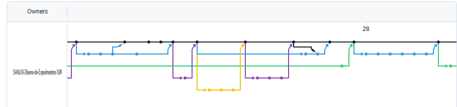
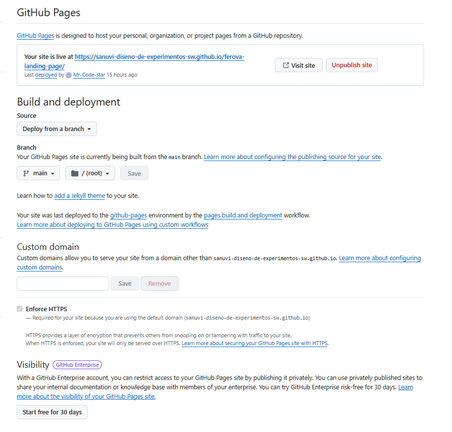
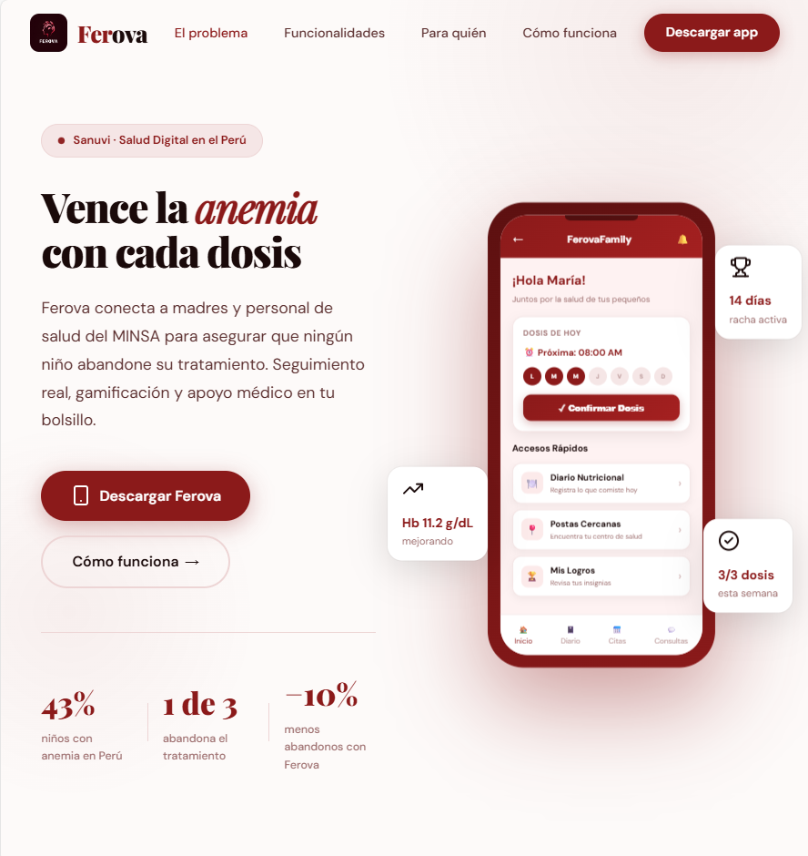
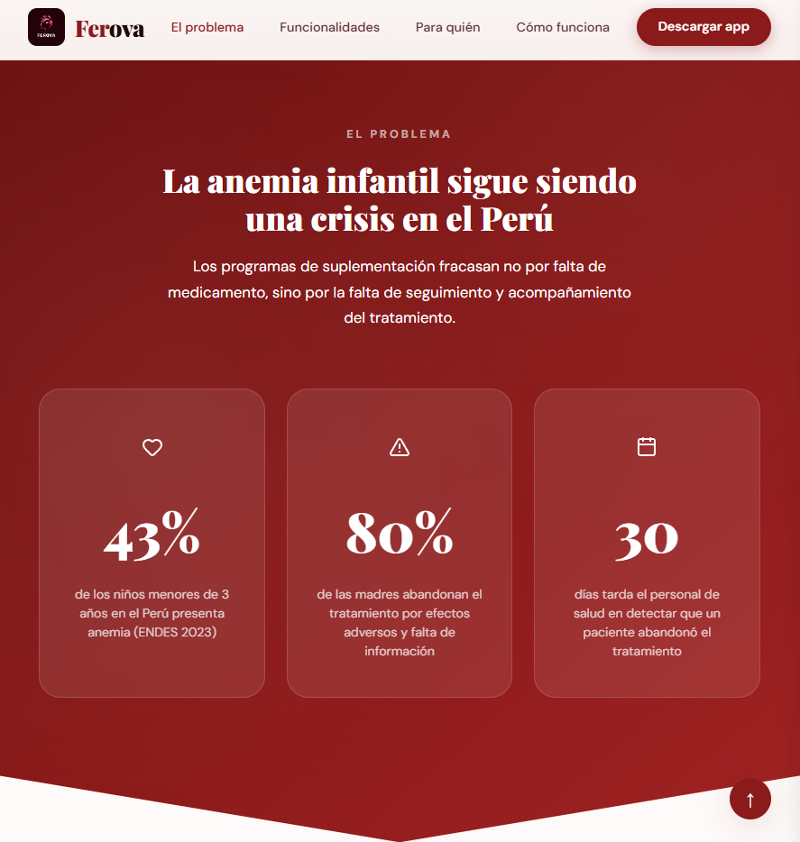
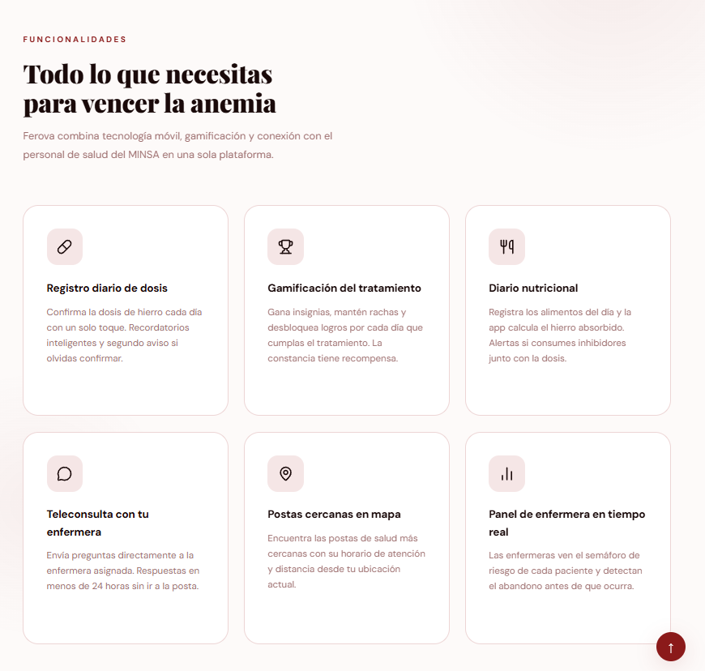
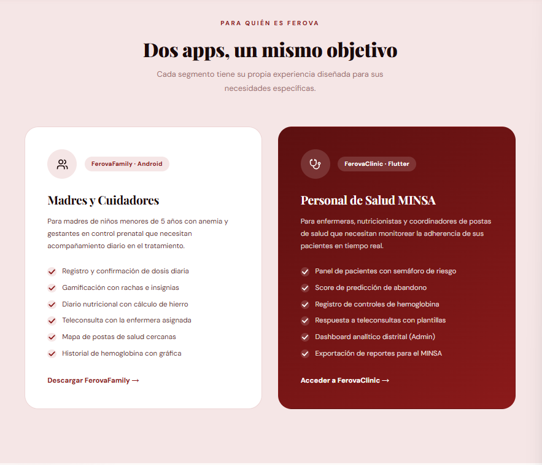
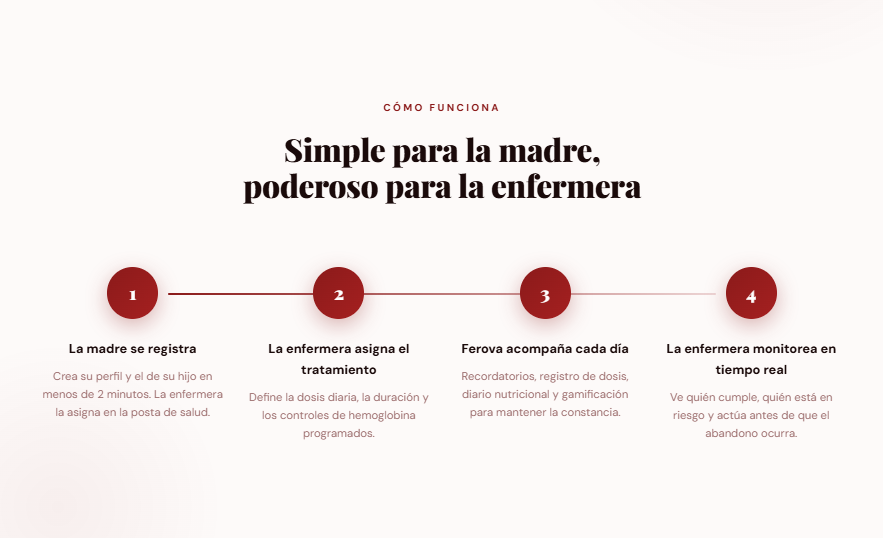
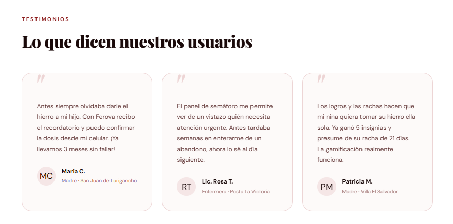
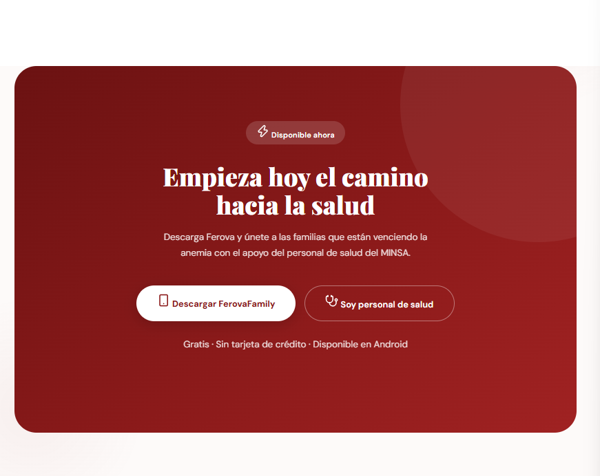

# Capítulo V: Product Implementation

## 5.1. Software Configuration Management

### 5.1.1. Software Development Environment Configuration

**Project Management:**

Para la gestión de nuestro proyecto, hemos utilizado como principal medio de comunicación WhatsApp, a través de un grupo en el cual planificamos reuniones y compartimos nuestras ideas sobre cada parte del trabajo. También utilizamos la aplicación de Discord, para realizar reuniones y conversar en modalidad virtual. Asimismo se utilizó Github el cual elaboramos un repositorio con todos los integrantes del grupo. En esta, hicimos la creación del documento para trabajar de manera colaborativa y también la documentación de las aplicaciones.

**Requirements Management:**

Para el registro de las historias de usuario, utilizamos la herramienta de Jira, en la cual se registró cada una de ellas y se ordenaron por prioridad en el Product Backlog.

**Product UX/UI Design:**

Se realizaron los productos de UX con la herramienta de UXPressia, así como las User Persona, Impact Mapping, entre otras. Por ello se pudo modelar de manera efectiva el diseño de la experiencia de usuario. Por otro lado, se realizaron los prototipos de la aplicación web utilizando la herramienta Figma, lo cual nos permitió realizae los Wireframes y Mock-ups para tener una mejor perspectiva de la aplicación.

**Software Development:**

-  **Entornos de Desarrollo (IDEs):** Para el desarrollo de la aplicación móvil FerovaFamily se utiliza Android Studio, trabajando con el lenguaje Kotlin. Para el desarrollo de la plataforma web FerovaClinic se utiliza WebStorm, debido a su integración con Angular. Para el desarrollo del backend se utiliza JetBrains Rider, como entorno de desarrollo para C# y .NET.

- **Tecnología de Desarrollo Móvil:** La aplicación FerovaFamily se desarrolla utilizando Kotlin y Android Studio, permitiendo implementar las funcionalidades orientadas a madres, padres y cuidadores.

- **Tecnologías Frontend Web:** La plataforma FerovaClinic se desarrolla utilizando Angular, junto con HTML, CSS y TypeScript para la construcción de interfaces web dinámicas y responsivas. WebStorm se utiliza como entorno principal para el desarrollo y gestión del código frontend.

- **Tecnologías Backend:** Los servicios backend de la solución se desarrollan utilizando C# y .NET, empleando JetBrains Rider como entorno principal de desarrollo. Esta tecnología permite implementar la lógica de negocio y los servicios necesarios para la comunicación con las aplicaciones del sistema.

- **Control de Versiones y Gestión:** Se utiliza GitHub como plataforma central para el alojamiento de repositorios, permitiendo un control detallado del historial de cambios y una colaboración eficiente mediante Git.

### 5.1.2. Source Code Management

Para la gestión de versiones, el proyecto adoptará el modelo GitFlow, utilizando GitHub como repositorio y plataforma principal. En las siguientes secciones se detallará la aplicación de este flujo de trabajo, además de proporcionar los enlace correspondiente de cada repositorio.

**Repositorios**

| Producto | URL |
|----------|-----|
| Report | https://github.com/SANUVI-Diseno-de-Experimentos-SW/sanuvi-report/tree/main |
| Landing Page | https://github.com/SANUVI-Diseno-de-Experimentos-SW/ferova-landing-page |
| Frontend Web Application | [URL] |
| RESTful API / Backend | https://github.com/SANUVI-Diseno-de-Experimentos-SW/WebApplication1 |
| Mobile Application | https://github.com/SANUVI-Diseno-de-Experimentos-SW/ferova-mobile-android |

Flujo de trabajo GitFlow

El ciclo de desarrollo se gestionará implementando el modelo de ramas diseñado por Vincent Driessen en 'A successful Git branching model'.

<p align="center">
  
</p>

**Estructura de branches (Ramas):**

- **Main (Rama Principal):** Constituye el eje central del repositorio, reservada exclusivamente para versiones estables y productivas del software. El código alojado aquí debe haber superado rigurosos procesos de validación y pruebas previas en las ramas de funcionalidad y desarrollo.

- **Develop (Rama de Desarrollo):** Actúa como el entorno de integración continua para el equipo. Su función principal es centralizar el progreso diario del proyecto, sirviendo de base para la consolidación de nuevas características antes de su despliegue final.

- **Features (Ramas de Funcionalidad):** Se empleará una rama independiente para cada módulo o tarea específica. Una vez concluida y verificada la funcionalidad, esta se integrará a la rama Develop. Para mantener el orden, se aplicará una nomenclatura estandarizada bajo el patrón "feature/chapter-#".

### 5.1.3. Source Code Style Guide & Conventions

#### Frontend Web App — FerovaClinic (Angular + TypeScript)

##### Convenciones generales:

- **Idioma:** Código, nombres de clases, funciones y variables completamente en inglés.
- **Estructura de carpetas:** Organización por módulos, componentes, servicios e interfaces.
- **Indentación:** 2 espacios.
- **Formato de archivos:** `.ts`, `.html`, `.scss`.
- **Componentización:** Las interfaces deben dividirse en componentes reutilizables y mantener una única responsabilidad.

##### Estilo de código adoptado:

- **Angular Style Guide:** Convenciones oficiales de Angular para estructura, componentes, servicios y organización del código. https://angular.io/guide/styleguide
- **TypeScript Style Guide:** Convenciones para escritura consistente y mantenible de código TypeScript. https://google.github.io/styleguide/tsguide.html

##### Estilo de código adoptado:

- **Componentes:** `PascalCase` — Ej.: `PatientListComponent`, `TreatmentTrackingComponent`.
- **Servicios:** `PascalCase` + sufijo `Service` — Ej.: `PatientService`, `AppointmentService`.
- **Interfaces:** `PascalCase` — Ej.: `Patient`, `Treatment`, `Appointment`.
- **Archivos:** `kebab-case` — Ej.: `patient-list.component.ts`, `treatment.service.ts`.
- **Variables y funciones:** `camelCase` — Ej.: `patientId`, `getPatientDetails()`.
- **Constantes:** `UPPER_SNAKE_CASE` — Ej.: `MAX_PATIENTS`.

---

####  Mobile Frontend — FerovaFamily (Kotlin + Android Studio + Jetpack Compose)

##### Convenciones generales:

- **Idioma:** Todo el código, nombres de clases, funciones y variables en inglés.
- **Indentación:** 4 espacios.
- **Formato de archivos:** `.kt`.
- **Arquitectura:** Separación de responsabilidades entre UI, lógica de presentación y acceso a datos.
- **Interfaz:** Las pantallas serán desarrolladas utilizando Jetpack Compose.

##### Estilo de código adoptado:

- **Kotlin Coding Conventions:** Convenciones oficiales para el desarrollo en Kotlin.[Kotlin Coding Conventions](https://kotlinlang.org/docs/coding-conventions.html)

- **Android Kotlin Style Guide:** Convenciones recomendadas para proyectos Android desarrollados con Kotlin. Android Kotlin Style Guide [Android Kotlin Style Guide (Google)](https://developer.android.com/kotlin/style-guide)

##### Nomenclatura:

- **Clases y objetos:** `PascalCase` — Ej.: `PatientProfile`, `TreatmentScreen`.
- **Funciones y variables:** `camelCase` — Ej.: `getPatientData()`, `selectedPatient`.
- **Constantes:** `UPPER_SNAKE_CASE` — Ej.: `MAX_PATIENTS`, `DEFAULT_TIMEOUT`.
- **Paquetes:** minúsculas y separados por puntos — Ej.: `com.ferova.family.ui.patient`.
- **Funciones composables:** `PascalCase` — Ej.: `PatientCard()`, `TreatmentScreen()`.
- **Archivos Kotlin:** `PascalCase` cuando representan componentes principales — Ej.: `PatientScreen.kt`, `TreatmentViewModel.kt`.

---

#### Backend — C# + .NET

##### Convenciones generales:

- **Idioma:** Código y documentación interna en inglés.
- **Indentación:** 4 espacios.
- **Formato de archivos:** `.cs`.
- **Arquitectura:** Separación de responsabilidades entre las capas de presentación, aplicación, dominio e infraestructura.
- **Framework:** .NET para la implementación de la API y lógica de negocio.

##### Estilo de código adoptado:

- **Microsoft C# Coding Conventions:** Convenciones oficiales de Microsoft para el desarrollo en C#.
- **.NET Coding Guidelines:** Buenas prácticas para la construcción y organización de aplicaciones .NET.

##### Nomenclatura:

- **Clases:** `PascalCase` — Ej.: `PatientService`, `TreatmentController`.
- **Interfaces:** `IPascalCase` — Ej.: `IPatientRepository`, `ITreatmentService`.
- **Métodos:** `PascalCase` — Ej.: `GetPatientById()`, `RegisterTreatment()`.
- **Variables:** `camelCase` — Ej.: `patientId`, `treatmentData`.
- **Propiedades:** `PascalCase` — Ej.: `PatientId`, `TreatmentStatus`.
- **Constantes:** `PascalCase` — Ej.: `MaxPatients`.
- **Endpoints REST:** `kebab-case` — Ej.: `/api/patients`, `/api/treatments`.
- **Namespaces:** `PascalCase` separados por puntos — Ej.: `Ferova.Application.Patients`.

---

#### Database — MongoDB (NoSQL)

##### Convenciones generales:

- **Formato:** Documentos almacenados en formato JSON/BSON.
- **Indentación:** 2 espacios para documentos JSON.
- **Modelado:** Se utilizarán documentos orientados a las necesidades de consulta del sistema, evitando duplicación innecesaria de información.
- **Identificadores:** Se utilizará `ObjectId` como identificador de los documentos cuando corresponda.

##### Nomenclatura:

- **Colecciones:** `snake_case` y en plural — Ej.: `patients`, `treatments`, `daily_doses`.
- **Campos:** `camelCase` — Ej.: `patientId`, `createdAt`, `treatmentStatus`.
- **Índices:** `snake_case` descriptivo — Ej.: `patient_id_index`, `treatment_status_index`.
- **Referencias:** Los campos utilizados para relacionar documentos deberán utilizar nombres descriptivos y consistentes. Ej.: `patientId`, `nurseId`, `treatmentId`.


### 5.1.4. Software Deployment Configuration

##### 1. Landing Page — Ferova

**Tecnología Base:**

- **Tecnología:** HTML, CSS y JavaScript
- **Repositorio:** GitHub
- **Hosting:** GitHub Pages

**Configuración y Despliegue:**

- El código fuente de la Landing Page de Ferova se mantiene en un repositorio de GitHub.
- La Landing Page está orientada a presentar información general sobre Ferova, sus funcionalidades y la propuesta de la plataforma.
- El proyecto utiliza **GitHub Pages** como servicio de hosting para publicar la página web.
- La publicación se realiza directamente desde el repositorio configurado para GitHub Pages.
- Los cambios realizados en los archivos de la Landing Page pueden ser publicados nuevamente mediante las actualizaciones realizadas en el repositorio.
- GitHub Pages proporciona el acceso web a la Landing Page sin requerir un servidor backend propio para su funcionamiento.
- La Landing Page funciona de manera independiente de FerovaClinic, aunque puede proporcionar enlaces de acceso hacia los diferentes componentes de la plataforma.

---


##### 2. Frontend Web Application — FerovaClinic (Angular)

**Tecnología Base:**

- **Framework:** Angular
- **Lenguaje:** TypeScript
- **IDE:** WebStorm
- **Build Tool:** Angular CLI
- **Hosting:** Vercel
- **Repositorio:** GitHub

**Configuración y Despliegue:**

- El código fuente de FerovaClinic se mantiene en un repositorio de GitHub, donde se gestiona el control de versiones y las actualizaciones de la aplicación web.
- El desarrollo de la aplicación se realiza utilizando **WebStorm** como entorno de desarrollo integrado (IDE).
- La aplicación está desarrollada con **Angular** y **TypeScript**, utilizando Angular CLI para la ejecución y construcción del proyecto.
- Para generar la versión de producción se realiza el proceso de compilación mediante Angular CLI, generando los archivos optimizados de la aplicación.
- El proyecto de FerovaClinic se encuentra vinculado con **Vercel**, plataforma utilizada para el despliegue y alojamiento de la aplicación web.
- Vercel permite realizar la construcción y publicación de la aplicación a partir del repositorio de GitHub.
- Las actualizaciones realizadas en el repositorio pueden generar nuevos despliegues de la aplicación web en Vercel.
- Las variables de entorno utilizadas por el frontend permiten configurar la URL del backend y otros parámetros necesarios para la comunicación con los servicios REST.
- En el entorno de desarrollo, FerovaClinic se ejecuta localmente mediante Angular CLI y puede conectarse al backend configurado para pruebas.
- En el entorno de producción, FerovaClinic se encuentra desplegado en Vercel y consume los servicios REST del backend desplegado en Railway.
- La aplicación web utiliza solicitudes HTTP/HTTPS para acceder a los servicios proporcionados por el backend.

**Integración con el backend:**

FerovaClinic consume la API REST desarrollada con C# y .NET para realizar las operaciones correspondientes a la gestión de pacientes, controles, tratamientos, citas, seguimiento y demás funcionalidades destinadas al personal de salud.

---

##### 3. Backend — C# + .NET

**Tecnología Base:**

- **Lenguaje:** C#
- **Framework:** .NET
- **IDE:** JetBrains Rider
- **Contenedorización:** Docker
- **Hosting:** Railway
- **Documentación de API:** Swagger / OpenAPI
- **Repositorio:** GitHub

**Configuración y Despliegue:**

- El código fuente del backend se mantiene en un repositorio de GitHub para gestionar el control de versiones y las actualizaciones del servicio.
- El desarrollo del backend se realiza utilizando **JetBrains Rider** como entorno de desarrollo integrado (IDE).
- La aplicación backend está desarrollada utilizando **C# y .NET** y proporciona los servicios REST utilizados por FerovaClinic y FerovaFamily.
- Para la construcción y despliegue de la aplicación se utiliza un archivo `Dockerfile`, que contiene las instrucciones necesarias para preparar el entorno, compilar el proyecto y generar la imagen de la aplicación.
- El repositorio de GitHub se encuentra vinculado con **Railway**, plataforma utilizada para el alojamiento y despliegue del backend.
- Railway utiliza la configuración del proyecto y el `Dockerfile` para realizar la construcción de la aplicación y ejecutar el servicio.
- El backend desplegado en Railway expone la API REST mediante HTTP/HTTPS para permitir el acceso desde las aplicaciones cliente.
- Los endpoints de la API se documentan mediante **Swagger / OpenAPI**.
- **Swagger UI** permite visualizar y realizar pruebas de los endpoints disponibles, incluyendo sus métodos HTTP, parámetros y respuestas.
- La configuración del backend utiliza variables de entorno para administrar valores dependientes del entorno de ejecución.
- Los cambios realizados en el repositorio pueden generar una nueva construcción y despliegue del backend en Railway.
- El backend proporciona los servicios necesarios para la gestión de usuarios, pacientes, historias clínicas, controles de hemoglobina, tratamientos, citas, seguimiento y comunicación.

**Entornos diferenciados:**

- **Desarrollo:** El backend se ejecuta localmente desde Rider utilizando el entorno de desarrollo de .NET.
- **Producción:** El backend se ejecuta en Railway utilizando la imagen construida mediante Docker y se encuentra disponible para las aplicaciones cliente.

**Integración con las aplicaciones cliente:**

- **FerovaClinic:** Consume la API REST desde la aplicación web desarrollada con Angular.
- **FerovaFamily:** Consume la API REST desde la aplicación móvil desarrollada con Kotlin.
- Ambas aplicaciones utilizan solicitudes HTTP/HTTPS para acceder a los servicios proporcionados por el backend.

##### 4. Aplicación Móvil — FerovaFamily (Kotlin + Android)

**Tecnología Base:**

- **Lenguaje:** Kotlin
- **IDE:** Android Studio
- **Framework:** Jetpack Compose
- **Plataforma:** Android
- **Distribución:** APK
- **Hosting de pruebas:** Firebase App Distribution
- **Repositorio:** GitHub

**Configuración y Despliegue:**

- El código fuente de FerovaFamily se mantiene en un repositorio de GitHub para gestionar el control de versiones y las actualizaciones de la aplicación.
- El desarrollo de la aplicación móvil se realiza utilizando **Android Studio** como entorno de desarrollo integrado (IDE).
- La aplicación está desarrollada en **Kotlin** y utiliza **Jetpack Compose** para la construcción de las interfaces de usuario.
- Para generar una versión instalable de la aplicación se realiza la compilación del proyecto desde Android Studio.
- Para las versiones de prueba se genera un archivo **APK (Android Package)**.
- El archivo APK generado puede instalarse en dispositivos físicos o emuladores Android para verificar el funcionamiento de la aplicación.
- Las versiones de prueba de FerovaFamily se distribuyen mediante **Firebase App Distribution**, permitiendo realizar pruebas con usuarios y testers seleccionados.
- Firebase App Distribution permite gestionar las versiones de prueba y distribuirlas a los testers antes de una publicación oficial.
- Las nuevas versiones de la aplicación pueden ser compiladas y distribuidas nuevamente mediante Firebase App Distribution para incorporar cambios y obtener retroalimentación durante las pruebas.
- FerovaFamily consume los servicios REST proporcionados por el backend desplegado en Railway mediante solicitudes HTTP/HTTPS.

**Entornos diferenciados:**

- **Desarrollo:** FerovaFamily se ejecuta desde Android Studio utilizando un emulador o dispositivo físico Android.
- **Pruebas:** Se genera un APK desde Android Studio y se distribuye mediante Firebase App Distribution.
- **Producción:** La aplicación puede prepararse como una versión de lanzamiento para su posterior distribución en el canal correspondiente.

---

##### 5. Flujo general de despliegue

El despliegue de la plataforma Ferova se organiza en cuatro componentes principales:

1. **Landing Page:** El código fuente se mantiene en GitHub y se publica mediante **GitHub Pages**, proporcionando la página informativa de Ferova.

2. **FerovaClinic:** La aplicación web desarrollada con **Angular y TypeScript** se mantiene en GitHub, se construye mediante Angular CLI y se despliega en **Vercel**.

3. **Backend:** La API desarrollada con **C# y .NET** se mantiene en GitHub. El `Dockerfile` define el proceso de construcción de la aplicación y **Railway** se utiliza para el despliegue y ejecución del backend. La API REST se documenta y prueba mediante **Swagger UI**.

4. **FerovaFamily:** La aplicación móvil desarrollada con **Kotlin y Jetpack Compose** se mantiene en GitHub y se compila mediante **Android Studio** para generar el APK. Las versiones de prueba se distribuyen mediante **Firebase App Distribution**.

5. **Comunicación entre componentes:** FerovaClinic y FerovaFamily consumen los servicios REST proporcionados por el backend mediante solicitudes HTTP/HTTPS.

##### 6. Resumen de tecnologías de despliegue

| Componente | Tecnología | Herramienta de desarrollo | Construcción | Despliegue / Distribución |
|---|---|---|---|---|
| Landing Page | HTML + CSS + JavaScript | WebStorm | — | GitHub Pages |
| FerovaClinic | Angular + TypeScript | WebStorm | Angular CLI | Vercel |
| Backend | C# + .NET | JetBrains Rider | Docker / Dockerfile | Railway |
| FerovaFamily | Kotlin + Jetpack Compose | Android Studio | Gradle / Android Build | Firebase App Distribution |
| API | REST / OpenAPI | JetBrains Rider / Swagger UI | Docker | Railway |


## 5.2. Product Implementation & Deployment

### 5.2.1. Sprint Backlogs

#### Sprint 1

**Sprint Backlog 1**

El Sprint 1 contempla la implementación de la Landing Page de Ferova, el desarrollo de las funcionalidades principales de FerovaFamily orientadas a las madres/apoderadas y la implementación completa de la API RESTful definida en el Product Backlog. Las historias incluidas corresponden únicamente a elementos previamente definidos en el Product Backlog.

| Sprint # | User Story Id | User Story Title | Description | Estimation (Hours) | Assigned To | Status |
|---------|---------------|------------------|-------------|--------------------|-------------|--------|
| Sprint 1 | US-01 | Conocer el valor de negocio de la plataforma | Como visitante del sitio web estático Quiero determinar el valor de negocio Para tomar la decisión de convertirme en usuario de la plataforma. | 6 | Damián Pereira, Luis Alberto | Done |
| Sprint 1 | US-02 | Aumento de confianza sobre la plataforma | Como visitante, Quiero conocer sobre los testimonios de otras personas Para aumentar la confianza sobre el uso de la plataforma. | 2 | Damián Pereira, Luis Alberto | Done|
| Sprint 1 | US-03 | Acceso a las aplicaciones | Como visitante, Quiero acceder o descargar la aplicación Para empezar a usarla en mis operaciones de negocio. | 4 | Damián Pereira, Luis Alberto | Done|
| Sprint 1 | US-04 | Registro de usuario | Como usuario Quiero registrarme con mi rol respectivo Para acceder a las funcionalidades de la aplicación. | 10 | Peñaranda Caldas, Gabriel Augusto | Done |
| Sprint 1 | US-05 | Inicio de sesión | Como usuario no autenticado quiero iniciar sesión para acceder de forma seguro a mi cuenta. | 4 | Peñaranda Caldas, Gabriel Augusto | Done |
| Sprint 1 | TS-01 | Autenticación de usuarios | Como developer quiero autenticar a los usuarios de forma segura a través de una API para que se permita el acceso al sistema. | 4 | Peñaranda Caldas, Gabriel Augusto | Done |
| Sprint 1 | TS-02 | Registro de usuarios | Como developer, quiero gestionar el registro de usuarios de forma segura a través de una API, para permitir la creación de cuentas en el sistema como una funcionalidad de mi aplicación. | 4 | Peñaranda Caldas, Gabriel Augusto  | Done |
| Sprint 1 | US-06 | Solicitar recuperación de acceso | Como usuario quiero solicitar la recuperación de mi cuenta para volver a acceder a mi cuenta. | 4 | Damián Pereira, Luis Alberto | Done |
| Sprint 1 | US-07 | Restablecer contraseña | Cómo usuario quiero restablecer mi contraseña para volver a acceder a mi cuenta. | 10 | Damián Pereira, Luis Alberto | Done |
| Sprint 1 | TS-03 | Recuperar contraseña mediante correo | Como developer, quiero gestionar la recuperación de contraseña de forma segura a través de una API, para permitir a los usuarios restablecer su acceso al sistema. | 10 | Damián Pereira, Luis Alberto | Done |
| Sprint 1 | US-09 | Acceso a la Pagina de Inicio | Como usuario, quiero ver la página de inicio para poder acceder a las funciones principales de la aplicación. | 2 |  Damián Pereira, Luis Alberto | Done |
| Sprint 1 | US-10 | Gestión de pacientes | Como madre, quiero gestionar la información de mi hijo, para mantener sus datos registrados y facilitar el seguimiento de su tratamiento. | 4 | Baca Camargo, Vitaly Arturo | Done |
| Sprint 1 | TS-04 | Registro de pacientes | Como developer, quiero gestionar el registro de pacientes mediante una API, para permitir que las madres incorporen nuevos pacientes a su seguimiento. | 6 | Baca Camargo, Vitaly Arturo | Done |
| Sprint 1 | TS-05 | Obtener pacientes de la madre | Como developer, quiero consultar los pacientes asociados a una madre mediante una API, para permitir la obtención de la información básica de los pacientes registrados. | 6 | Por asignar | Baca Camargo, Vitaly Arturo | Done |
| Sprint 1 | TS-06 | Consulta de evolución de hemoglobina | Como developer, quiero consultar la evolución de los niveles de hemoglobina de un paciente mediante una API, para proporcionar información sobre su progreso durante el seguimiento. | 4 | Quijandria Araneda, Vicente | Done |
| Sprint 1 | TS-10 | Asignación de paciente a enfermera | Como developer, quiero gestionar la asignación de pacientes a una enfermera mediante una API, para establecer la relación de seguimiento entre la enfermera y el paciente. | 10 | Quijandria Araneda, Vicente | Done |
| Sprint 1 | TS-11 | Gestion del historial clínica | Como developer, quiero gestionar la creación de la historia clínica de un paciente mediante una API, para almacenar su información clínica y facilitar su seguimiento. | 16 | Quijandria Araneda, Vicente | Done |
| Sprint 1 | TS-12 | Dar de alta a un paciente | Como developer, quiero gestionar el alta de un paciente mediante una API, para finalizar su seguimiento cuando corresponda. | 4 | Baca Camargo, Vitaly Arturo | Done |
| Sprint 1 | TS-21 | Registro del control de hemoglobina | Como developer, quiero gestionar el registro de los controles de hemoglobina de los pacientes mediante una API, para mantener actualizada la información de su evolución y determinar automáticamente su estado de anemia. | 16 | Baca Camargo, Vitaly Arturo | Done |
| Sprint 1 | TS-07 | Inicio del tratamiento | Como developer, quiero gestionar el inicio del tratamiento de un paciente mediante una API, para establecer sus condiciones de tratamiento y generar las dosis correspondientes. | 6 | Baca Camargo, Vitaly Arturo | Done |
| Sprint 1 | TS-08 | Consulta del detalle del tratamiento | Como developer, quiero consultar el detalle del tratamiento de un paciente mediante una API, para obtener información sobre su evolución y cumplimiento del tratamiento. | 6 | Baca Camargo, Vitaly Arturo | Done |
| Sprint 1 | TS-09 | Gestión del estado del tratamiento | Como developer, quiero gestionar la finalización o abandono de un tratamiento mediante una API, para mantener actualizado su estado y registrar la observación correspondiente. | 2 | Baca Camargo, Vitaly Arturo | Done |
| Sprint 1 | TS-18 | Gestión y seguimiento de dosis | Como developer, quiero gestionar la confirmación y consulta de las dosis de un paciente mediante una API, para mantener actualizado el seguimiento del cumplimiento del tratamiento. | 10 | Baca Camargo, Vitaly Arturo | Done |
| Sprint 1 | US-14 | Diario nutricional | Como madre, quiero llevar un registro de los alimentos que consume mi hijo durante el día, para conocer su alimentación y el aporte de hierro asociado a los alimentos registrados. | 2 | Apaza bocanegra, Elizabeth Noelia | Done |
| Sprint 1 | US-15 | Resumen nutricional diario | Como madre, quiero consultar el resumen nutricional diario de mi hijo, para conocer los alimentos registrados, el hierro absorbido y el cumplimiento de la meta diaria. | 4 | Apaza bocanegra, Elizabeth Noelia | Done |
| Sprint 1 | TS-15 | Registro de consumo de alimento | Como developer, quiero gestionar el registro del consumo de alimentos de un paciente mediante una API, para calcular el hierro absorbido y mantener actualizada su información nutricional. | 6 | Apaza bocanegra, Elizabeth Noelia | Done |
| Sprint 1 | TS-16 | Consulta del diario nutricional | Como developer, quiero consultar el consumo de alimentos de un paciente correspondiente al día actual mediante una API, para obtener su resumen nutricional y el hierro absorbido. | 10 | Apaza bocanegra, Elizabeth Noelia | Done |
| Sprint 1 | TS-17 | Consulta de alimentos | Como developer, quiero gestionar la consulta de alimentos mediante una API, para obtener información nutricional de los alimentos según una categoría o un criterio de búsqueda. | 10 | Apaza bocanegra, Elizabeth Noelia | Done |
| Sprint 1 | US-16 | Racha de tratamiento | Como madre, quiero conocer la cantidad de días consecutivos en los que mi hijo ha cumplido con su tratamiento, para mantener la constancia durante el proceso. | 4 | Baca Camargo, Vitaly Arturo| Done |
| Sprint 1 | US-17 | Insignias por logros del tratamiento | Como madre, quiero obtener insignias al alcanzar hitos durante el tratamiento de mi hijo, para reconocer mi constancia y motivarme a continuar con su seguimiento. | 4 | Baca Camargo, Vitaly Arturo| Done |
| Sprint 1 | US-18 | Puntos por cumplimiento del tratamiento | Como madre, quiero obtener puntos por confirmar el cumplimiento de las dosis de mi hijo, para reconocer mi constancia y mantener la motivación durante el tratamiento. | 4 | Baca Camargo, Vitaly Arturo| Done |
| Sprint 1 | TS-13 | Consulta del progreso de gamificación | Como developer, quiero gestionar la consulta del progreso de gamificación asociado a un paciente mediante una API, para proporcionar información sobre los puntos acumulados y la constancia del tratamiento. | 4 | Baca Camargo, Vitaly Arturo| Done |
| Sprint 1 | TS-14 | Consulta de insignias y progreso | Como developer, quiero gestionar la consulta de las insignias asociadas a un paciente mediante una API, para obtener su estado de desbloqueo y el progreso hacia cada logro del tratamiento. | 4 | Baca Camargo, Vitaly Arturo| Done |
| Sprint 1 | US-19 | Comunicación con la enfermera | Como madre, quiero comunicarme con la enfermera asignada para realizar consultas relacionadas con el tratamiento de mi hijo y recibir orientación durante su seguimiento. | 4 | Peñaranda Caldas, Gabriel Augusto | Done |
| Sprint 1 | TS-20 | Gestión de teleconsultas | Como developer, quiero gestionar las teleconsultas entre madres y enfermeras mediante una API, para permitir el intercambio de consultas y respuestas durante el seguimiento del tratamiento del paciente. | 16 | Peñaranda Caldas, Gabriel Augusto | Done |
| Sprint 1 | US-26 | Reserva y gestión de citas médicas | Como madre, quiero reservar, consultar y cancelar citas para mis pacientes, para organizar sus controles médicos en las postas de salud disponibles. | 6 | Peñaranda Caldas, Gabriel Augusto | Done |
| Sprint 1 | US-27 | Consulta de postas y horarios disponibles | Como madre, quiero consultar las postas cercanas y sus horarios disponibles, para seleccionar una alternativa adecuada al programar una cita para mi paciente. | 4 | Peñaranda Caldas, Gabriel Augusto | Done |
| Sprint 1 | US-29 | Visualización de la próxima cita | Como madre, quiero consultar la próxima cita confirmada de mis pacientes, para conocer con anticipación la fecha, hora y posta donde se realizará el control. | 4 | Peñaranda Caldas, Gabriel Augusto | Done |
| Sprint 1 | TS-24 | Gestión de postas de salud | Como desarrollador, quiero implementar una API para registrar y consultar las postas de salud disponibles en el sistema, para permitir al administrador gestionar los establecimientos y visualizar la información de cada posta. | 6 | Peñaranda Caldas, Gabriel Augusto | Done |
| Sprint 1 | TS-25 | Asignación de enfermeras a postas de salud | Como desarrollador, quiero implementar una API que permita verificar la disponibilidad de enfermeras y asignarlas a una posta, para mantener correctamente la relación entre enfermeras y establecimientos de salud. | 10 | Peñaranda Caldas, Gabriel Augusto | Done |
| Sprint 1 | TS-26 | Consulta de distritos disponibles | Como desarrollador, quiero implementar una API que proporcione los distritos disponibles, para permitir seleccionar correctamente la ubicación de una posta durante su registro. | 6 | Peñaranda Caldas, Gabriel Augusto | Done |
| Sprint 1 | TS-27 | Gestión de citas y disponibilidad de postas | Como desarrollador, quiero implementar una API para gestionar la reserva, cancelación y consulta de citas médicas de los pacientes, así como consultar las postas y horarios disponibles, para permitir una correcta gestión de las atenciones. | 16 | Peñaranda Caldas, Gabriel Augusto | Done |
| Sprint 1 | US-32 | Registro del cumplimiento de dosis | Como madre, quiero registrar el cumplimiento de las dosis de mi paciente, para llevar un seguimiento de su tratamiento. | 10 | Peñaranda Caldas, Gabriel Augusto | Done |

### 5.2.2. Implemented Landing Page Evidence

El equipo completó el diseño, implementación y despliegue de la Landing Page de **Ferova**, desarrollada como página promocional de la solución digital orientada al seguimiento y control del tratamiento de la anemia. La Landing Page presenta la problemática abordada por Ferova, sus principales funcionalidades, los segmentos de usuarios a los que está dirigida y el flujo general de funcionamiento de la solución.

- **Plataforma de Despliegue:** GitHub Pages
- **Tecnología:** Angular + TypeScript
- **Características Implementadas:**
  - Sección principal (Hero) con propuesta de valor de Ferova.
  - Presentación del problema de la anemia infantil y su contexto.
  - Sección de funcionalidades principales de Ferova.
  - Presentación de los segmentos de usuarios: madres/cuidadores y personal de salud.
  - Sección "Cómo funciona" con el flujo general de interacción entre la madre y el personal de salud.
  - Sección de testimonios.
  - Sección final de llamada a la acción para descargar FerovaFamily o acceder a FerovaClinic.
  - Diseño responsive adaptado a diferentes tamaños de pantalla.
  - Navegación mediante enlaces internos entre las principales secciones de la Landing Page.

<br>

<div align="center">
  
</div>

<br>

**Figura 1.** Implementación de la sección principal de la Landing Page de Ferova.

<br>

<div align="center">
  
</div>

<br>

**Figura 2.** Sección de problemática y contexto de la anemia infantil.

<br>

<div align="center">
  
</div>

<br>

**Figura 3.** Sección de funcionalidades principales de Ferova.

<br>

<div align="center">
  
</div>

<br>

**Figura 4.** Sección de segmentos de usuarios y propuesta de valor para cada plataforma.

<br>

<div align="center">
  
</div>

<br>

**Figura 5.** Sección "Cómo funciona" de la solución Ferova.

<br>

<div align="center">
  
</div>

<br>

**Figura 6.** Sección de testimonios de usuarios.

<br>

<div align="center">
  
</div>

<br>

**Figura 7.** Sección final de llamada a la acción para acceder a FerovaFamily y FerovaClinic.

<br>

<div align="center">
  
</div>

### 5.2.3. Implemented Frontend-Web Application Evidence


### 5.2.4. Acuerdo de Servicio - SaaS

#### 5.2.4.1. Descripción del Servicio

Ferova es una solución digital orientada al seguimiento y control del tratamiento de la anemia, desarrollada por Sanuvi. El servicio integra una aplicación móvil denominada **FerovaFamily**, dirigida a madres, apoderadas y cuidadores, y una plataforma web denominada **FerovaClinic**, dirigida al personal de salud.

El servicio permite:

- Registrar y consultar información de los pacientes.
- Registrar y realizar seguimiento de las dosis del tratamiento.
- Consultar la evolución de los controles de hemoglobina.
- Registrar información nutricional relacionada con el tratamiento.
- Gestionar y consultar citas de control.
- Consultar postas de salud cercanas.
- Facilitar la comunicación entre las apoderadas y el personal de salud.
- Proporcionar indicadores para facilitar el seguimiento de los pacientes por parte del personal de salud.
- Incorporar elementos de gamificación para incentivar la constancia durante el tratamiento.

Ferova se proporciona mediante servicios digitales accesibles desde dispositivos Android para **FerovaFamily** y mediante un navegador web para **FerovaClinic**.

---

#### 5.2.4.2. Derechos de los Usuarios

Los usuarios de Ferova tienen derecho a:

- Acceder a las funcionalidades correspondientes al rol asignado dentro de la plataforma.
- Consultar la información registrada asociada a su cuenta y a los pacientes que tenga autorizados para gestionar.
- Recibir información clara sobre el funcionamiento de las funcionalidades disponibles.
- Mantener la confidencialidad de sus credenciales de acceso.
- Solicitar la actualización o corrección de información personal cuando corresponda.
- Recibir una experiencia de uso coherente con las funcionalidades disponibles en la versión utilizada.
- Solicitar soporte ante problemas relacionados con el acceso o funcionamiento de la plataforma.

---

#### 5.2.4.3. Obligaciones de los Usuarios

Los usuarios se comprometen a:

- Proporcionar información veraz y actualizada durante el registro y uso de la plataforma.
- Mantener sus credenciales de acceso bajo confidencialidad.
- No compartir sus credenciales con terceros.
- Utilizar la plataforma únicamente para los fines relacionados con el seguimiento del tratamiento y las funcionalidades ofrecidas.
- Registrar información de manera responsable y conforme a la realidad del paciente.
- Mantener actualizados los datos necesarios para el seguimiento del tratamiento.
- Informar oportunamente cualquier acceso no autorizado o actividad sospechosa asociada a su cuenta.
- Respetar las funciones y permisos correspondientes al rol asignado.

---

#### 5.2.4.4. Restricciones de Uso

Está prohibido utilizar Ferova para:

- Acceder, modificar o eliminar información de otros usuarios sin autorización.
- Intentar obtener acceso a funcionalidades restringidas mediante mecanismos no autorizados.
- Compartir cuentas o credenciales de acceso de manera que permita el uso no autorizado de la plataforma.
- Introducir código malicioso, virus u otros elementos que puedan afectar el funcionamiento del servicio.
- Realizar actividades que comprometan la seguridad, disponibilidad o integridad de la plataforma.
- Utilizar la información obtenida mediante Ferova para fines distintos a los autorizados.
- Suplantar la identidad de otro usuario o profesional de salud.
- Utilizar la plataforma para actividades ilícitas o contrarias a la normativa aplicable.

---

#### 5.2.4.5. Responsabilidades del Proveedor

Sanuvi se compromete a:

- Mantener disponibles las funcionalidades implementadas de Ferova.
- Realizar acciones de mantenimiento y actualización necesarias para el funcionamiento del servicio.
- Implementar mecanismos razonables de seguridad para proteger la información gestionada por la plataforma.
- Gestionar los incidentes técnicos identificados durante el funcionamiento del servicio.
- Mantener actualizada la documentación relacionada con las funcionalidades principales cuando corresponda.
- Informar cambios relevantes que puedan afectar el uso de la plataforma.

Las funcionalidades y características disponibles pueden variar de acuerdo con las actualizaciones realizadas sobre Ferova.

---

#### 5.2.4.6. Limitaciones del Servicio

Ferova constituye una herramienta digital de apoyo para el seguimiento del tratamiento y la coordinación entre usuarios y personal de salud.

La información presentada por la plataforma no reemplaza la evaluación, diagnóstico, prescripción ni las indicaciones realizadas por un profesional de salud.

Las decisiones relacionadas con el tratamiento del paciente deben ser realizadas por el personal de salud responsable, de acuerdo con la evaluación clínica correspondiente.

Sanuvi no será responsable por decisiones tomadas por los usuarios fuera de las indicaciones proporcionadas por el personal de salud ni por información ingresada incorrectamente por los propios usuarios.

Asimismo, pueden producirse interrupciones temporales del servicio debido a mantenimiento, actualizaciones, problemas de conectividad, servicios de terceros u otras circunstancias técnicas fuera del control directo de Sanuvi.

---

#### 5.2.4.7. Protección de Datos y Privacidad

Ferova gestiona información proporcionada por sus usuarios durante el uso de la plataforma.

Los datos serán tratados de acuerdo con las políticas de privacidad aplicables y con la normativa vigente correspondiente a la protección de datos personales.

Los usuarios son responsables de proporcionar información correcta y de utilizar la plataforma respetando la privacidad y confidencialidad de la información de los pacientes.

El acceso a la información estará condicionado por el rol y los permisos asignados dentro de Ferova.

La información personal no deberá ser compartida con terceros sin la correspondiente autorización, salvo cuando exista una obligación legal aplicable.

---

#### 5.2.4.8. Acceso y Gestión de Cuentas

Para utilizar las funcionalidades que requieren autenticación, el usuario deberá contar con una cuenta registrada en Ferova.

El usuario es responsable de:

- Proporcionar información correcta durante el registro.
- Mantener actualizadas sus credenciales.
- Proteger sus datos de acceso.
- Informar cualquier sospecha de acceso no autorizado.

Sanuvi podrá restringir temporalmente una cuenta cuando se detecten actividades que comprometan la seguridad de la plataforma o incumplan las condiciones de uso.

---

#### 5.2.4.9. Modificaciones del Servicio

Sanuvi podrá realizar modificaciones, actualizaciones o mejoras sobre Ferova con el objetivo de mantener y mejorar el funcionamiento de la plataforma.

Las modificaciones podrán incluir:

- Incorporación de nuevas funcionalidades.
- Mejoras de usabilidad y accesibilidad.
- Correcciones de errores.
- Actualizaciones de seguridad.
- Modificaciones técnicas necesarias para mantener el servicio.

Cuando una modificación afecte de manera significativa las condiciones de uso, esta podrá ser comunicada mediante los canales disponibles de la plataforma o del sitio web.

---

#### 5.2.4.10. Terminación o Restricción del Acceso

El usuario podrá dejar de utilizar Ferova en cualquier momento.

Sanuvi podrá restringir o suspender el acceso de una cuenta cuando:

- Se incumplan las presentes condiciones de servicio.
- Se detecte un uso fraudulento o no autorizado.
- Se realicen actividades que comprometan la seguridad de la plataforma.
- Exista una obligación legal que requiera dicha restricción.

La suspensión o terminación del acceso no elimina las obligaciones que, por su naturaleza, deban continuar vigentes.

---

#### 5.2.4.11. Propiedad Intelectual

Los elementos que conforman Ferova, incluyendo su diseño, identidad visual, código fuente, interfaces, contenidos y componentes desarrollados por Sanuvi, se encuentran protegidos por las normas aplicables de propiedad intelectual.

El uso de Ferova no concede al usuario derechos de propiedad sobre el software, diseño, código fuente o identidad visual de la plataforma.

Los usuarios conservan los derechos que les correspondan sobre la información que proporcionen a la plataforma, de acuerdo con la normativa aplicable.

---

#### 5.2.4.12. Resolución de Incidencias

Ante problemas relacionados con el acceso o funcionamiento de Ferova, el usuario podrá comunicarse mediante los canales de contacto publicados en el sitio web.

Las incidencias serán evaluadas de acuerdo con su naturaleza y disponibilidad de los servicios técnicos correspondientes.

Para facilitar la atención, el usuario deberá proporcionar información suficiente sobre el problema identificado, evitando compartir contraseñas u otros datos de autenticación.

---

#### 5.2.4.13. Aceptación de los Términos

El acceso y uso de las funcionalidades de Ferova implica la aceptación de los presentes términos y condiciones.

En caso de que el usuario no esté de acuerdo con alguna de las condiciones establecidas, deberá abstenerse de utilizar las funcionalidades correspondientes de la plataforma.

Los presentes términos estarán disponibles públicamente en la sección **Terms and Conditions** del sitio web de Ferova.

---

#### 5.2.4.14. Contacto

**Sanuvi - Ferova**

- **Producto:** Ferova
- **Aplicación móvil:** FerovaFamily
- **Plataforma web:** FerovaClinic
- **Sitio web:** Landing Page oficial de Ferova
- **Sección:** Terms and Conditions


### 5.2.5. Implemented Native-Mobile Application Evidence

Hemos Desplegaro la aplicación móvil Ferova Family utilizando Firebase App Distribution, permitiendo que los evaluadores o usuarios de prueba puedan instalar y probar la aplicación antes de su lanzamiento oficial.


**Paso 1: Creación del Proyecto en Firebase**

Se creó un nuevo proyecto en Firebase con el nombre Ferova-Family desde la consola de Firebase.

- **Resultado:** El proyecto fue creado correctamente y quedó listo para registrar aplicaciones Android.

<div align="center">
	
</div>

<br>

**Paso 2: Registro de la Aplicación Android**

Se registró la aplicación Android dentro del proyecto Firebase utilizando los siguientes datos:

```
Nombre de la aplicación: Ferova Family

Nombre del paquete: pe.edu.upc.ferovafamily
```

- **Resultado:** Firebase vinculó correctamente la aplicación Android al proyecto.

<div align="center">
	
</div>

<br>

**Paso 3: Configuración Exitosa del Proyecto**

Luego del registro de la aplicación, Firebase confirmó que la configuración fue realizada exitosamente.

- **Resultado:** El proyecto quedó preparado para distribuir versiones de la aplicación.

<div align="center">
	
</div>

<br>

**Paso 4: Generación del APK desde Android Studio**

Se generó el archivo APK desde Android Studio utilizando la siguiente ruta:

```
Build
→ Generate App Bundles or APKs
→ Generate APKs
```

- **Resultado:** Android Studio compiló la aplicación y generó el archivo APK correspondiente.

<div align="center">
	
</div>

<br>

**Paso 5: Ubicación del APK Generado**

El archivo generado se ubicó en la siguiente ruta del proyecto:

```
app/build/outputs/apk/debug/app-debug.apk
```

- **Resultado:** El APK quedó listo para ser distribuido mediante Firebase App Distribution.
  
<div align="center">
	
</div>

<br>

**Paso 6: Carga del APK en Firebase App Distribution**

Se accedió al módulo App Distribution de Firebase y se cargó el archivo APK generado previamente.

- **Resultado:** Firebase inició el procesamiento y distribución de la aplicación para los usuarios de prueba.


<div align="center">
	
</div>

<br>

**Paso 7: Invitación a los Evaluadores**

Firebase envió automáticamente un correo electrónico de invitación a los usuarios registrados como evaluadores.

Desde dicho correo, los usuarios pueden aceptar la invitación e instalar la aplicación en sus dispositivos Android.

- **Resultado:** La aplicación quedó disponible para pruebas y validación.

<div align="center">
	
</div>


### 5.2.6. Implemented RESTful API and/or Serverless Backend Evidence


### 5.2.7. RESTful API documentation

> Documentación OpenAPI/Swagger de los endpoints por Bounded Context.

**Enlace:** [URL de la documentación desplegada]


### 5.2.8. Team Collaboration Insights

> Capturas de los analíticos de colaboración y commits en GitHub para los repositorios de producto.


<!-- COMPLETAR -->

## 5.3. Video About-the-Product

| Campo | Dato |
|-------|------|
| Enlace del video | [URL de Microsoft Stream] |
| Duración | [mm:ss] |


